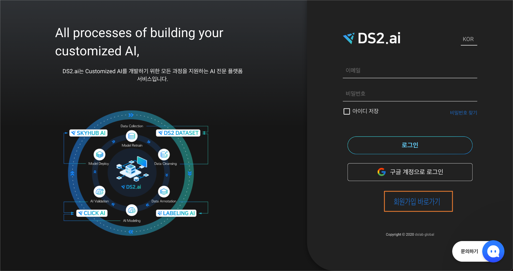
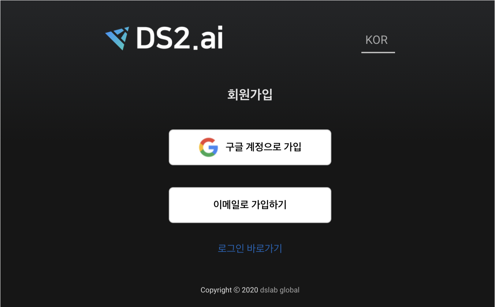
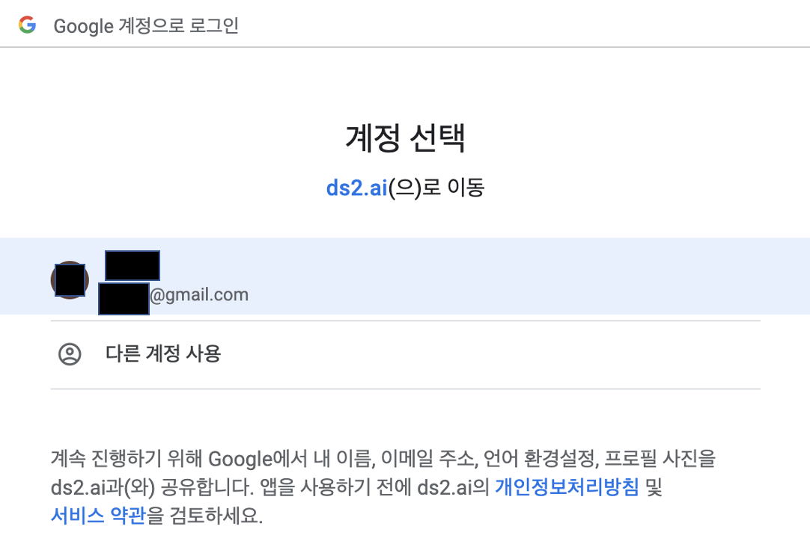
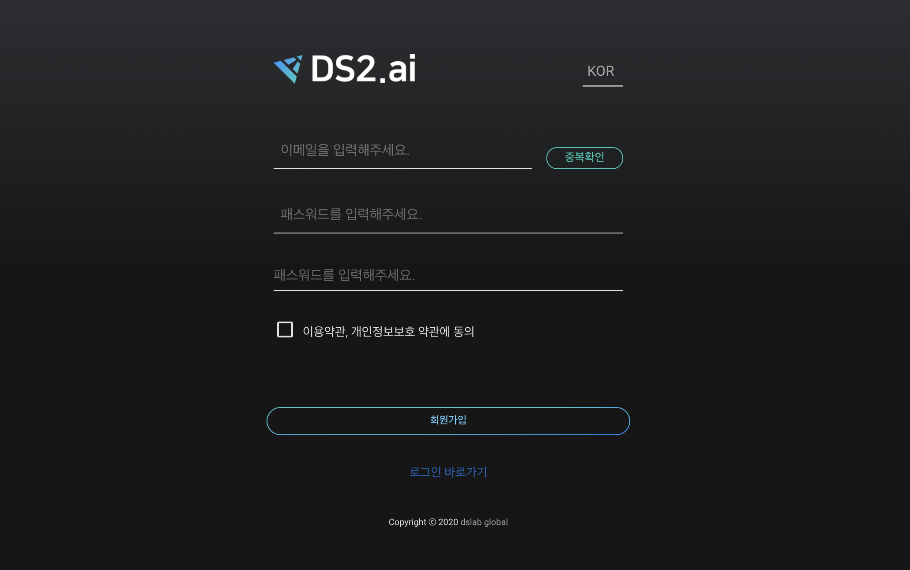
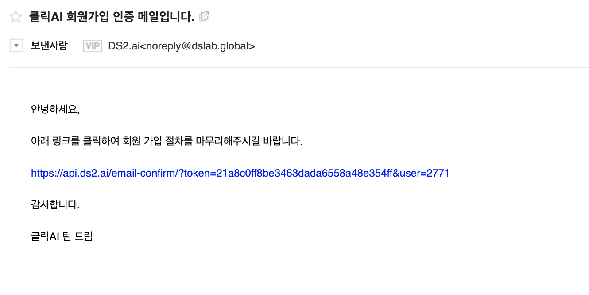
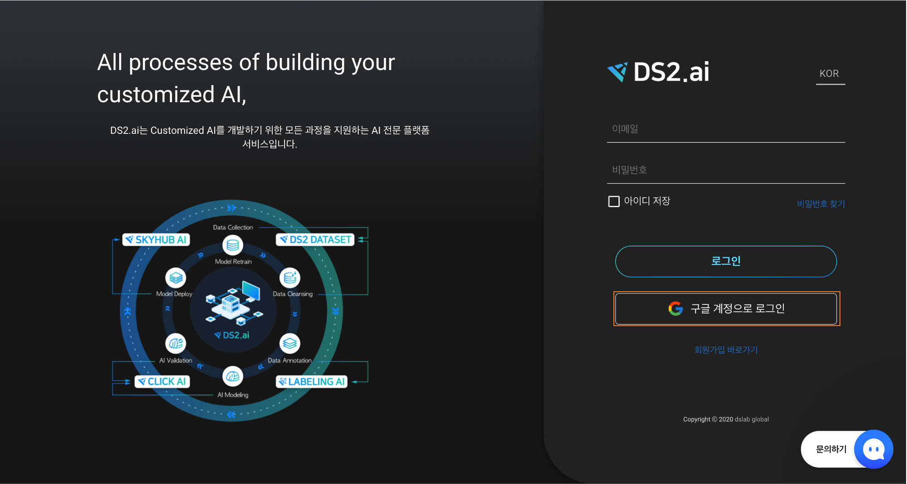
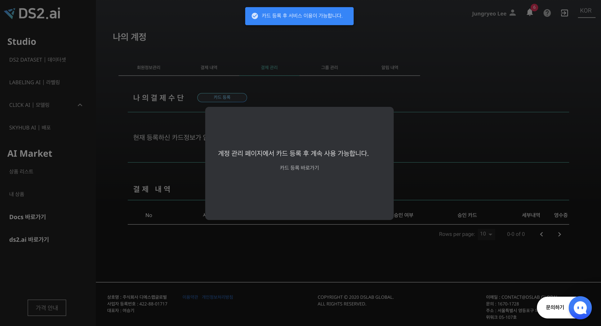
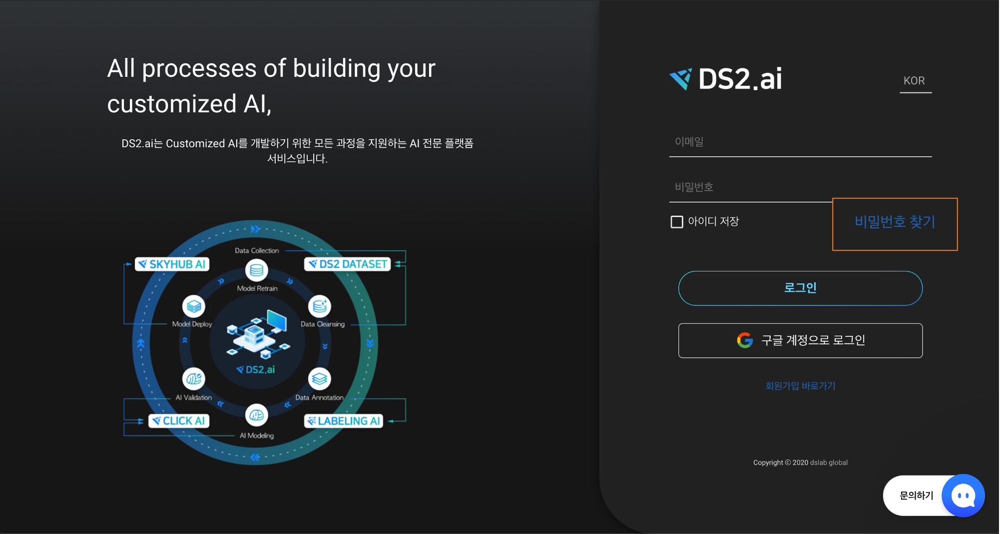
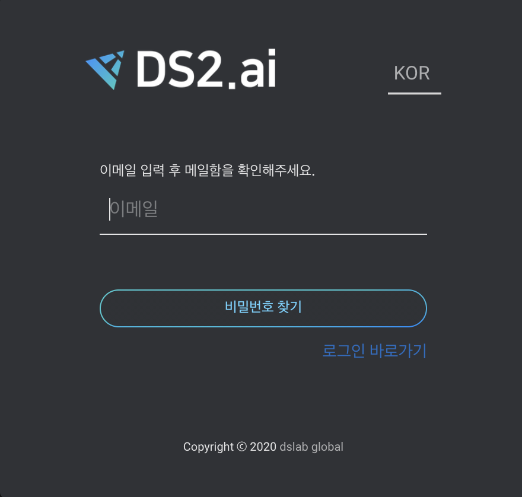

# **계정 관리**

## ** 1. 계정 생성하기 **

[https://console.ds2.ai](https://console.ds2.ai/) 로 접속합니다. 

{: width="700px",hight="300px" }
[회원가입 바로가기]를 클릭해주세요.  
 
  
{: width="500px",hight="300px" }  
회원가입 방법은 다음과 같습니다. 
 

### **1-1. 구글 계정으로 가입 **
 

{: width="500px",hight="300px" }  
구글 계정으로 가입하면 구글계정과 연동하여 회원가입 및 로그인이 가능합니다. 
  
  

### **1-2. 이메일로 가입하기 **
 

{: width="600px",hight="300px" }

[이메일로 가입하기]를 클릭하면 구글 이외의 이메일을 사용하여 회원 가입이 가능합니다.

- 이메일주소 입력후 [중복확인] 해주세요.
- 비밀번호는 영문, 숫자, 특수문자 3종류를 조합하여 최소 8자리 이상의 길이로 구성하여야 합니다.
- 이용약관, 개인정보보호 약관 동의

회원가입 버튼을 클릭하면, 가입시 입력한 이메일 주소로 인증 메일을 전송합니다.   
 
{: width="600px",hight="300px" }  
인증메일에 있는 링크로 접속하여 회원가입 절차를 마무리합니다.

## **2. 로그인하기**

회원 가입 방법에 따라 로그인 방법이 다릅니다. 

1. 구글계정으로 가입으로 가입한 경우

    {: width="600px",hight="300px" }  
    구글 계정으로 로그인을 클릭하여 구글과 연동하여 로그인합니다.  
     

2. 이메일로 가입하기로 가입한 경우

    {: width="600px",hight="300px" }  
    회원가입시 등록한 이메일주소와 비밀번호를 입력하여 로그인 합니다.
     

    {: width="600px",hight="300px" }  
    로그인 후 카드 등록을 해야 서비스 무료 사용 credit을 제공합니다. 

## **3. 비밀번호 찾기**

*이메일로 가입하기로 가입한 경우만 지원합니다.*

{: width="600px",hight="300px" }

{: width="300px",hight="300px" }  

회원 가입 당시 등록한 이메일 주소를 입력하면, 비밀번호를 변경할 수 있는 링크를 이메일로 전달드립니다.

## **4. 탈퇴하기**

로그인 → 나의 계정 → 회원정보관리 → 회원탈퇴 에서 탈퇴할 수 있습니다. 

자세한 내용은 [계정 구성](account_02_manage.md) 을 확인해주세요.
 
 
 
 
 
 