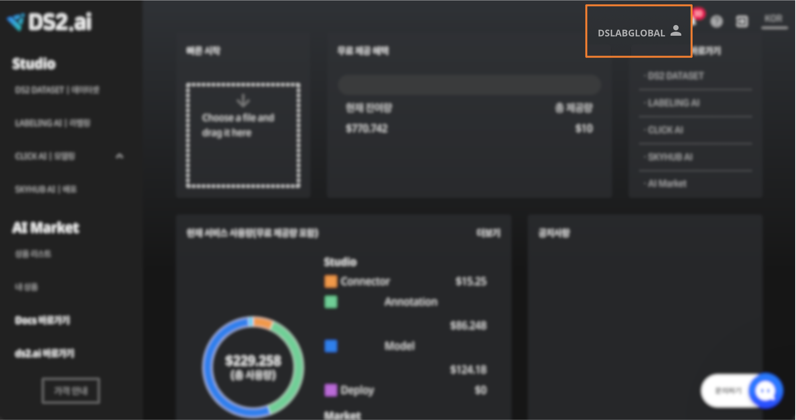
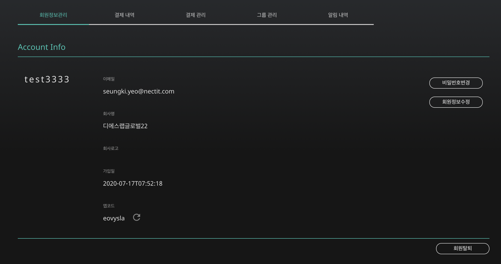
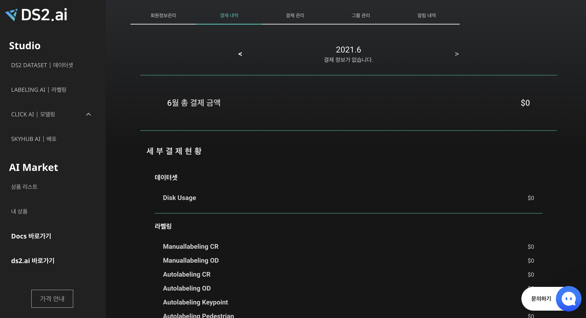
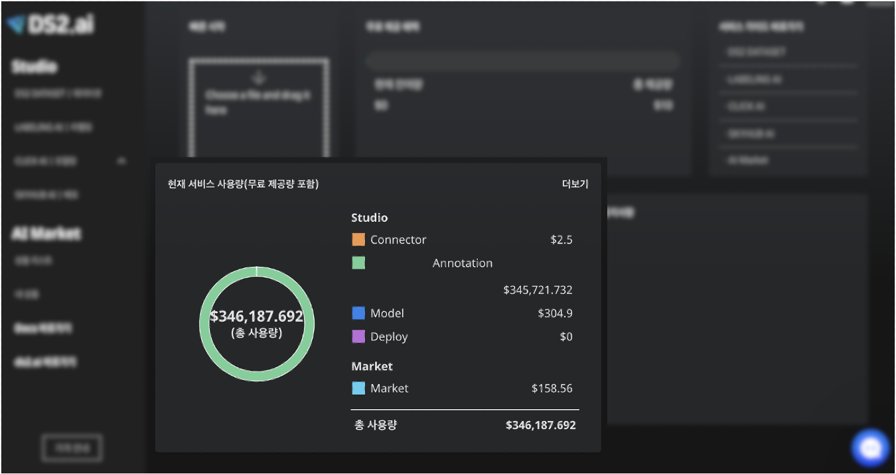
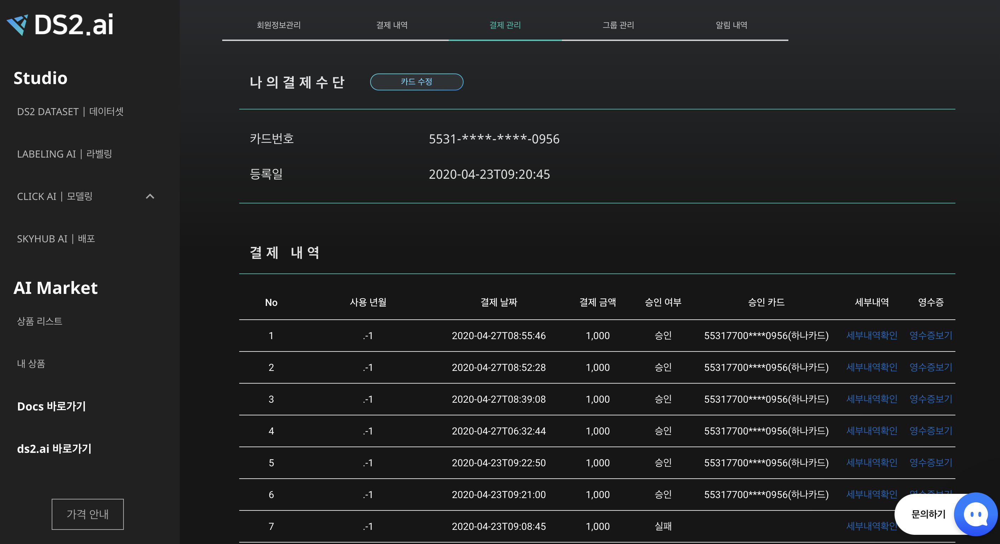
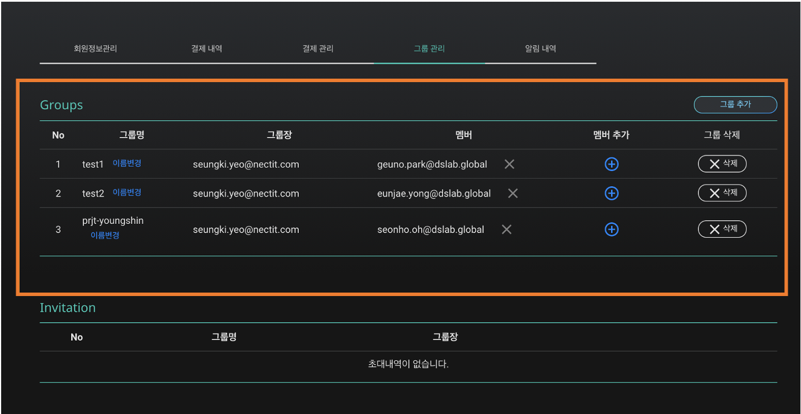
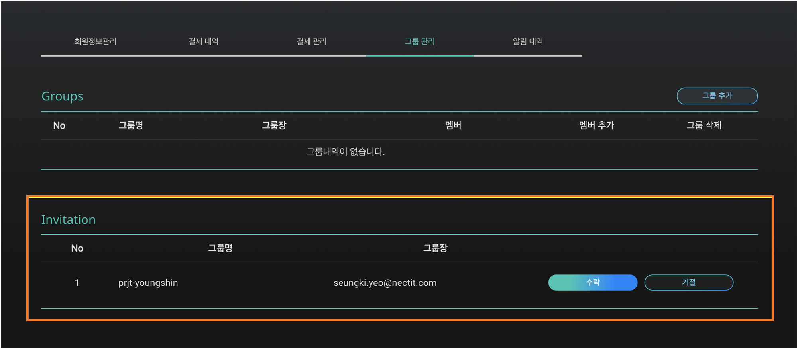
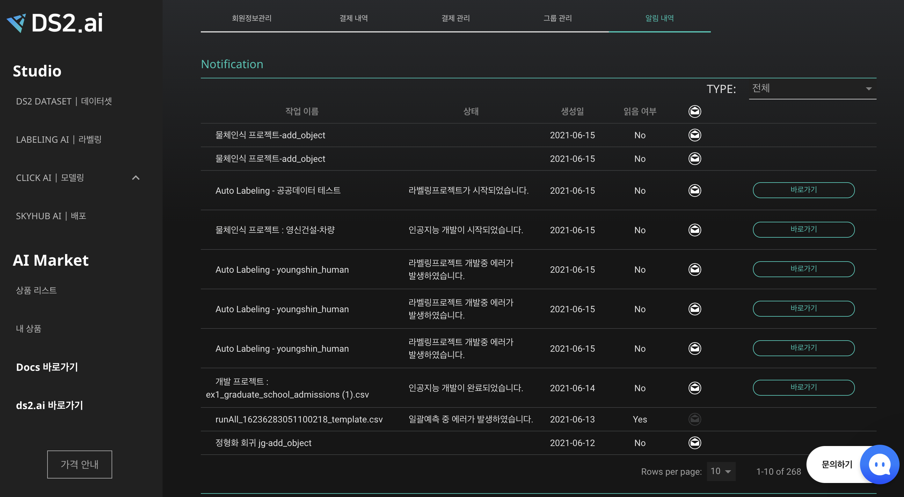

# **계정 구성**

나의 계정 설정, 카드 등록, 결제 내용 확인, 그룹 설정 등의 방법을 확인합니다.

{: width="600px",hight="300px" }  
로그인 후 우측 상단의 내 계정과 사람 아이콘을 클릭하면, 나의 계정에 대한 정보를 확인할 수 있습니다.

## **1. 회원정보관리 : 계정정보**

{: width="600px",hight="300px" }

- **가입정보 확인** : 이메일, 회사명, 회사로고, 가입일, 앱코드
- **회원 정보 수정** : 이름, 회사명, 회사로고, 프로모션코드
- **비밀번호 변경**

    [비밀번호변경] 버튼을 누르고 팝업창의 '변경하기'를 클릭하면 가입시 등록한 이메일 주소로 링크가 전송됩니다. 해당 링크에서 비밀번호 변경이 가능합니다. 

    *이메일로 가입하기로 가입한 경우에만 비밀번호 변경이 가능합니다. 구글 계정으로 가입한 경우, 구글 아이디 및 비밀번호가 동일하게 연동되므로 비밀번호 변경이 불가합니다.*

- **회원탈퇴**

    [회워탈퇴] 버튼을 누르고 팝업창의 계정의 비밀번호를 입력하면 바로 탈퇴합니다. 

    개인 정보 방침에 따라 회원 탈퇴 시 모든 데이터는 90일 보관 후 영구적으로 삭제됩니다.

    회원탈퇴후 계정복구가 불가능합니다. 

## **2. 결제내역: 솔루션 사용 내역**

{: width="600px",hight="300px" }  
"결제내역" 에서는 월 단위의 총 결제금액과 각 솔루션 기능별 사용 금액을 확인할 수 있습니다. 

{: width="600px",hight="300px" }  
전체 서비스 사용량은 로그인 후 메인 페이지에서도 확인 가능합니다.

## **3. 결제관리: 결제정보, 결제금액**

{: width="600px",hight="300px" }  
메인페이지의 현재 서비스 사용량의 더보기를 클릭하면, "나의 계정→결제 관리" 페이지로 이동합니다. 

{: width="600px",hight="300px" }  
"결제관리"에서는 나의 결제 수단과 결제 내역 확인이 가능합니다. 

1. **나의 결제 수단**

    등록한 카드 정보 확인 및 등록 카드 변경

2. **결제 내역 **

    결제 건별 상세 내용 확인

## **4. 그룹관리: 프로젝트 공유 멤버관리**

개발한 인공지능 및 프로젝트를 공유할 멤버를 추가하거나 초대받은 내용을 확인할 수 있습니다.

1. **초대하기**

    "나의 계정 - 그룹관리 - Groups"에서 그룹추가 및 삭제, 그룹 내 멤버 추가 및 삭제를 간편하게 할 수 있습니다. 

    {: width="600px",hight="300px" }  

    - 그룹 삭제 시 공유중이던 프로젝트를 삭제된 그룹의 멤버와 더이상 공유할 수 없습니다.
    - 멤버 추가의 경우, **[console.ds2ai.ai](http://console.ds2ai.ai) 의 가입**된 이메일 계정으로 멤버를 추가할 수 있습니다.   
    (멤버 회원가입 필)
    - 멤버 추가의 경우, 추가된 멤버의 이메일로 초대 알림메일이 전송되고, 멤버가 수락하면 프로젝트 공유가 가능합니다.
     
 

2. **초대받기**

    다른 사용자로부터 초대받았을 경우, 알림메일이 전송되며, 나의 계정에서 확인 가능합니다.

    {: width="600px",hight="300px" }  

    "나의 계정 - 그룹관리 - Invitation" 에서 수락 또는 거절을 할 수 있습니다. 수락시, 그룹장이 내가 속한 그룹에 공유한 프로젝트를 바로 확인할 수 있습니다. 

    동일 그룹의 초대를 3번 이상 거절 할 경우, 해당 그룹에 참여할 수 없으므로 유의해주시길 바랍니다

## **5. 알림 내역 : 프로젝트 개발 정보**

인공지능 개발 관련한 중요한 알림을 확인합니다.

{: width="600px",hight="300px" }  

"알림 내역" 에서는 프로젝트 개발과 관련 이슈의 상세 내용을 확인할 수 있습니다. 

{: width="600px",hight="300px" }  

간단한 알람 내용은 홈페이지 우측 상단의 종 아이콘을 클릭하여 빠르게 확인할 수 있으며, 종 아이콘 클릭시 상단에 있는 [전체 알람보기] 버튼을 눌러도 알림 내역 상세페이지로 이동이 가능합니다. 

