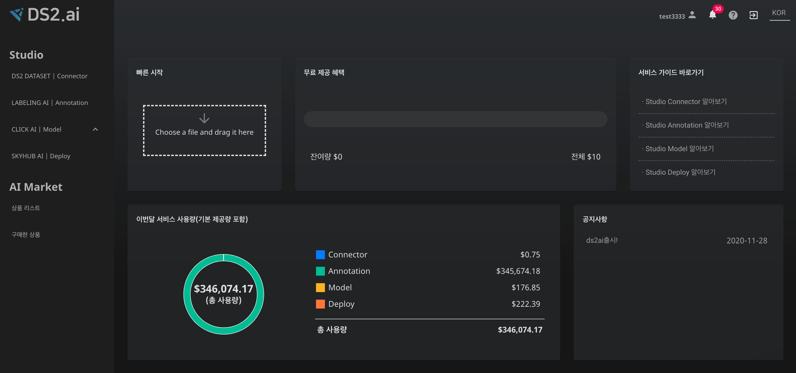

# **청구서 및 사용량**

## **1. 사용량 확인하기**

홈페이지([refactoring.clickai.ai](http://refactoring.clickai.ai/signin))에 접속한 후 로그인 화면
    

{: width="700px",hight="300px" }  
사용량 확인은 메인 페이지에서 확인이 가능합니다.

    
  1)  각 솔루션마다 사용량을 확인 가능합니다. 
  2)  후불제로 결제 되며 사용량 만큼 결제일에 결제를 합니다. 
  3)  무료 제공 혜택이 주어졌을때 무료 제공 혜택으로부터 사용량만큼 차감이 됩니다. 
  ------------------------

## **2. 청구서 확인하기**

### **2-1. 이용내역**

회원정보의 이용내역에서는 세부 사용 현황과 현재 사용 금액, 다음 결제 예정일 등의 정보를 확인 할 수 있습니다.

- 세부 사용 현황을 통해 각 인공지능 및 기능들의 사용량에 따른 금액을 확인 가능 합니다.
- 오토라벨링, 수동라벨링, 예측 API, 학습, 데이터 용량, 무료 사용량, 선불 충전 금액, 세금(부가세)에 따른 사용 현황과 그에 해당하는 AU가 표시됩니다.

### **2-2. 결제관리**

회원정보의 결제관리에서는 현재까지의 결재 내역을 확인 가능 합니다.

- 현재 등록되어 있는 카드와 등록일을 확인하고, 결제 카드를 수정할 수 있습니다.
- 최근 결제 내역에서 결제 날짜, 금액, 승인 여부 및 결제 수단(승인 카드)을  확인할 수 있습니다.
- 영수증을 확인하고 인쇄할 수 있습니다.

 
 
