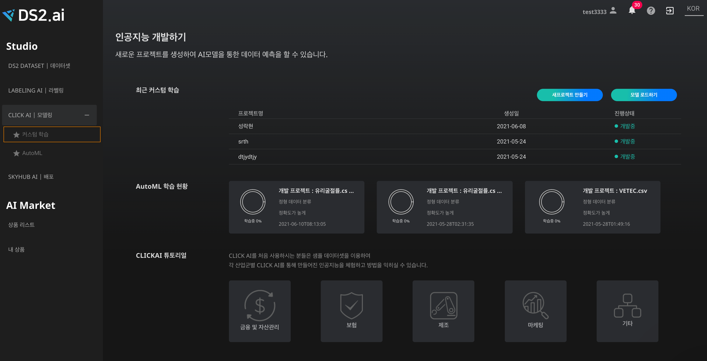
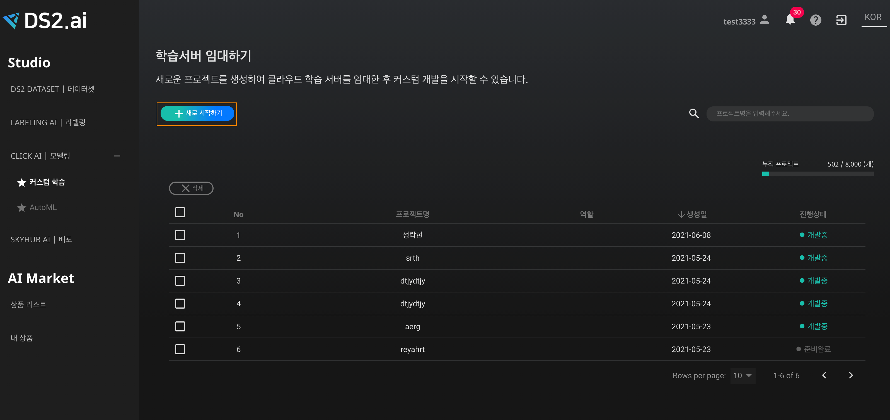
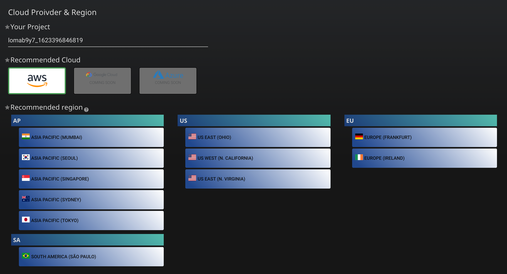
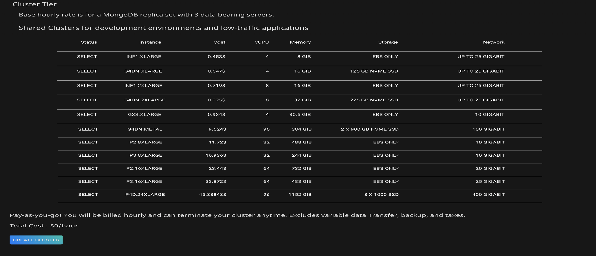
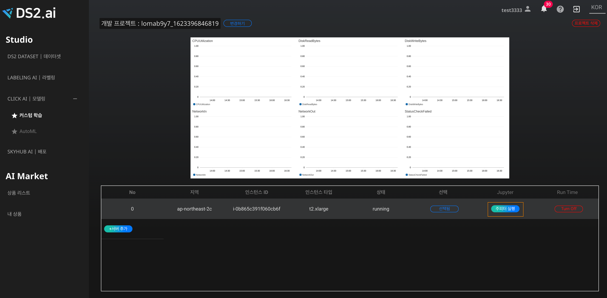
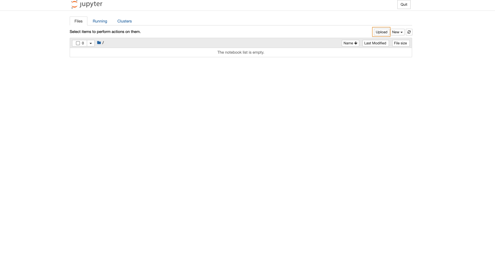
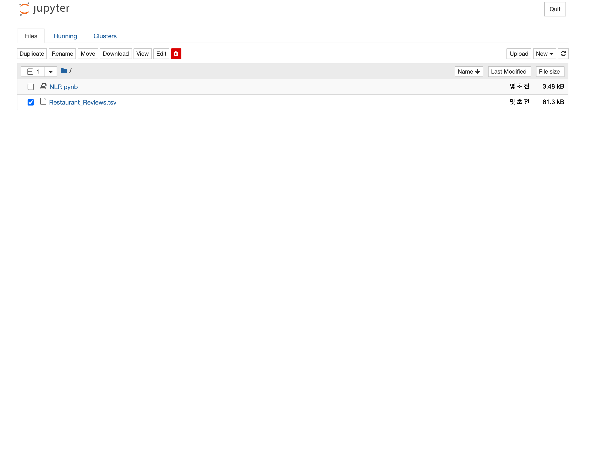
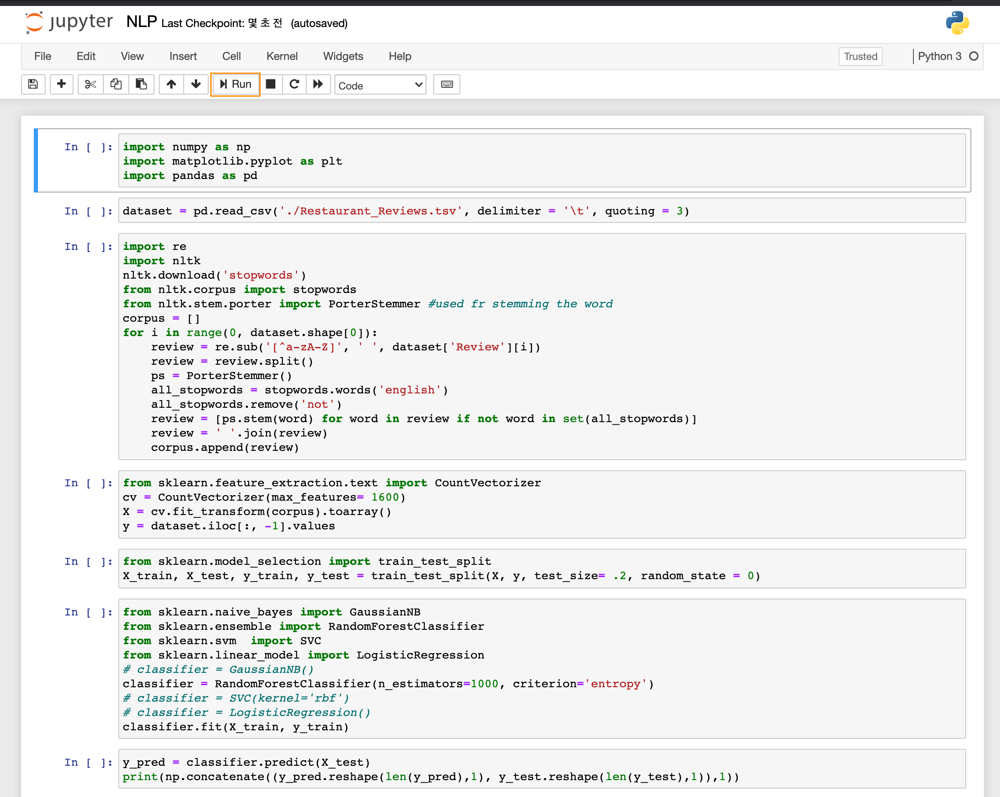

<link rel="stylesheet" href="./index.css">
# **커스텀  학습 이용하기** 
 

## ** 1. 커스텀 학습의 jupyter notebook 이용하기 **

CLICK AI의 Custom Training을 이용한다면 Jupyter 환경에서 인공지능 학습 및 실행을 할 수 있는 서버를 구축할 수 있고, 기존의 워크 플로우를 유지하여 전반적인 운영비용을 줄일 수 있습니다. Jupyter 노트북 서버를 사용하면 원하시는 서버 환경에서 Jupyter notebook을 실행할 수 있습니다. 

 {: width="700px",hight="300px" } 

 커스텀 학습을 클릭합니다.

 {: width="700px",hight="300px" }

 새로운 프로젝트를 생성하여 프로젝트를 생성합니다. 프로젝트 생성을 위해 새로 시작하기를 선택합니다.

 {: width="700px",hight="300px" }

 학습 서버 환경을 구축하기 위해 원하는 서버 와 서버의 지역을 설정합니다.
- googl cloud, azure 별도의 문의가 필요합니다.

 {: width="700px",hight="300px" }

티어설정을 하면 프로젝트 생성 준비가 완료됩니다. 

 {: width="700px",hight="300px" }

대시보드를 통해 서버의 사용량을 확인 할 수 있습니다. 주피터 실행 버튼이 생기면 주피터 실행 버튼을 클릭합니다. 

 {: width="700px",hight="300px" }

주피터 창이 열리면 주피터 환경에서 인공지능 학습 및 실행을 할수 있습니다. upload 버튼을 클릭하여 이용할 파일을 업로드 하여 주피터를 이용할 수 있습니다.

 {: width="700px",hight="300px" }

주피터 창에 업로든된 파일들을 확인 할 수있으며 파일을 클릭합니다.

 {: width="700px",hight="300px" }

주피터 창에 코드를 입력합니다. 코드를 실행 시키기 위해 Run 버튼을 클릭하여 각 셀의 코드를 실행시킵니다. 

 
 
 

