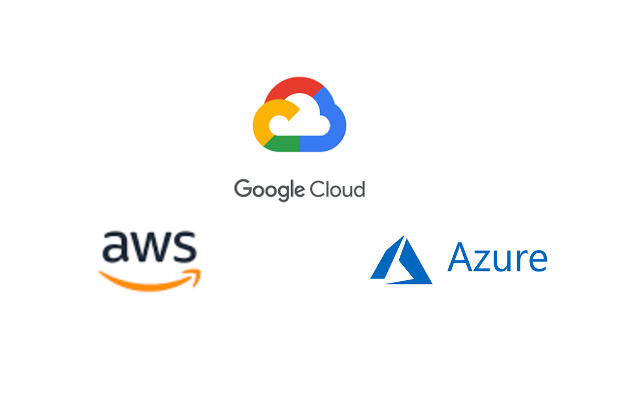
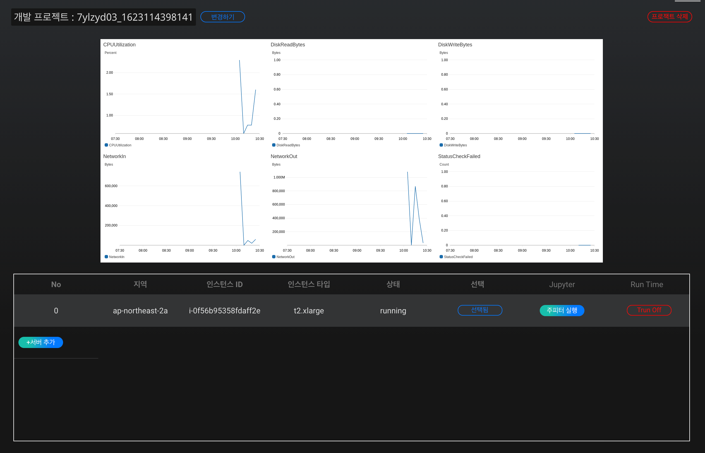

# **Custom Training ** 
 
## **원하는 성능의 학습서버를 임대하여 Jupyter 환경에서 직접 인공지능 코딩 개발**

## **1. Custom Training 이란 ?** 

기존의 인공지능(AI) 생성 과정은 대용량의 데이터를 이용하고 복잡한 연산 처리를 요구하기 때문에, 따로 서버를 구축하지 않는다면 값비싼 그래픽처리장치(GPU)를 기반으로 해야합니다.

CLICK AI의 Custom Training을 이용한다면 Jupyter 환경에서 인공지능 학습 및 실행을 할 수 있는 서버를 구축할 수 있고, 기존의 워크 플로우를 유지하여 전반적인 운영비용을 줄일 수 있습니다.

- 자유로운 알고리즘 튜닝 가능
- 예산에 맞는 맞춤형 서버 설정 가능
- 데이터 및 인공지능 전문 역량 필요

## **2. Custom Training 기능 **

1. 맞춤형 학습 서버 구성
백엔드 서버 구축 역량이 없어도 원하는 성능의 맞춤형 학습 서버를 간편하게 직접 구성할 수 있습니다.
2. Jupyter 환경을 통한 코딩
Jupyter 환경에서 원하는 알고리즘을 직접 코딩하고 하이퍼 파라미터 튜닝을 통해 인공지능을 개발할 수 있습니다.
3. Magic Code 자동 생성 
Jupyter로의 복사 및 붙여넣기만으로 비전문가도 인공지능 개발을 시작할 수 있는 Magic Code를 자동으로 생성합니다.

## **3. Custom Training 제공 서버 **

백엔드 서버 구축 역량이 없어도 원하는 성능의 맞춤형 학습 서버를 선택하여 이용 가능합니다. 서버와 해당 지역을 선택하여 사용자에게 맞는 클라우드 학습 서버를 간편하게 설정해 보세요. 

 {: width="400px",hight="300px" }

## **4. Custom Training 비용**

시간당 서버 이용량에 따라 청구되며 언제든지 사용을 종료할 수 있습니다. 프로젝트의 사용량에 서버의 확장 가능하고 유연한 가격 책정 옵션을 제공합니다.

## **5. Custom Training 대시보드**

{: width="700px",hight="300px" }  

1. 학습 서버의 사용량을 확인할 수 있습니다. 
2. 서버 추가를 하여 서버의 수를 늘려 처리 능력을 향상 시킬 수 있습니다. 수평 스케일로 각 서버에 걸리는 부하를 균등하게 해줍니다. 서버의 
3. 프로젝트의 이름 수정 및 삭제가 가능합니다.

 
 
 

