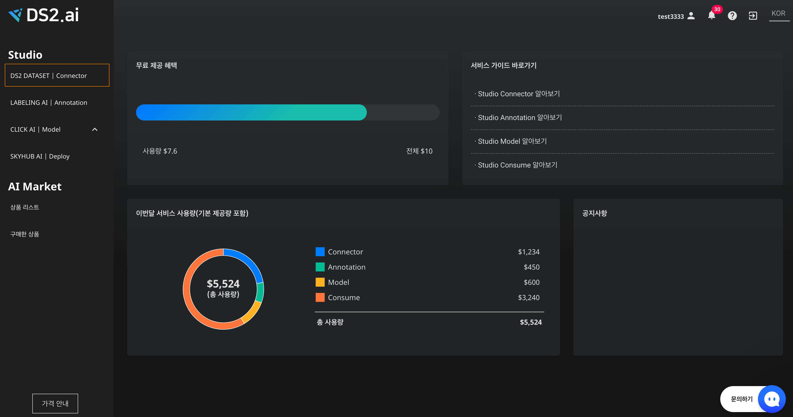
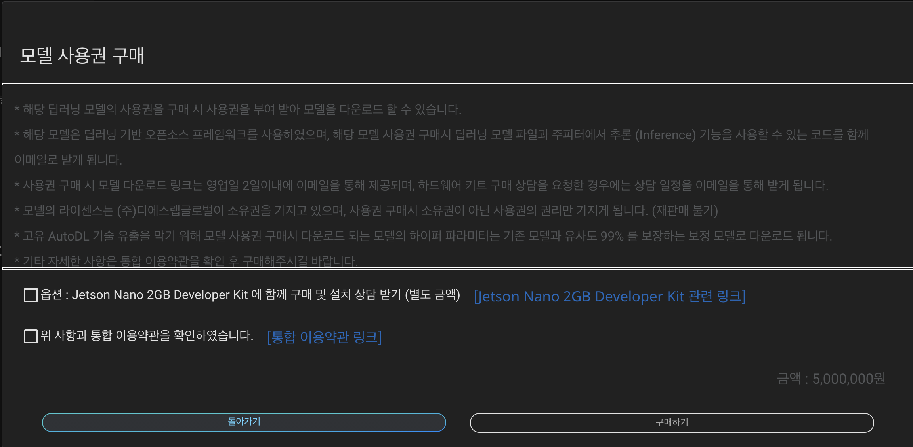

<link rel="stylesheet" href="./index.css">

# **이미지 분류 모델 이용하기**

## **이미지 분류(Image Classification)란?**

이미지 분류란 카테고리(Class) 별 분류된 이미지를 가지고 모델을 훈련시켜 어떤 이미지가 어느 카테고리의 속하는지 예측하는 모델입니다.물체 인식과 다르게 하나의 이미지의 여러 카테고리(Class)를 예측하는 것이 아닌 하나의 이미지의 하나의 카테고리(Class)를 예측할 수 있습니다.

### **직접 사용해보기**

### **학습 목표 : 이미지를 통해 선박의 종류를 구분하는 AI 모델 만들기**

## **1. 데이터 확인하기**

{: width="400px",hight="200px" } 
[ship.zip] 
카테고리별로 분류된 이미지 파일의 데이터로 구성되어 있습니다.

## **2. AI 모델 만들기**

### **1) 데이터 업로드하기**

{: width="600px",hight="300px" } 
데이터 업로드를 위해 DS2 DATASET을  클릭합니다.

 

{: width="600px",hight="300px" } 
인공지능 개발을 위한 데이터 추가를 위해 데이터 추가하기를 클릭합니다.

 

{: width="600px",hight="300px" } 
다운 받은 데이터는 zip 파일 이기 때문에 ZIP를 클릭하고 다음을 누릅니다.

 

{: width="600px",hight="300px" } 
파일찾기 버튼을 클릭하여 다운받을 데이터를 클릭하여 업로드 합니다. 

 

{: width="600px",hight="300px" } 
다운 받을 데이터를 선택하여 업로드 합니다. 업로드된 파일을 확인할 수 있으며 데이터 설정에 압축파일 내 라벨링 데이터 포함을 선택해 줍니다. 

 

{: width="600px",hight="300px" } 
데이터가 업로드 중입니다.

 

### **2) 인공지능 개발하기**

{: width="600px",hight="300px" } 
해당 프로젝트에 맞는 학습형태, 선호하는 방식을 선택해 주세요. 
1. 학습형태는 '이미지 분류' 를 선택합니다.  
2. 선호하는 방식은 2가지로 나뉘어져 있으며, '정확도가 높게' 방식을 선택하겠습니다.

 

{: width="600px",hight="300px" } 
모든 작업이 완료 된 후, 오른쪽 상단의  Start을 클릭하여 인공지능을 생성합니다.

 

{: width="600px",hight="300px" } 
인공지능을 생성 중입니다.

 

{: width="600px",hight="300px" }  
생성 완료된 인공지능 프로젝트는 AutoML에서 확인할 수 있습니다.

 

{: width="600px",hight="300px" } 
인공지능 진행상태를 확인 할 수있습니다.

 

## **3. 인공지능 상세보기/예측하기**

{: width="600px",hight="300px" }  
CLICK AI 는 여러개의 인공지능 모델을 생성하고 모델별 상세내용을 확인하여 최적의 인공지능 모델을 선택할 수 있습니다. 모든 인공지능 모델 생성이 완료되면 모델별 예측 정확도를 확인 및 비교할 수 있고, 각 모델에 대한 상세보기, 이미지 예측이 가능합니다

 

### **1) 상세보기**

**1-1) 모델 성능 평가** 

{: width="600px",hight="300px" } 
Detail 은 모델의 오차율(Error Rate)와 MASE(Mean of Absolute Scaled Errors)을 확인할 수 있습니다.

 

**1-2) API**

{: width="600px",hight="300px" } 
API는 해당 모델을 프로그래밍 언어로 활용할 수 있도록 API 를 제공합니다. CLICK AI 의 API는 JavaScript, Python, Wget, Java 언어를 지원합니다

 

**1-3) 서비스앱 이용하기**

{: width="600px",hight="300px" } 
"TRAINING MODEL (모델번호)" 우측에 "서비스 앱 공유하기" 버튼을 클릭하면, [DS2.AI](http://ds2.AI) 외부에서도 예측과 분석이 가능합니다. 외부 사이트의 배경 색상을 선택하여 저장한후, 공유 URL을 클릭해주세요.

 

### **2) 이미지 예측**

{: width="600px",hight="300px" } 
개별예측을 선택하면, 각 변수의 값을 입력하여 하나의 예측값을 결과로 얻을 수 있습니다. 단일 예측이나 모델의 정확도를 테스트하기 위한 용도로 활용할 수 있습니다. 키에 맞는 데이터를 입력하여 결과값을 확인할 수 있습니다.

 

## **4. 인공지능 활용하기**

{: width="600px",hight="300px" }  
생성된 각 인공지능 모델에 대해 다운로드, 디플로이, 판매하기 형태로 활용이 가능합니다.

 

### **1) 다운로드**

{: width="600px",hight="300px" } 
다운로드를 클릭하면 모델 사용권을 구매할 수 있습니다.  모델 사용권 구매시 딥러닝 모델 파일과 주피터에서 추론 (Inference) 기능을 사용할 수 있는 코드를 함께 이메일로 전송합니다.  
\* Jetson Nano 2GB Developer Kit 의 칩셋을 별구 구매하시면 운영서버 접속없이 임베디드 제품을 통해 인공지능 모델을 활용할 수 있습니다.

 

### **2) 디플로이**

{: width="600px",hight="300px" } 
디플로이를 선택하시면, 클라우드 서버를 임대하여 해당 모델을 베포, 운영, 관리할 수 있는 통합 MLOPS를 제공합니다.

 

{: width="600px",hight="300px" } 
원하는 클라우드 제공사와 지역을 선택하시면 사용가능한 INSTANCE 목록을 확인할 수 있습니다. 
\* google 클라우드, azure의 사용을 원하시면 별도의 문의가 필요합니다. 

 

{: width="600px",hight="300px" } 
원하는 INSTANCE 선택 후 하단의 "CREATE CLUSTER"를 클릭하시면, [스카이허브 배포하기](.\ds2_waytodeploy.md)를 통해 연동된 MLOPS를 활용할 수 있습니다.

 

### **3) 판매하기**

{: width="500px",hight="200px" } 
판매하기를 선택하면 생성한 모델을 [DS2.AI](http://ds2.AI) 의 AI Market 에 판매할 수 있습니다. 해당 모델의 희망가격과 판매 옵션을 선택하여 판매요청을 클릭해주세요. AI 모델 적정성 검토 및 데이터 보안 절차를 거쳐 AI Market에 업로드 됩니다.

 

{: width="600px",hight="300px" } 
판매 가능 판정한 모델은 AI Market의 상품리스트에서 확인할 수 있으며, 고객의 모델이 필요한 다른 사용자가 구매하면 직접 책정한 금액의 수익이 발생합니다.(20% 수수료 발생)
    
 
 
 
 
 
 
