<link rel="stylesheet" href="./index.css">

# **매직코드의 AI 모델 생성하기**

## **매직코드란?**

Jupyter 또는 코렙에서  복사 및 붙여넣기만으로 비전문가도 인공지능 개발을 시작할 수 있는 Magic Code를 자동으로 생성합니다.  
\* Custom Training 을 이용하는 고객에게만 제공하는 서비스입니다.  
<a href="https://github.com/DS2BRAIN/ds2docs/blob/main/docs/ds2_customtraining.md">   Learn more →</a>

### **직접 사용해보기**

### **학습 목표 : 유방암 데이터를 이용하여 조직이 악성종양인지 양성종양인지 판단을 예측하는 AI 모델 만들기 **

## **1. 데이터 확인하기**

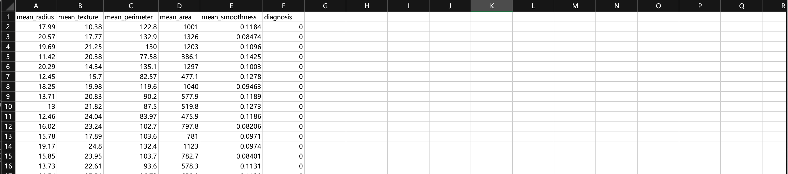 
[Breast_cancer_data.csv] 
데이터 특징은 유바암 조직의 데이터로 구성되었습니다. 
결과인 조직이 악성종양인지 양성종양인지  분류하는 '0'와 '1' 로 구분됩니다.

## **2. AI 모델 만들기**

### **1) 데이터 업로드하기**

{: width="600px",hight="300px" } 
데이터 업로드를 위해 DS2 DATASET을  클릭합니다.

 

{: width="600px",hight="300px" } 
인공지능 개발을 위한 데이터 추가를 위해 데이터 추가하기를 클릭합니다.

 

{: width="600px",hight="300px" } 
다운 받은 데이터는 .csv파일이기 때문에 CSV를 클릭하고 다음을 누릅니다.

{: width="600px",hight="300px" } 
파일찾기 버튼을 클릭하여 다운받을 데이터를 클릭하여 업로드 합니다. 

 

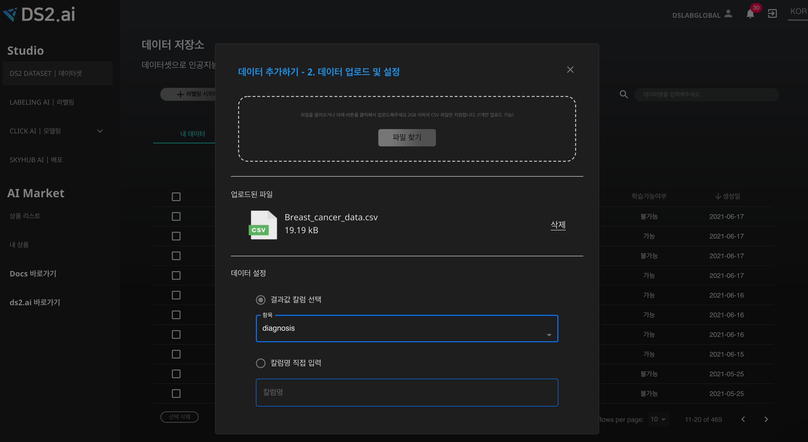{: width="600px",hight="300px" } 
업로드된 파일을 확인할 수 있으며 데이터 설정에 결과값 컬럽을 선택해 주세요. 

 

{: width="600px",hight="300px" } 
데이터가 업로드 중입니다.

 

### **2) 인공지능 개발하기**

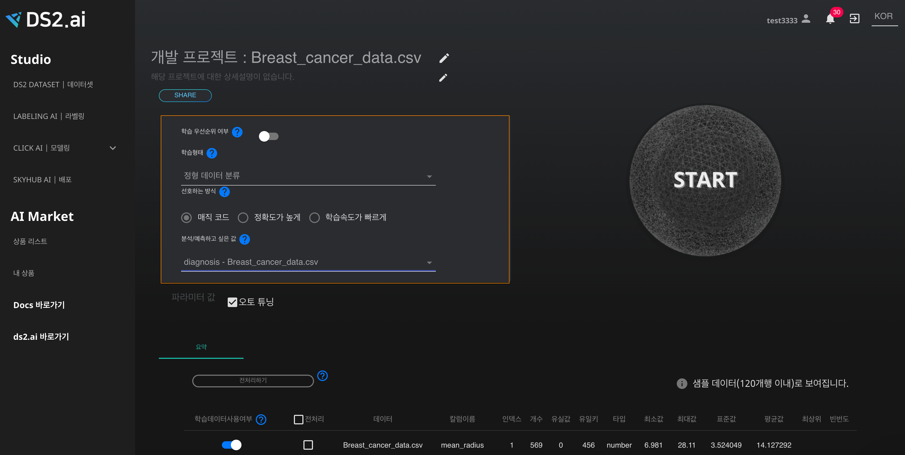{: width="600px",hight="300px" } 
해당 프로젝트에 맞는 학습형태, 선호하는 방식을 선택해 주세요. 
 1. 학습형태는 '정형 데이터 분류' 를 선택합니다.  
 2. 선호하는 방식은 3가지로 나뉘어져 있으며, '매직 코드' 방식을 선택하겠습니다. 
 3. 분석/예측하고 싶은 값에 'diagnosis- Breast_cancer_data.csv'을 입력합니다.  

 

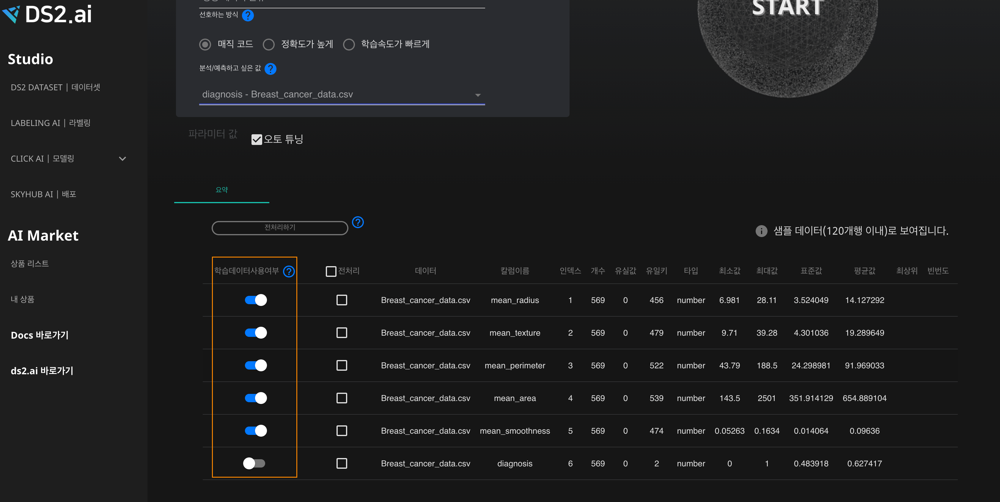{: width="600px",hight="300px" } 
하단을 보면 데이터 요약과 더불어 학습데이터 사용여부를 선택할 수 있습니다.   (분석/예측하고 싶은 값은 자동으로 사용여부가 해제됩니다.)

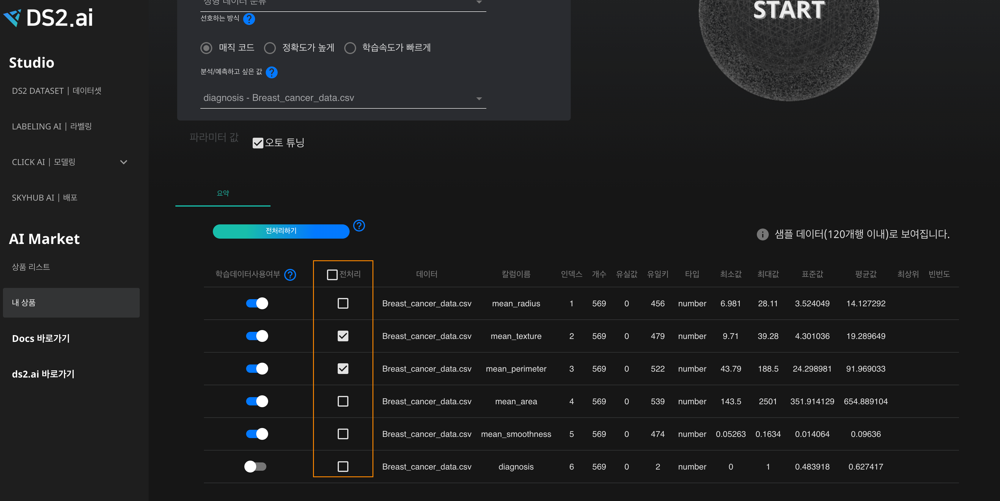{: width="600px",hight="300px" } 
데이터 전처리를 선택하여 전처리 하기를 원하는 값을 선택하여 전처리 할 수 있습니다. 
전처리 필요 시 전처리하기 버튼을 클릭하여 전처리를 실행합니다.전처리에 대한 자세한 설명은 [데이터 전처리](./ds2_clean_data.md)에서 확인하실 수 있습니다.

 

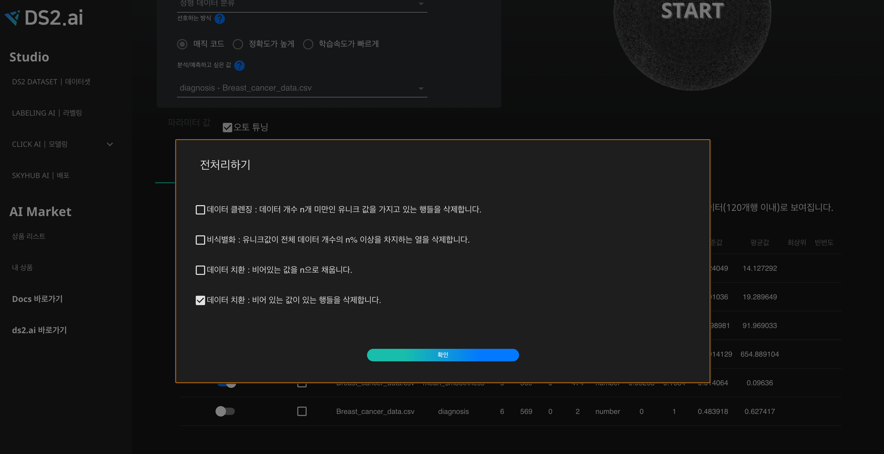{: width="600px",hight="300px" } 
원하는 전처리 기능들을 선택하고 완료를 클릭합니다.

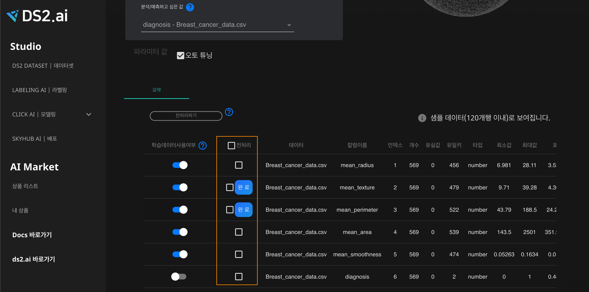{: width="600px",hight="300px" } 
완료된 전처리는 완료 표시를 통해 확인할 수 있습니다.

 

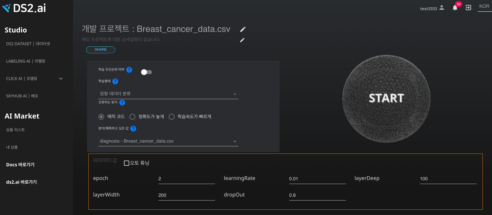{: width="600px",hight="300px" } 
매직 코드에는 파라미터 값을 설정을 하여 사용자가 직접 모델의 파라미터 값을 세팅하여 모델링을 할 수있습니다. 

 

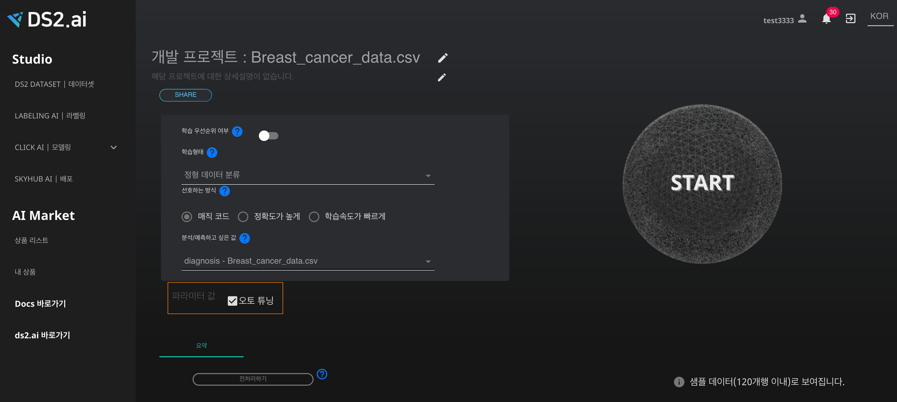{: width="600px",hight="300px" } 
CLICK AI의 최적값으로 셋팅한 파라미터 값을 이용을 원하시면 오토 튜닝을 클릭합니다. 

 

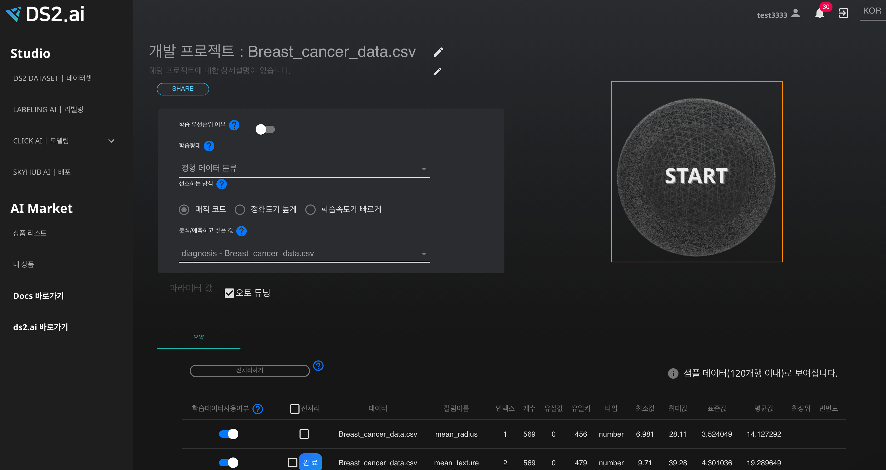{: width="600px",hight="300px" } 
모든 작업이 완료 된 후, 오른쪽 상단의  Start을 클릭하여 인공지능을 생성합니다.

 

## **3. 매직코드 실행하기**

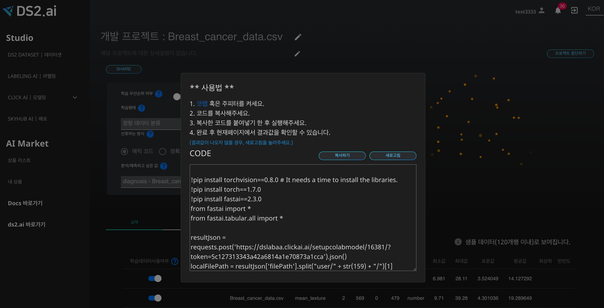{: width="600px",hight="300px" } 
CLICKAI는 모델 생성을 위한 코드를 제공해 드립니다. 원하시는 환경(코랩 또는 주피터)을 선택하여 열어주세요.

 

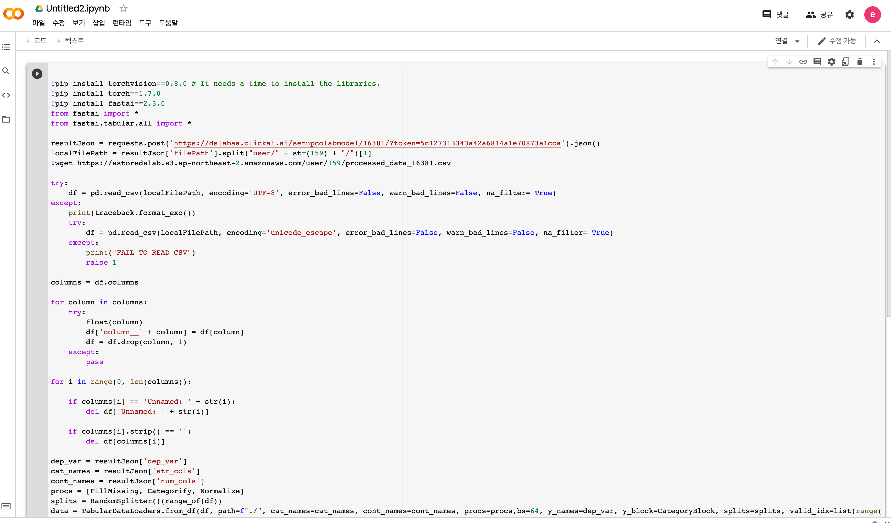{: width="600px",hight="300px" } 
원하시는 환경에서 코드를 복사하여 코렙 혹은 주피터 셀에 붙여넣기를 하여 실행하기(Shift + Enter)를 클릭하여 해당 코드를 실행 시켜주세요.

 

{: width="600px",hight="300px" } 
생성 완료된 인공지능 프로젝트는 AutoML에서 확인할 수 있습니다.

 

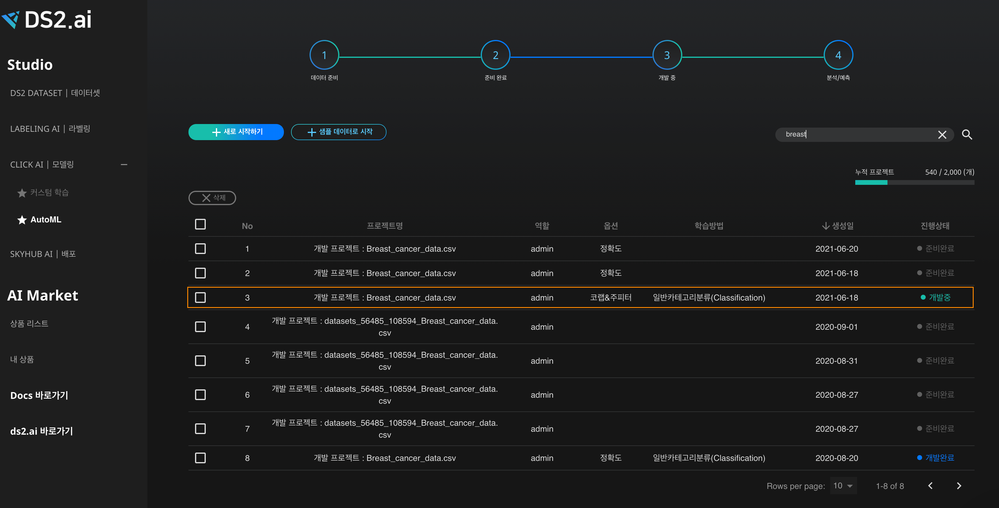{: width="600px",hight="300px" } 
인공지능 진행상태를 확인 할 수있습니다.

 

 
 
 
 
 
