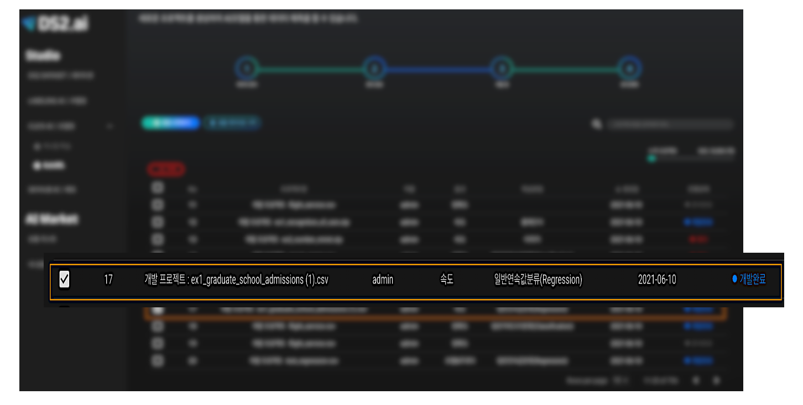
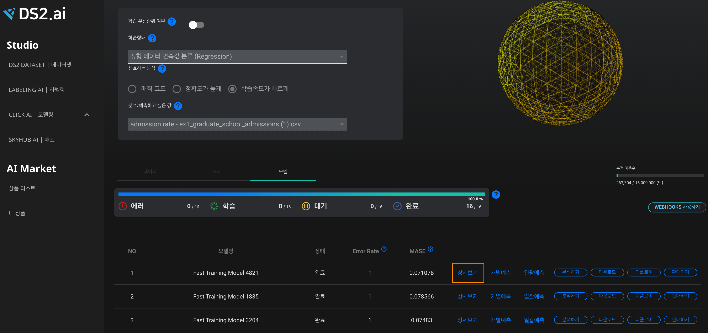
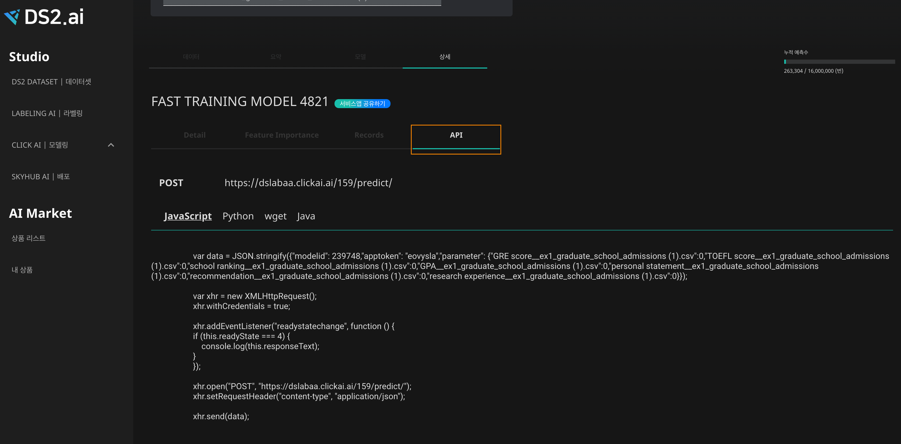
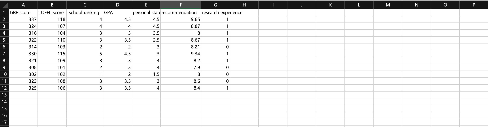

# **API 사용 예측 **

## **API 사용 예측  이란 ?** 

API(어플리케이션 프로그래밍 인터페이스)는 인공지능의 구현 방식을 알지 못해도, 제품 또는 서비스가 서로 커뮤니케이션 할 수 있으며, 어플리케이션 개발을 간소화하여 시간과 비용을 절약 할 수 있습니다.

CLICK AI에서 제공하는 API는 생성된 인공지능으로 매번 예측값을 구하는 수고스러움을 대신하여 프로그래밍을 통하여 자동화 하도록 해줍니다.

## **1.  API 사용하기**

<center>
 {: width="700px",hight="300px" }<br>
개발이 완료된 인공지능 중 하나를 선택하여 클릭합니다.(위의 선택된 예제는 정형 데이터 연속값 분류 예제로 사용된 대학원 입학 예측 인공지능입니다.)
</center>    

<center>
 {: width="700px",hight="300px" }<br>
'상세보기'를 클릭합니다.
</center>

<center>
 {: width="700px",hight="300px" }<br>
상세보기란에 있는 'API'를 통해서 각 프로그래밍 언어별로 API를 받을 수 있습니다. 
</center>

## **2.  예측하기**
### **1) 계별예측**
```python
import requests
import json

url = "https://dslabaa.clickai.ai/159/predict/"

payload = {"modelid":239748,"apptoken":"eovysla",
           "parameter": {"GRE score__ex1_graduate_school_admissions (1).csv":325,
                          "TOEFL score__ex1_graduate_school_admissions (1).csv":100,
                          "school ranking__ex1_graduate_school_admissions (1).csv":1,
                          "GPA__ex1_graduate_school_admissions (1).csv":3,
                          "personal statement__ex1_graduate_school_admissions (1).csv":3,
                          "recommendation__ex1_graduate_school_admissions (1).csv":9,
                          "research experience__ex1_graduate_school_admissions (1).csv":1}}
headers = {
             'content-type': "application/json",
             'cache-control': "no-cache",
           }

response = requests.request("POST", url, data=json.dumps(payload), headers=headers)

print(response.text)
```
위와 같이 CLICK AI에 기재되어 있는  API 코드를 복사하여 붙여 놓은 뒤, 각 파라미터에 맞는 값을 입력 후 실행시키면 예측결과값을 얻을 수 있습니다.


### **2) 일괄예측**

일괄예측 테스트를 위하여 예측하고 싶은 값을 graduation rate test.csv 파일에 입력합니다. 

<center>
 {: width="700px",hight="300px" }<br>
[graduation rate test.csv]
</center>


```python

import requests
import json

url = "https://dslabaa.clickai.ai/159/predict/"

# sample = 샘플데이터
sample = pd.read_csv('graduation rate test.csv', index_col=0)

for _, row in sample.iterrows():
	payload = {"modelid":239748,"apptoken":"eovysla",
	           "parameter": {"GRE score__ex1_graduate_school_admissions (1).csv":row[0],
                          "TOEFL score__ex1_graduate_school_admissions (1).csv":row[1],
                          "school ranking__ex1_graduate_school_admissions (1).csv":row[2],
                          "GPA__ex1_graduate_school_admissions (1).csv":row[3],
                          "personal statement__ex1_graduate_school_admissions (1).csv":row[4],
                          "recommendation__ex1_graduate_school_admissions (1).csv":row[5],
                          "research experience__ex1_graduate_school_admissions (1).csv":row[6]}}
headers = {
             'content-type': "application/json",
             'cache-control': "no-cache",
           }

response = requests.request("POST", url, data=json.dumps(payload), headers=headers)

print(response.text)
```
혹은 파일을 업로드 하여, API를 이용하여 일괄예측이 가능합니다.
<br>
<br>
<br>
<br>
