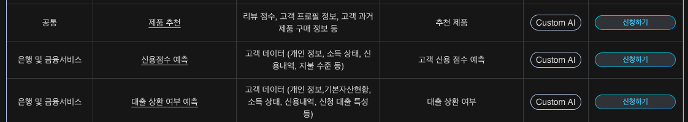
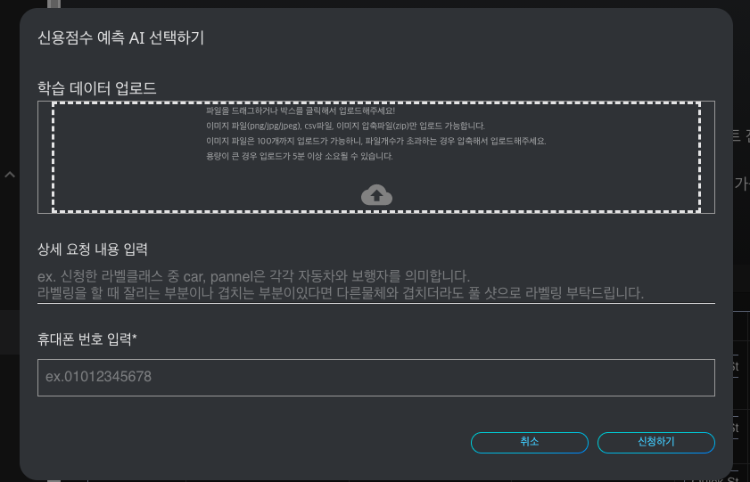

# **Custom AI**

각 산업군에 맞는 활용되어 있는 인공지능 리스트 입니다. AI market을 통해 산업군 별로 사용 가능한 인공지능을 활용해서 비즈니스에 도입해보세요!

- 해당 인공지능 생성 및 이용을 위한 내용을 확인하시고, 학습데이터를 수집해 보세요.
- 리스트에 없는 모델일지라도 데이터만으로 직접 개발하거나 개발을 요청할 수 있습니다.

### **Custom AI 상품 리스트**

- **공통**: 제품 추천
- **은행 및 금융 서비스**: 신용점수 예측, 대출 상환 여부 예측, 상품 서비스 분석 및 추천, 자금 세탁 방지 및 예측, 고객 이탈 방지, 무역 감시
- **보험**: 보험 상품 추천, 클레임 분석 및 보험 사기 예측, 보험 가입 심사 간소화, 견적 자동화, 고객 이탈 방지 및 예측, 잠재 고객 발굴, 건강 보험 비용 예측
- **제조**: 수익 최적화, 재고 최적화, 예측 정비, 안전 모니터링, 불량 예측, 제품품질 분류, 공사장 안전모 착용 모니터링, 수요 예측
- **물류**: 수요 예측, 재고 최적화를 통한 창고 관리, 주문 관리 최적화, 선박 유지 보수 관리, 배송 지연 예측
- **마케팅**: 타겟팅 분석 및 예측, 평판관리 및 개선(감정인식 분석), 챗봇 알고리즘 개선, 고객 이탈 방지 및 예측
- **경영**: 전략기획 - 광고 예산 관리, 전략 기획 - 판매 예측, 전략 기획 - 가격 최적화, HR - 직원 인사 관리, 총무 - 건물 관리, HR- 채용 관리, 마케팅 - 고객 구매 상품 예측, 마케팅 - 이탈 고객 예측, 영업관리 - 제품 재고 확인
- **농산/축산/수산**: 농산물 수확량 예측, 농약 살포량 예측, 가축 생산 최적화, 강아지, 고양이 품종 분류, 동물 인식
- **에너지**: 에너지 소비 이상탐지, 시간별 에너지 사용량 예측, 예측 정비, 전기 계약 용량 최적화
- **공공/법률**: 승소 확률 예측
- **방위**: 총기 소지 여부 판별, 산불 모니터링
- **기타**: 원자재 가격 예측, 음식 서비스 최적화, 고객 분석, 재난 탐지 및 인명 구조, 위해 물품 감지, 스포츠 인식, 자율주행 시멘틱 세그멘테이션, 교통 수단 및 도로 시설 인식

### Custom AI 사용 방법

{: width="700px",hight="300px" }  

DS2.AI 콘솔의 AI Market 중 '상품 리스트'를 클릭합니다. 리스트에 있는 Custom AI 중 사용하고자 하는 인공지능의 '신청하기' 버튼을 선택합니다.

{: width="700px",hight="300px" }  

Custom AI 개발을 신청하기 위해서는 학습을 위한 데이터, 상세 내용, 휴대폰 번호가 필요합니다. 해당 사항을 입력하신 후 '신청하기'를 클릭하시면 Custom AI 개발 신청이 완료됩니다.
