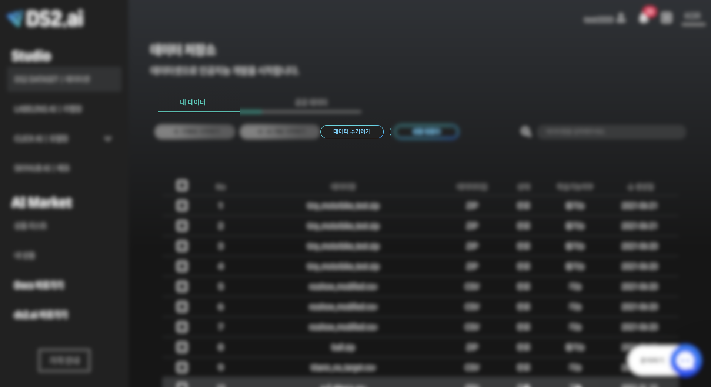
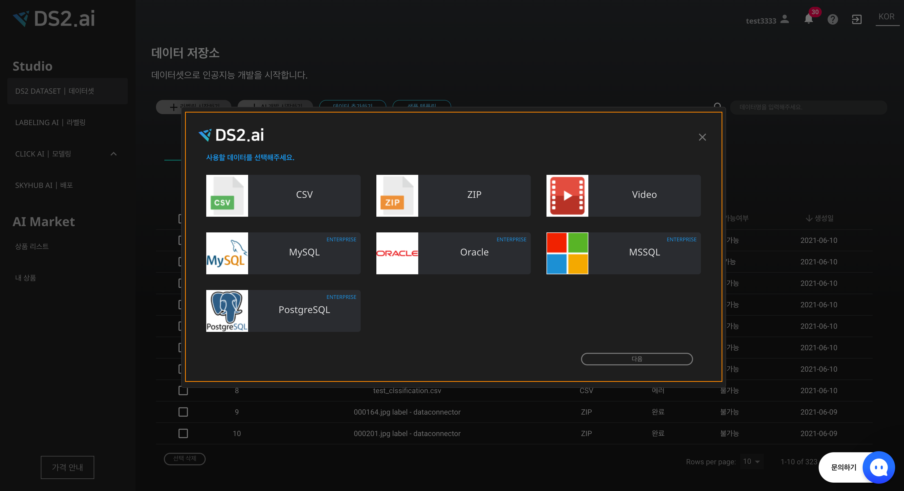

# **학습 데이터 연동**

[영상](https://s3-us-west-2.amazonaws.com/secure.notion-static.com/17a995b6-28e2-4461-ab73-7bfeda7c1da1/_.mp4)

인공지능 개발의 첫번째 단계는 인공지능 학습을 위한 데이터 준비입니다. 

DS2 DATASET 에서는 개인 컴퓨터에 있는 데이터를 직접 업로드하거나  데이터베이스 관리시스템과 연동하여 데이터를 불러올 수 있습니다.

데이터 업로드는 CSV, ZIP, Video(MP4, MOV) 파일 형식을 지원하며, 데이터베이스 관리시스템은 MySQL, Postgre SQL, Oracle, MSSQL 등의 연동을 지원합니다. 

## **1. 지원하는 데이터 형식**

| 데이터 종류   |      데이터      |    인공지능   |  별도 문의 |
|:----------:|:-------------------:|:-------------------:|:----------:|
| CSV |  텍스트 데이터  | 카테고리 분류 모델, 연속값 분류 모델, 자연어 분류, 시계열 처리, 추천 시스템 |No|
| Video(MP4, MOV) |  비디오 데이터 | 물체인식 |No|
| ZIP  |    이미지 데이터  |  이미지 분류, 물체인식 |No|
| DB | PostgreSQL, Oracle, MSSQL, MySQL | 카테고리 분류 모델, 연속값 분류 모델, 자연어 분류, 시계열 처리, 추천 시스템 |Yes|

## **2. 데이터 업로드**

{: width="700px",hight="300px" }  
[데이터 추가하기] 버튼을 클릭하여 내 컴퓨터에 저장되어 있는 데이터를 [DS2.ai](http://ds2.ai) 인공지능 개발 서버로 업로드할 수 있습니다.

### 2-1. 데이터 형식 선택

{: width="450px",hight="300px" }  
업로드하고자 하는 데이터 형식을 선택하고 다음 버튼을 클릭합니다.
 
 

{: width="450px",hight="300px" }  
DBMS 선택시, 문의하기 채널로 연결됩니다.

### 2-2. 데이터 업로드 및 설정

{: width="450px",hight="300px" }   
상단에 점선으로 이루어진 네모상자에 파일을 끌어오거나 [파일찾기] 버튼을 클릭하여 업로드해주세요.

데이터 형식에 따라 업로드 제한 사항 및 데이터 설정 내용이 다르므로, 개발하고자 하는 인공지능과 업로드 데이터 형식에 따라 알맞게 설정합니다.

|     데이터 종류     |     파일 제한사항     |    데이터 설정  |
|:----------------:|:-------------------|:-------------------|
| CSV |  2GB 이하의 CSV 파일 1개만 업로드 가능 | 결과값 컬럼 선택 또는 직접 입력|
| Video(MP4, MOV) |  5GB 이하의 MP4, MOV파일 1개만 업로드 가능 | 프레임 값(1~600 사이의 분당 프레임값 입력(기본값: 60)|
| ZIP  |   압축파일은 최소 10장 이상의 이미지를 포함해야 함. 1GB 이하의 ZIP 파일만 업로드 가능. 압축된 이미지 파일은 PNG/JPG/JPEG/MP4 형식만 지원. 1개만 업로드 가능.  | 압축 파일 내 라벨링 데이터 포함 |
