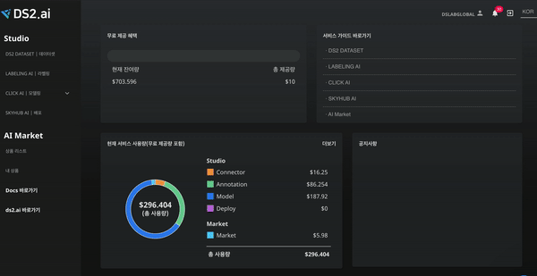
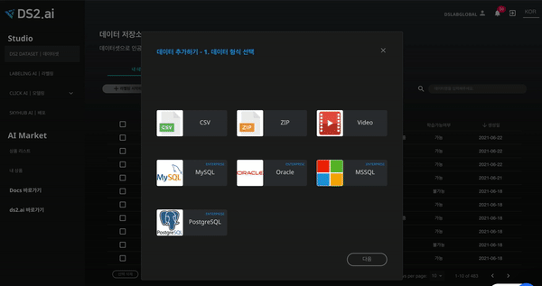
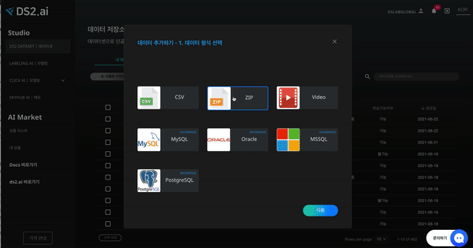
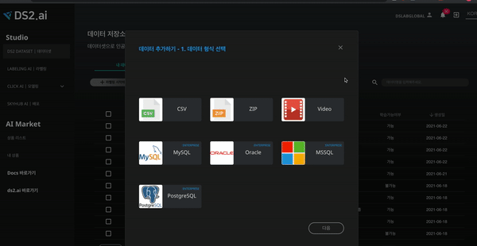

# **학습 데이터 연동**

## ** 1) 학습 데이터 연동 **  
인공지능 개발의 첫번째 단계는 인공지능 학습을 위한 데이터 준비입니다. DS2 DATASET 에서는 개인 컴퓨터에 있는 데이터를 직접 업로드하거나  데이터베이스 관리시스템과 연동하여 데이터를 불러올 수 있습니다.

데이터 업로드는 CSV, ZIP, Video(MP4, MOV) 파일 형식을 지원하며, 데이터베이스 관리시스템은 MySQL, Postgre SQL, Oracle, MSSQL 등의 연동을 지원합니다. 

## **2)  지원하는 데이터 형식**

| 데이터 종류   |      데이터      |    인공지능   |  별도 문의 |
|:----------:|:-------------------:|:-------------------:|:----------:|
| CSV |  텍스트 데이터  | 카테고리 분류 모델, 연속값 분류 모델, 자연어 분류, 시계열 처리, 추천 시스템 |No|
| Video(MP4, MOV) |  비디오 데이터 | 물체인식 |No|
| ZIP  |    이미지 데이터  |  이미지 분류, 물체인식 |No|
| DB | PostgreSQL, Oracle, MSSQL, MySQL | 카테고리 분류 모델, 연속값 분류 모델, 자연어 분류, 시계열 처리, 추천 시스템 |Yes|

## **2. 데이터 업로드**

### **2-1. 데이터 형식 선택 **

[데이터 추가하기] 버튼을 클릭하여 내 컴퓨터에 저장되어 있는 데이터를 [DS2.ai](http://ds2.ai) 인공지능 개발 서버로 업로드할 수 있습니다. CSV, ZIP(Png,Jpg,Jpeg,Gif), Video(MP4, MOV) 파일 형식을 지원하며, 데이터베이스 관리시스템은 MySQL, Postgre SQL, Oracle, MSSQL 등의 연동을 지원합니다.

  
{: width="700px",hight="300px" }  

  
|     데이터 종류     |     파일 제한사항     |    데이터 설정  |
|:----------------:|:-------------------|:-------------------|
| CSV |  2GB 이하의 CSV 파일 1개만 업로드 가능 | 결과값 컬럼 선택 또는 직접 입력|
| Video(MP4, MOV) |  5GB 이하의 MP4, MOV파일 1개만 업로드 가능 | 프레임 값(1~600 사이의 분당 프레임값 입력(기본값: 60)|
| ZIP  |   압축파일은 최소 10장 이상의 이미지를 포함해야 하며 1GB 이하의 ZIP 파일만 업로드 가능   \* 압축된 이미지 파일은 PNG/JPG/JPEG/Gif 형식만 지원 하며 1개만 업로드 가능  | 압축 파일 내 라벨링 데이터 포함 |

### **1) CSV 파일**  

  
{: width="700px",hight="300px" }  
상단에 점선으로 이루어진 네모상자에 파일을 끌어오거나 [파일찾기] 버튼을 클릭하여 업로드해주세요.  
  \* 데이터 설정에 결과값(예측값) 컬럼을 선택합니다.

      

### **3) Zip 파일**  

    
{: width="700px",hight="300px" }    
상단에 점선으로 이루어진 네모상자에 파일을 끌어오거나 [파일찾기] 버튼을 클릭하여 업로드해주세요. 
  \* 데이터 설정에 압축파일 내 라벨링 데이터 포함을 클릭합니다.

    

### **4) Video 파일**  

    
{: width="700px",hight="300px" }    
상단에 점선으로 이루어진 네모상자에 파일을 끌어오거나 [파일찾기] 버튼을 클릭하여 업로드해주세요. 
 \* 데이터 설정에 프레임 값을 설정해 줍니다. 프레임 값(1~600) 사이의 분당 프레임값 입력 (기본값: 60)

    

### **5) 데이터 베이스**  

    
{: width="700px",hight="300px" }       
MYSQL에 접속하여 데이터를 업로드하기 위해서 필요한 정보들을 입력 후에 다음을 클릭합니다.  
  \* 데이터 베이스 (MySQL, Postgre SQL, Oracle, MSSQL) 의 연동을 위해서는 별도의 문의가 필요합니다.

    
 
 
 
 
 