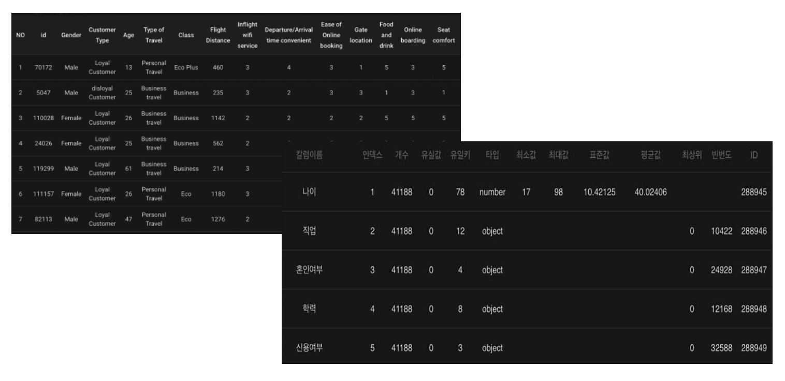

# **학습 데이터 정제**

## **학습 데이터 정제**

데이터는 새로운 인공지능 생성 및 기존 인공지능 개선에 있어 가장 중요한 요소입니다. 양질의 데이터로 학습한 인공지능은 보다 정확한 예측이 가능하고, 정확한 예측이 이루어질 때 유용한 인사이트를 얻을 수 있기 때문입니다.  따라서 좋은 인공지능을 생성하기 위해서는 이에 적합한 데이터(이미지, 텍스트, 시계열, 사운드, 정형 데이터)를 사용해야 하며, 인공지능이 잘 학습할 수 있도록 알맞은 전처리 작업을 진행해야 합니다. 

이와 더불어 인공지능에 이용할 데이터의 관리 전략도 필요합니다.  대용량의 학습 데이터를 일일이 확인하며 파악하는 것은 시간이 오래 걸리는 작업입니다. DS2 DATASET를 통해 시간이 많이 걸리는 작업을 자동화하는 기본 업로드 도구, 통합 데이터 품질 및 데이터 준비 도구를 통해 데이터 준비를 간소화합니다.

*  데이터 결합
*  데이터 요약
*  데이터 전처리

## **1. 데이터 결합**

인공지능 학습을 위한 최적의 데이터셋은 하나의 데이터셋 안에 인공지능 개발에 필요한 모든 정보가 포함되어 있는 경우 입니다. 하지만 하나의 데이터 파일로는 정보가 부족할 때, 혹은 다른 추가적인 데이터가 필요할 때, 우리는 더 높은 신뢰도 혹은 정확도를 가진 인공지능을 위해서 필연적으로 두 개 이상의 데이터를 결합해야 합니다. 일반적으로 프로그래밍을 이용하거나 엑셀을 통해 할 수 있지만, 프로그래밍의 경우 이에 대한 전문적인 지식이 있어야 한다는 전제가 있고 또한, 엑셀을 이용한 작업은 시간적 비용이 많이 드는 노동입니다. 

DS2 Dataset에서는 언급된 두 가지 방법을 대신해서 클릭만으로 데이터를 쉽게 결합하는 방법을 제공하며, 데이터 결합은 텍스트 기반의 인공지능 모델에 한해서 적용됩니다.
>[!TIP]
> 두개의 데이터 셋에 공통 컬럼이 존재하여야 데이터 결합이 가능합니다.  

 {: width="600px",hight="200px" } 
 <데이터 결합>

## **2. 데이터 요약**

DS2 DATASET는 데이터 미리보기 또는 통계 데이터를 확인해 데이터 탐색을 통해 데이터 품질을 모니터링 할 수 있기 때문에 데이터를 신뢰할 수 있습니다. 

 {: width="700px",hight="300px" } 
 <데이터 요약 및 통계치 보기>

### **1) 데이터 미리보기**

데이터 요약을 통해 원본데이터를 확인 할 수 있습니다. 인공지능에 학습할 데이터를 미리 확인을 해서 데이터를 탐색하고 이해하는데 도움이 됩니다. 데이터에 포함되어 있는 각 컬럼의 속성을 파악해서 전처리가 필요한 컬럼을 확인하는 단계입니다.
### **2) 데이터 통계치 보기**

데이터의 각 컬럼의 정보를 확인할 수 있습니다. 각 컬럼의 유실값, 유일키, 타입, 최소값, 최대값, 표준값, 평균값, 빈번도 등을 확인하여 결측값 인공지능 생성의 정확도를 저하시키는 값을 확인 하고 필요하지 않는 컬럼을 제외 할 수 있습니다. 

###  **
 통계값 지표
**

| 통계값 지표  |      설명     | 
|:----------:|:-------------------:|
| 유실값|  공란인 데이터의 갯수를 표시합니다.  | 
| 최대값  |    해당 컬럼에서 최댓값을 표시합니다. | 
| 표준값 | 데이터의 분포된 정도를 바탕으로 특정 수치의 가치를 검토하기 쉽게 표준화한 값입니다. | 
| 평균값 | 해당 컬럼의 모든 값을 더하여 데이터 갯수로 나눈 평균을 표시합니다.| 
| 최상위 | 카테고리 데이터중 빈번도가 높은 인덱스 값입니다. | 
| 빈번도 | 카테고리 데이터의 빈번도가 높은 인덱스의 빈번도를 나타냅니다. | 

## **3. 데이터  전처리**

데이터는 양뿐만 아니라 질 또한 중요합니다. 데이터 전처리란, 보다 정확한 결과물을 위해 데이터의 품질을 향상시키는 작업을 의미합니다.이러한 작업을 통해 데이터 수집과정에서 생긴 오류를 줄여 설명력이 높은 데이터를 만드는 작업을 합니다. 데이터 전처리는 데이터 과학/분석 단계 중 가장 중요한 작업으로써, 가장 많은 시간 투자가 필요한 작업입니다. DS2 DATASET 는 데이터 품질을 향상시킬 수 있는 보편적인 방법을 자동화하여 간편하고 신속하게 전처리를 수행할 수 있습니다.
 

###   **데이터 품질을 저해하는 주요 원인**

| 원인   |      결과    | 
|:----------:|:-------------------|
| 공란 데이터 값의 존재|  - 결측값을 통해 중요한 정보의 손실   - 신뢰성 없는 모델 결과  | 
| 동일한 데이터 값의 서로 다른 표기 | - 데이터 품질의 문제로 인한 정보의 왜곡  - 신뢰성 없는 모델 결과   - 일관성을 잃은 데이터  | 
| 형식에 맞지 않는 데이터 값의 존재 | - 데이터 품질의 문제로 인한 정보의 왜곡  - 신뢰성 없는 모델 결과  | 
| 유니크값만으로 이뤄진 값 | - 신뢰성 없는 모델 결과 | 
| 중복된 데이터 값  | - 데이터 품질의 문제로 인한 정보의 왜곡  - 스토리지 사용량의 비용 발생  - 데이터 편향성 발생  |  

DS2 DATASET은 이러한 데이터 품질을 저해하는 주요 원인을 없애기 위해 전처리 작업을 제공합니다. 

### **데이터 전처리 기능**

**1) 데이터 클렌징**

상대적으로 데이터 개수와 비교하여 유니크 값이 너무 적을 경우, 데이터 품질의 저해를 야기할 수 있습니다. 이것은 곧, 인공지능 학습에 저해를 발생시킬 수 있기 때문에, 이런 데이터는 삭제를 권장합니다. 일반적으로 데이터 5개 미만인 유니크 값을 가지고 있는 행들의 삭제를 추천하며, 데이터의 특성에 따라 다른 값으로 변경하여 삭제 할 수 있습니다.

**2) 비식별화**

데이터 수집시, 데이터가 일정 기준을 가지고 수집이 되지 않고, 무차별적으로 수집이 된다면, 모든 값들이 고유한 값 즉, 유니크값을 가지게 될 수 있습니다. 이렇게 한 열에 대한 데이터 값들의 과반수가 유니크값을 가지게 된다면, 데이터의 품질을 떨어뜨리고 인공지능 학습 또한 저해시킬 수 있기 때문에 해당 열에 대한 삭제를 권장합니다. 일반적으로 80% 이상을 차지할 경우 삭제를 추천하며, 데이터 특성에 따라 변경하게 삭제할 수 있습니다.

**3) 데이터 치환**

데이터 수집시, 온전히 모든 조사를 통해서 데이터 수집을 하기란 쉽지 않습니다. 그렇기 때문에, 수집 과정에서 데이터의 공백이 발생하는데, 데이터 공백은 전체적인 데이터 품질을 떨어뜨리고 신뢰성을 낮추는 원인이 되기 때문에, 공백값에 대한 변경이 필요합니다. 일반적으로 비어있는 값에 대해서 0값으로 채우는 것을 권장하며, 다른 값으로 선택하여 채울 수 있습니다.
 
 
 