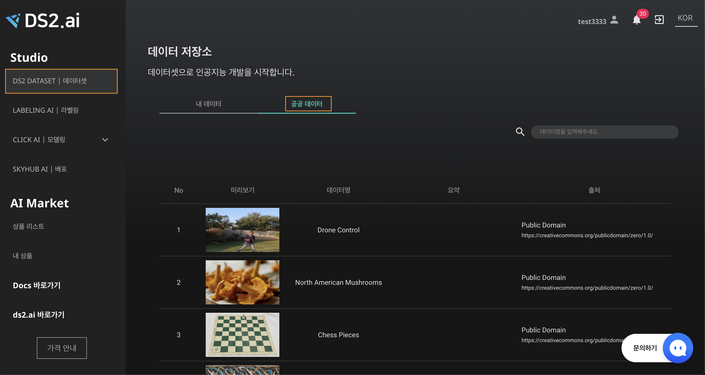

# **공공 데이터 활용**

[DS2.ai](http://ds2.ai)는 기업이나 정부에서 공개한 데이터셋 중, 인공지능 개발에 보다 가치있게 활용할 수 있으리라 판단한 공공데이터를 제공합니다. [DS2.ai 플랫폼](console.ds2.ai)에서는 현재 다양한 산업군에서 활용 가능한 30여개의 이미지 공공데이터를 Labeling AI로 연동하여 사용가능합니다. 공공데이터는 상시 업데이트 예정에 있습니다.  

{: width="700px",hight="300px" }

"DS2 DATASET | 데이터셋 → 공공데이터" 에서 확인하실 수 있습니다.

 
 
 