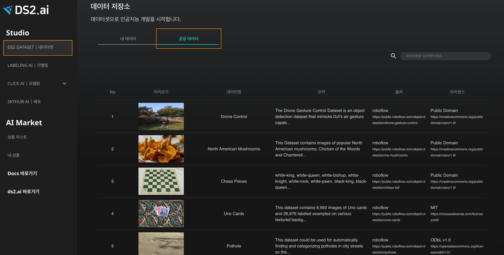

# **공공 데이터 활용**

## **1. 공공 데이터 활용**

[DS2.ai](http://ds2.ai)는 기업이나 정부에서 공개한 데이터셋 중, 인공지능 개발에 보다 가치있게 활용할 수 있으리라 판단한 공공데이터를 제공합니다. [DS2.ai 플랫폼](console.ds2.ai)에서는 현재 다양한 산업군에서 활용 가능한 30여개의 이미지 공공데이터를 Labeling AI로 연동하여 사용가능합니다. 공공데이터는 상시 업데이트 예정에 있습니다.  

## **2. 공공 데이터 활용한 프로젝트 생성**

{: width="700px",hight="300px" } 
"DS2 DATASET | 데이터셋 → 공공데이터" 에서 확인하실 수 있습니다.

 

{: width="700px",hight="300px" } 
원하시는 데이터 셋을 클릭하고 해당 프로젝트를 실행을 실행시키기 위해 라벨링 시작하기를 클릭합니다. 

 

{: width="700px",hight="300px" } 
드론 컨트롤 데이터셋을 이용한 프로젝트를 생성하기 위해 드론(프로젝트 명) 과 물체인식(프로젝트 설명)을 기입하고 데이터 카테고리 선택에 해당 이미지에 알맞는 프로젝트를 설정하여 클릭을 합니다. 

 

{: width="700px",hight="300px" } 
원하시는 데이터 셋을 클릭하고 해당 플로젝트를 실행을 실행시키기 위해 라벨링 시작하기를 클릭합니다. 

 

{: width="700px",hight="300px" } 
물체인식 프로젝트 대시보드를 확인할 수 있으며 공공 데이터를 이용하여 라벨링 프로젝트를 실행할 수 있습니다. 관련 프로젝트 실행을 위해 라벨링 프로젝트[./label_05_image.md] 내용을 확인하여 주세요.

 
 
 