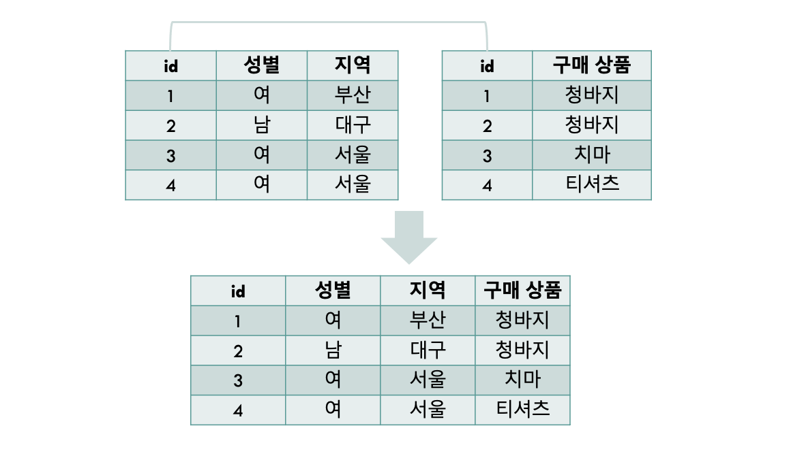
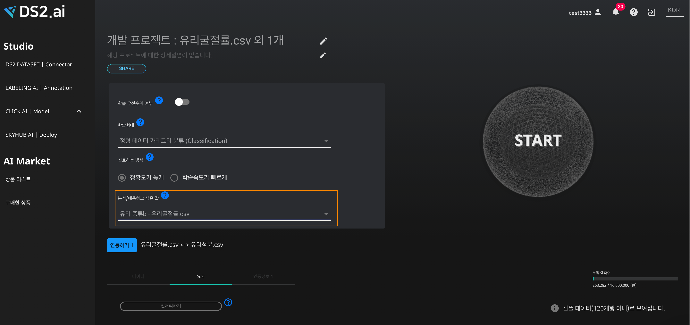

# **학습 데이터 결합**

하나의 데이터 파일안에 우리가 원하는 모든 정보를 가지고 있을 때, 인공지능 학습을 하기에는 더할나위 없이 최고의 상황입니다. 하지만 하나의 데이터 파일로는 정보가 부족할 때 혹은 다른 추가적인 데이터가 필요할 때, 우리는 더 높은 신뢰도 혹은 정확도를 가진 인공지능을 위해서 필연적으로 두 개 이상의 데이터를 결합해야 합니다. 일반적으로 프로그래밍을 이용하거나 엑셀을 통해 할 수 있지만, 프로그래밍의 경우 이에 대한 전문적인 지식이 있어야 한다는 전제가 있고 또한, 엑셀을 이용한 작업은 시간적 비용이 많이 드는 노동입니다. 

DS2 Dataset에서는 언급된 두 가지 방법을 대신해서 클릭만으로 데이터를 쉽게 결합하는 방법을 제공하며, 데이터 결합은 텍스트 기반의 인공지능 모델에 한해서 적용됩니다.

### 데이터 결합 예시

{: width="600px",hight="300px" }  

학습 목표 - 두 가지의 데이터셋을 이용해서 데이터결합 후 인공지능 학습

학습 자료 - 유리굴절률.csv, 유리성분.csv  
[유리굴절률.csv](./dataset/유리굴절률 (1).csv)  
[유리성분.csv](./dataset/유리성분 (1).csv)

위의 두 데이터셋을 살펴보면 서로 다른 데이터를 가지고 있습니다.

{: width="600px",hight="300px" }  
[ 유리성분.csv의 경우, 각 id값을 가진 유리 마다 성분들이 정리되어 있습니다. ]

{: width="600px",hight="300px" }  
[ 유리굴절률.csv의 경우, 각 id값을 가진 유리마다 굴절률과 유리의 종류가 카테고리화되어 1부터 7까지의 숫자로 표기되어 있습니다. ]

유리의 종류를 구분 짓기 위해서는 유리의 굴절률 뿐만 아니라 유리가 가진 성분들이 유리의 종류를 구분 짓는 데 중요한 역할을 합니다. 그렇기 때문에, 위 두 데이터를 결합 할 필요가 있습니다.

### **1. 데이터 업로드**

유리굴절률.csv 파일과 유리성분.csv 파일을 업로드 합니다. 업로드 방법은 
[학습 데이터 연동](./dataset_01_upload.md) 을 참고해주세요 . 

### **2. 데이터 결합**

{: width="700px",hight="300px" }  
[ 업로드한 두 데이터를 클릭하고, AI개발 시작하기를 클릭합니다. ] 

### **3. 인공지능 개발을 위한 전처리**

{: width="700px",hight="300px" }  
카테고리 별로 나뉘어진 유리의 종류를 예측하는 것이기 때문에, 학습형태는 정형 데이터 카테고리 분류를 선택합니다.

{: width="700px",hight="300px" }  
선호하는 방식은 2가지로 나뉘어져 있으며, '정확도가 높게' 방식을 선택하겠습니다.

{: width="700px",hight="300px" }  
최종적으로 예측하고자 하는 값은 유리굴절률.csv 파일에 있는 유리 종류이기 때문에, '유리 종류 - 유리굴절률.csv'를 선택합니다.

{: width="700px",hight="300px" }  
분석/예측하고 싶은 값을 선택하고 나면, 연동하기가 생성됩니다. 연동하기를 하기 위해서, '연동하기1' 혹은 '연동정보1'을 클릭합니다.

{: width="700px",hight="300px" }  
두 데이터가 공통적으로 가지고 있는 데이터는 id 값이기 때문에, 각 데이터셋별로 id를 클릭합니다.

{: width="700px",hight="300px" }  
연동작업이 끝났습니다! 이제 오른쪽 상단의 START 버튼을 클릭하여 인공지능 모델을 생성할 수 있습니다.

{: width="700px",hight="300px" }  
START 버튼을 클릭하면, 모델 생성이 시작되며, 모델생성의 진행사항을 확인할 수 있습니다.