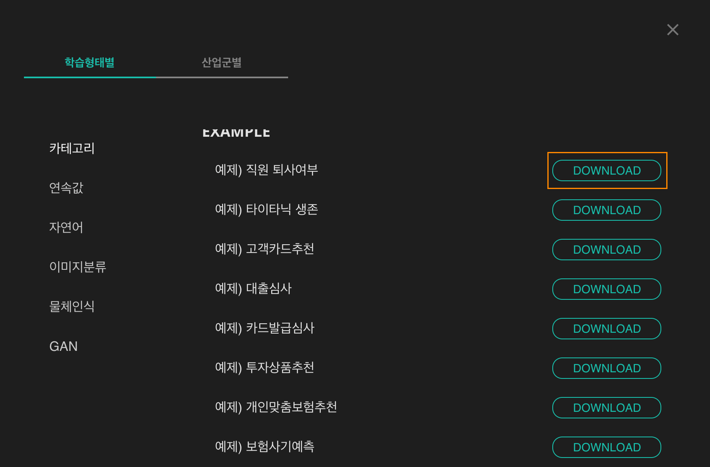
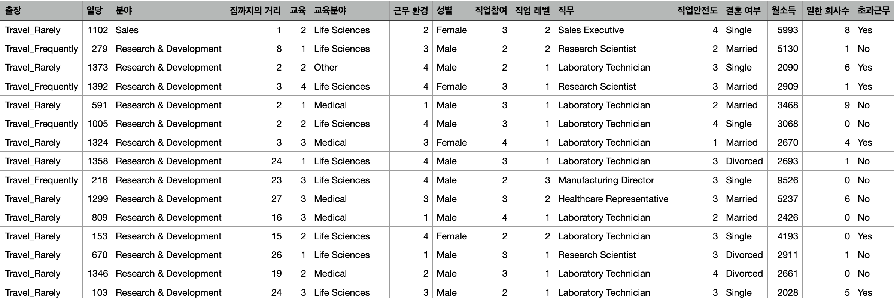

# **재학습용 데이터 수집**

## **1. 샘플 탬플릿이란? **

샘플 탬플릿을 활용하여 인공지능 생성을 하는데 이해도를 높이는데 도움을 주는데 활용할 수 있습니다. 데이터 셋의 구성 요소를 파악하고 인공지능 모델 생성의 전 과정의 프로세스를 파악하여 인공지능 생성 프로젝트를 실행해 보세요.
 
 

|     학습형태 별     |     산업군 별     |  
|:----------------:|:-------------------:|
| &ensp;&ensp;&ensp;카테고리 데이터  &ensp;&ensp; |  &ensp;&ensp;&ensp;금융 및 자산관리&ensp;&ensp;|
| 연속값 데이터  |  보험 | 
| 자연어 데이터 |  제조 | 
| 이미지 분류  |  마케팅 | 
| 물체인식  |  기타 | 
| GAN  |  - | 

## **3. 샘플 탬플릿 활용한 인공지능 생성하기**

{: width="500px",hight="200px" }  
원하시는 형태의 샘플 데이터 셋을 다운로드 합니다. 다운로드된 파일을 이용하여 인공지능을 생성을 할 수 있습니다. 각 데이터 셋에 맞는 학습형태를 선택하여 인공지능 생성을 진행을 해주세요. 

 

{: width="700px",hight="300px" }  
데이터를 확인합니다. 이 데이터는 카테고리 학습형태의 데이터 셋으로 구성되어 있습니다. 카테고리 형태의 데이터 셋을 활용해 인공지능 생성을 위해 [카테고리 분류 모델 생성하기](./ds2_category.md) 페이지를 확인하여 주세요.  
 

관련 자료:  
[카테고리 분류 모델 생성하기](./ds2_category.md)  
[연속값 분류 모델 생성하기](./ds2_continuous.md)  
[자연어 처리 모델 생성하기](./ds2_text.md)  
[시계열 처리 모델 생성하기](./ds2_time.md)  
[추천 시스템 모델 생성하기](./ds2_recommendation.md)  
[이미지 분류 모델 생성하기](./ds2_image.md)  
[물체인식 모델 생성하기](./ds2_imagedetection.md)  
 
 
 
 
 