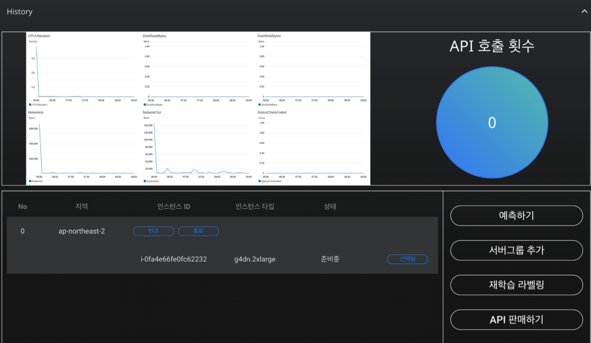

# **대시보드**

## ** 1. 대시보드 역할?  **

대시보드를 이용하여 인스턴스를 모니터링하고 인공지능 구축,배포 및 관리 할 수있습니다. 인공지능 운영 환경의 실시간 모니터링하여 구축된 인공지능 파이프라인의 서버를 실시간으로 모니터링하고 이슈에 대해 신속하게 대응할 수 있습니다. 현재 이용하고 있는 인스턴트확인이 가능하며  최소 및 최대 용량 한도를 지정하여 서버 사용에 장애로 인한 과도한 비용이 발생하지 않도록 방지하고 있습니다. 

## ** 2. 대시보드 활용 방법  **

    **SKYHUB AI 대시보드** 
{: width="700px",hight="300px" }  

 

### **1) 지표**

사용량 지표 측정이 가능합니다. 다음과 같은 상태 확인 지표를 이용하여 실시간으로 이용량 및 이슈를 확인 할 수 있습니다.  
**CPU utilization** 
  : CPU 사용률은 컴퓨팅 작업의 유형과 양에 따라 달라질 수 있습니다.
  
**DiskReadBytes** 
  : 기간 당 사용한 볼륨에 대한 모든 디스크에서 읽은 바이트 수를 표시합니다. 

**DiskWriteBytes**
  : 디스크에 기록 된 총 바이트 (MB)를 표시합니다.

**NetworkIn** 
  : 인스턴스로 들어오는 네트워크 트래픽의 볼륨, 인스턴스가 받은 바이트 수를 표시합니다. 

**NetworkOut**
  : 인스턴스가 보내는 네트워크 트래픽의 볼룸, 인스턴스에서 나가는 바이트 수를 표시합니다. 

**StatusCheckFailed** 
  : 인스턴스의 상태를 확인 가능 합니다. 인스턴스 상태 확인이 통과하면 "0"이고 그렇지 않으면 "1"입니다.

### ** 2) 기능   **

텍스트 수동 라벨링은 학습 데이터의 라벨을 직접 생성하는 작업입니다.  자연어 데이터인 영화 리뷰가 나열된 텍스트 데이터를 수동 라벨링 할 수 있습니다. 예를 들어, 영화 리뷰가 나열된 텍스트 데이터를 수동 라벨링 할 수 있습니다. 

Labeling AI에서는 직접 라벨링 클래스의 개수와 이름을 정해야 합니다. 예를 들어, 위의 영화 리뷰 데이터 분석 프로젝트에서 라벨 클래스를 긍정(1), 부정(0)으로 라벨링 할 수 있습니다. AI 모델은 각 텍스트 데이터를 자연어처리로 분석하여 라벨링 값인 1, 0과의 관계를 학습할 것입니다.

#### **
 텍스트 데이터 라벨링 
**
|  서비스 기능  | 설명  | 
|:----------:|:-------------------:|
|  예측하기  |완성된 인공지능을 이용하여 인공지능은 분석 결과를 바탕으로 데이터 예측을 수행할 수 있습니다.  |  
|  서버그룹 추가   |사용하시는 서버에 새로운 서버를 추가하여 가용성을 늘릴수 있습니다. 비정상적으로 작동된 인스턴트를 중단하고 새로운 인스턴트를 이용하여 유연하게 대체 가능합니다.   |  
|  재학습     |    초기 학습 데이터에 SKYHUB AI에 의해서 수집된 데이터를 추가하여 인공지능을 재학습 할 수있습니다.  |
|  API 판매    |SKYHUB AI는 완성된 AI를 신속하게 배포하고 사용할 수 있도록 4가지 언어의 API를 자동 생성합니다. |
|  API 호출 횟수  |  API를 이용하여 AI를 배포한 횟수를 의미합니다. |

### **3) API 호출 (python) 코드**  -> tab 으로 바꿀예정

           ''' import requests
          import json

          url = "https://api.clickai.ai/159/predict/"

          payload = {"modelid":228551,"apptoken":"1c4f41ac9a02404dada5023f3e20a3b9","parameter": {"나이__은행마케팅.csv":0,"직업__은행마케팅.csv":"","혼인여부__은행마케팅.csv":"","학업__은행마케팅.csv":"","신용카드 소지 여부__은행마케팅.csv":"","연봉__은행마케팅.csv":0,"집담보 대출__은행마케팅.csv":"","기타 대출__은행마케팅.csv":"","연락 방법__은행마케팅.csv":"","최근 연락한 날 (일)__은행마케팅.csv":0,"최근 연락한 날 (월)__은행마케팅.csv":"","최근 연락 기간__은행마케팅.csv":0,"최근 켐페인 참가 여부__은행마케팅.csv":0,"최근 켐페인 이후 시간 소요 (일)__은행마케팅.csv":0,"최근 켐페인 이후 연락 횟수__은행마케팅.csv":0,"이전 마케팅 성공 여부__은행마케팅.csv":""}}
          headers = {
            'content-type': "application/json",
            'cache-control': "no-cache",
            }

          response = requests.request("POST", url, data=json.dumps(payload), headers=headers)

          print(response.text) ''' 

 
 
 

