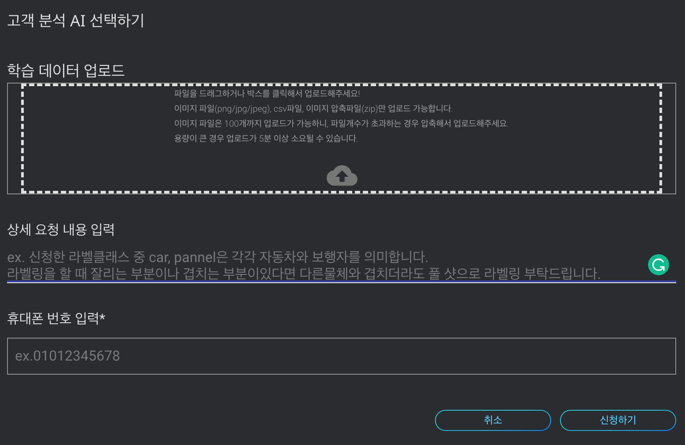
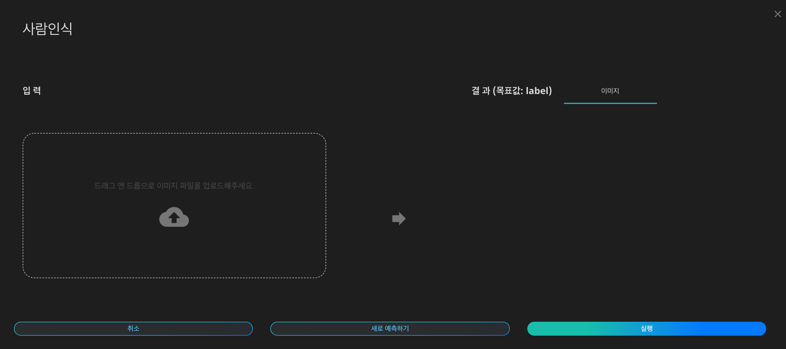

# **AI Market**

## **1. AI Market 이란?** 

DS2.AI의 AI Market을 통하여 AI 모델을 자유롭게 사고 팔 수 있습니다.

DS2.AI에서 제공하는 AI Market 플랫폼은 자사 자체적으로 개발한 인공지능과 더불어 외부에서 사용한 AI를 업로드해 판매하거나, 개발자들이 직접 개발한 모델을 할 수도 있습니다. 인공지능 제작자의 권리를 보호하고 유해 파일의 유통과 무분별한 업로드를 막기 위하여, 검수 과정에서 중앙에 Storage를 확보하여 관리를 진행합니다.

AI Market은 Quick Start와 Custom AI 두 종류로 구분할 수 있습니다. Quick Start는 추가적인 학습 데이터 없이 이미 학습이 완료된 인공지능으로써, API를 통하여 원하는 값을 예측해볼 수 있습니다. Custom AI는 고객 데이터를 이용하여 맞춤형 학습이 가능한 모델로써, 구체적인 목적의 인공지능 모델을 개발할 때 활용될 수 있습니다.

###  **
 지원 가능 데이터 형식
**

| Quick Start   |     Custom AI    |    
|:----------:|:-------------------:|
|Marketplace의 모델 리스트 중 개발 완료된 인공지능을 의미하며, 바로 인공지능 기능을 이용할 수 있는 서비스입니다. | Marketplace의 인공지능 모델 리스트 중 원하시는 모델이 있는 경우, 해당 기능의 맞춤형 인공지능 개발을 요청할 수 있는 서비스입니다. | 
| 즉시 사용가능  |    개발 소요기간 필요  |  
| 맞춤형 고도화 가능 (*모델 별 가능여부 확인 필요) | 맞춤형 |

## **2. AI market 상품 리스트 **

각 산업군에 맞는 활용되어 있는 인공지능 리스트 입니다. AI market을 통해 산업군 별로 사용 가능한 인공지능을 활용해서 수익화 하여 보세요. 

- 해당 인공지능 생성 및 이용을 위한 학습데이터 정보를 이용하여 인공지능 생성을 위한 학습데이터를 수집하여 보세요.
- 리스트에 없는 모델일지라도 데이터만으로 직접 개발하거나, 개발을 요청할 수 있습니다.

## **3. AI Market 이용 방법  **

원하시는 유형의 AI를 검색하여 신청하시고 인공지능 생성에 필요한 내용 및 데이터를 제출해 주시면 검토후 연락을 드립니다. 별도의 운영환경 및 서버 없이도 API만으로도 사용할 수있습니다. 

### **1) Custom AI**

AI 생성을 위한 데이터 검토 > 진행 가능 여부 확인 > 설치 비용 입금 후 프로젝트 진행 > 생성된 AI 를 후불제에 맞춰 사용

- 학습데이터의 크기나 전처리여부에 따라서 금액이 변동될 수 있고, 자세한 사항은 컨설턴트를 통해 진행가능 여부 및 정확한 견적 안내가 가능합니다.

 {: width="700px",hight="100px" }

### **2) Quick Start**

학습 데이터 필요없이  즉시 이용가능한 인공지능입니다. 이용 하고자하는 인공지능 선택하고 해당 인공지능에 맞는 데이터 업로드와 동시에 예측하기를 이용 가능합니다.

 {: width="700px",hight="300px" }

## **4. AI Market 구매 상품 리스트  **

총 구매한 인공지능 리스트를 보여드립니다. 구매한 인공지능 리스트 내에서 인공지능 사용이 가능합니다. 구매 상품 리스트에는 사용 가능 인공지능, 신청한 날짜, 이용 여부 등을 확인할 수 있습니다.  

 
 
