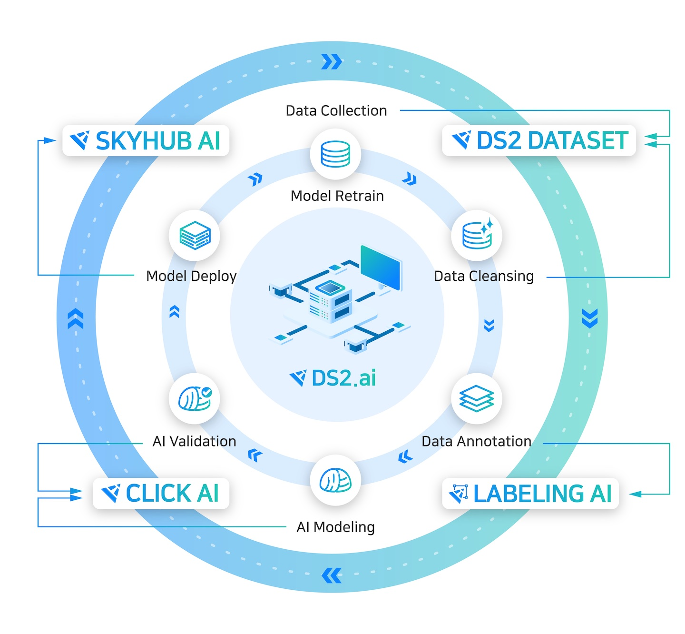

<link rel="stylesheet" href="./index.css">

# **DS2 AI 가이드**

### **All processes of building your customized AI**
{: width="600px",hight="600px" }

 
 

안녕하세요 👋  
맞춤형 AI 개발의 모든 과정, **DS2.ai 솔루션**을 소개합니다.  
 
데이터 준비 단계부터 라벨링, 인공지능 개발, 배포, 유지 및 보수에 이르는 모든 과정을 자동화한 플랫폼, DS2.ai 의 사용 설명 가이드 입니다.  
인공지능을 잘 모르는 고객에게는 AI 도입부터 배포까지 간단한 클릭만으로도 인공지능을 개발 할 수 있는 환경을, 개발자 및 데이터 과학자에게는 단순 작업의 시간은 줄이고 안정적인 서버 관리를 통해 개발 및 인공지능 구축에 전념할 수 있는 환경을 제공합니다.  
또한 양질의 AI 모델을 거래할 수 있는 AI Market을 운영합니다. 다양한 AI를 접하고 공유하며 수익을 창출하고 사업 서비스를 개선할 수 있습니다.
 
 

### **전자동화 AI 개발 및 도입을 위한 플랫폼, DS2.AI**
{: width="800px",hight="300px" }

 

-------------------------------------------------------

    

<!-- ## **가이드**

<body>

    

        <h5>  계정 생성</h5>
        <a href="https://dslab-clickai.github.io/ds2_ai/ds2_create_account/">   Learn more →</a>

        <h5>  계정 생성</h5>
        <a href="https://dslab-clickai.github.io/ds2_ai/ds2_create_account/">   Learn more →</a>

</body> -->

     
 
 
 
 
        
        
