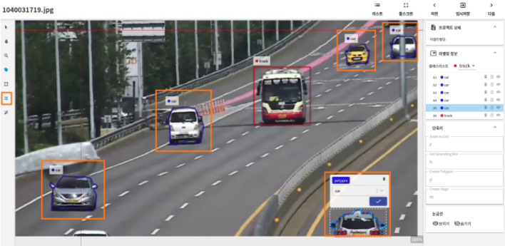

# **라벨링**

## **라벨링 이란 ?** 

인공지능을 사용하기 위해서는 다양한 데이터를 인공지능에 주입하여 학습시켜야합니다. 이때 인공지능이 스스로 학습할 수 있는 형태로 데이터를 분류하고 가공하는 과정이 필요한데 이 작업을 데이터 라벨링이라고 합니다.
 

 {: width="700px",hight="300px" }

 
데이터 라벨링은 인공지능이 데이터를 판단하고 학습할 수 있도록 적절하게 가공하는 과정입니다. 대량의 데이터에 정확한 라벨링 작업을 진행함으로써  데이터의 품질을 높일 수 있습니다. 만약 라벨링 작업이 부정확하게 이루어지거나 데이터 일부만 가지고 학습한다면  인공지능의 성능이 저하될 수 있습니다. 예를 들어 자율 주행 자동차가 사람을 가로수로 인식한다면 어떻게 될까요? 혹은 범죄자를 분석하는 인공지능이 특정 인종을 범죄자로 인식하는 경우를 생각해 볼 수 있습니다. 이렇게 잘못된 데이터로 학습된 인공지능 서비스들은 위험하고 차별적인 요소를 낳을 수 있기 때문에 주의를 기울여야 하는 중요한 단계인 것입니다.

## **1. Labeling AI의 라벨링**

Labeling AI은 다양한 방식을 이용한 라벨링 작업을 지원합니다. 이미지, 음성, 텍스트 등의 정형 및 비정형 데이터를 각 상황과 목적에 맞는 라벨링 방식을 선택할 수 있습니다. 이미지 라벨링을 하기 위해 단순하고 이용이 쉬운 바운딩 박스 또는 폴리곤을 이용한 라벨링부터 스켈레톤, 키포인트, 시멘틱 세그멘테이션, 매직 툴 등 더욱 고도화 된 라벨링 기능들을 사용하여 데이터 라벨링을 진행할 수 있습니다. Labeling AI에서 지원되는 라벨링 방식들의 차이와 적용 기준에 대하여 자세히 살펴보겠습니다.
 

## **2. Labeling AI의 라벨링 툴 **

 {: width="700px",hight="300px" }

 
[A] 이미지 파일 별 라벨링 탐색 

- 언어 선택: 국기 선택을 통해 한글, 영어를 선택합니다.
- 리스트: 업로드한 이미지 파일 리스트를 확인하거나, 라벨링을 위한 특정 이미지를 선택하여 작업할 수 있습니다.
- 이전: 이전 이미지로 돌아가 라벨링 내용을 확인하거나, 라벨링 수정 및 삭제가 가능합니다.
- 저장: 현재 라벨링 진행 상태를 저장합니다.
- 다음: 다음 이미지를 미리보기 하거나, 라벨링을 시작할 수 있습니다.

[B] 라벨링 방법 선택 및 각종 도구

- Select Region: 태그 수정 등을 할 수 있도록 선택합니다.
- Drag/Pan: 이미지를 이동합니다.
- Zoom In/Out: 이미지를 확대/축소 합니다.
- Show Tags: 라벨링 태그를 표시할지 설정합니다.
- Add Bounding Box: 바운딩 박스 라벨링을 시작합니다.
- Add Polyline: 폴리라인 라벨링을 시작합니다.
- Add Polygon: 폴리건 라벨링을 시작합니다.
- Add Magic Tool: 매직툴을 이용한 라벨링을 시작합니다.

[C] 전반적인 라벨링 프로젝트 현황 확인

- 프로젝트 상세: 프로젝트 상세 설명과 라벨링 진행률이 표시됩니다.
- 라벨링 정보: 프로젝트 생성 후 지정한 라벨링 클래스를 확인할 수 있습니다.
- Undo/Redo: 라벨링을 수정합니다.
- 단축키: 현재 툴 별로 설정되어 있는 단축키 목록이 표시됩니다.
- 눈금선: 라벨링을 할 때, 이미지 파일 위에 가로 눈금선과 세로 눈금선을 표시하거나 숨깁니다.
- 내가 한 라벨링: 현재 진행 완료한 바운딩 박스(BOX), 폴리건(POLYGON), 매직툴(MAGIC TOOL)별 라벨링 갯수를 확인할 수 있습니다.
- 더욱 간편한 라벨링 프로세스를 위하여 도구별 단축키를 지원합니다.

 
 
