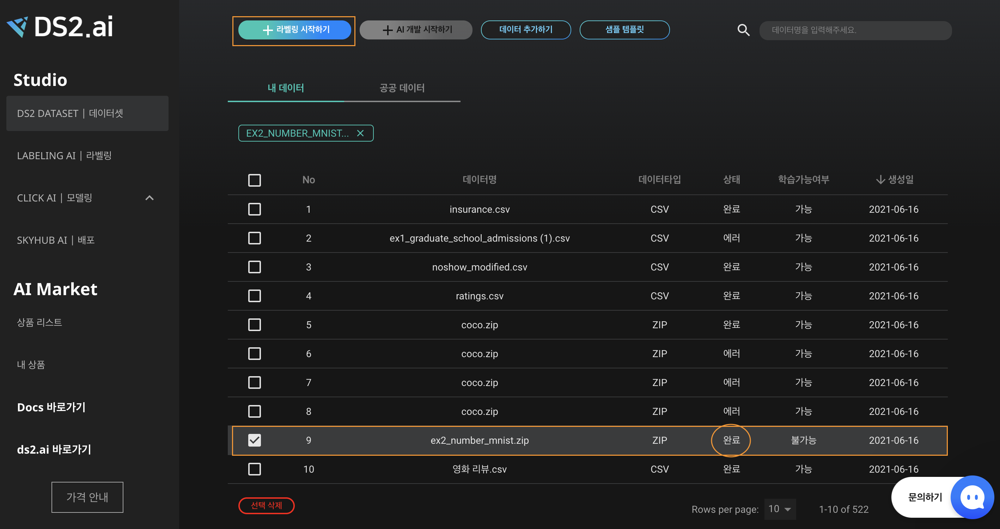
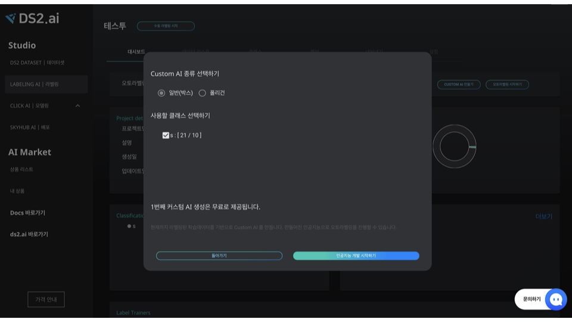
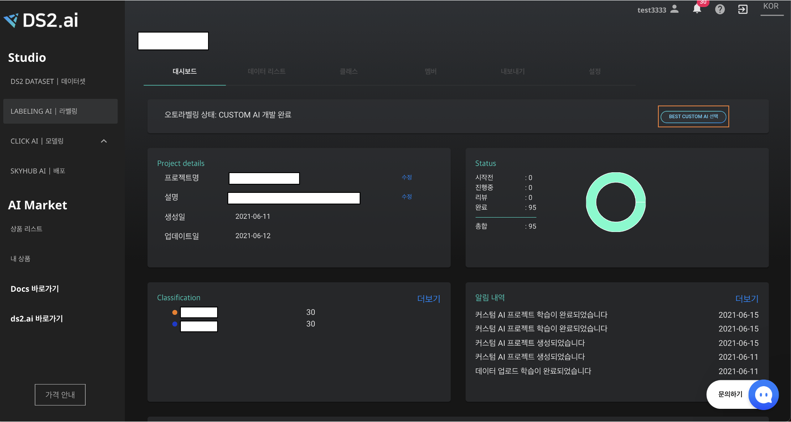
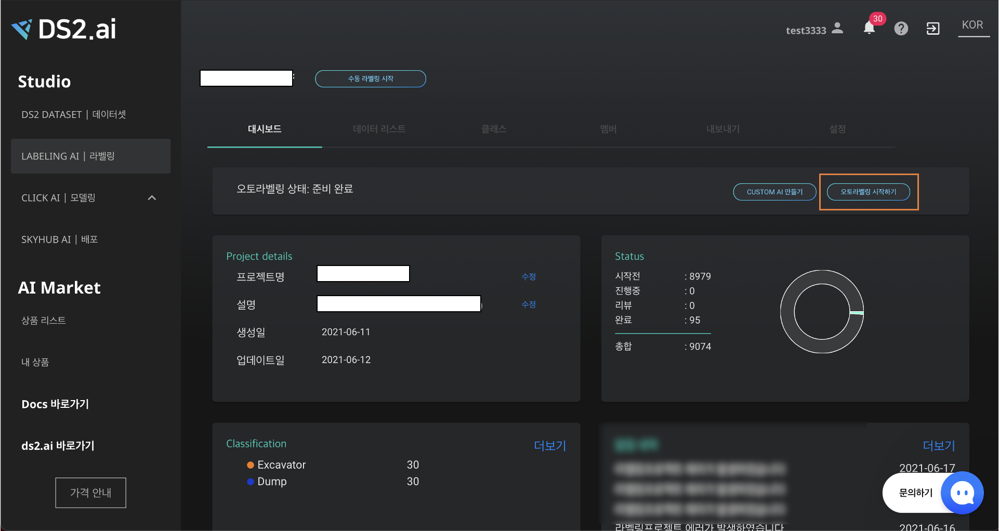

# ** Custom AI 오토라벨링 **

Custom AI는 라벨링하고 싶은 객체에 대하여 수동라벨링을 진행한 후, 이를 토대로 생성한 인공지능 모델로 오토라벨링을 진행하는 기능입니다. 

{: width="700px",hight="100px" }

### **1. 프로젝트 생성하기**

{: width="700px",hight="300px" }  
"LABELING AI | 라벨링" 에서 [+라벨링 시작하기] 버튼을 클릭하거나, "DS2 DATASET | 데이터셋" 으로 이동합니다.
 

{: width="700px",hight="300px" } 
오토라벨링 할 "ZIP" 형식의 데이터 셋을 선택한 후 [+라벨링 시작하기] 버튼을 클릭하세요. 이때 데이터의 업로드 상태는 "완료"여야 정상정으로 프로젝트를 생성할 수 있습니다.   
- 데이터 업로드는 [학습 데이터 연동](dataset_01_upload.md) 를 확인해주세요.
 

{: width="700px",hight="300px" } 
프로젝트 이름, 설명 및 데이터 카테고리를 "물체인식"으로 선택한 후 [다음]을 클릭해주세요.
 

{: width="700px",hight="300px" } 
생성한 프로젝트는 "LABELING AI | 라벨링"의 프로젝트 리스트에 추가된 것을 확인할 수 있습니다.
 
 

### **2. 수동라벨링**

CUSTOM AI를 통한 오토라벨링을 진행하기에 앞서 라벨링하고 싶은 객체 클래스별 최소 10개의 수동라벨링이 필요합니다. 

클래스 추가 및 수동 라벨링은 [수동라벨링가이드](label_03_manual.md)를 확인해주세요. 

수동라벨링이 완료되었다면 'CUSTOM AI 만들기'를 선택합니다.

### **3.CUSTOM AI 만들기**

소량의 수동라벨링 데이터를 활용하여 내 데이터의 맞춤형 라벨링을 위한 CUSTOM AI를 생성합니다.

{: width="700px",hight="300px" } 
객체 클래스별 10개 이상의 수동라벨링을 마친 후 LABELING AI 의 대시보드에서 [CUSTOM AI 만들기]를 클릭합니다. 
 

{: width="700px",hight="300px" } 
라벨링 종류와 CUSTOM AI 개발에 사용할 클래스를 선택한 후 [인공지능 개발 시작하기]를 클릭해주세요.
(라벨링 종류에 대한 자세한 사항은 [수동라벨링가이드](label_03_manual.md)에서 확인할 수 있습니다.)
 

{: width="700px",hight="300px" }  
커스텀 AI 프로젝트 학습 시작과 완료는 알림 탭과 이메일로 확인하실 수 있습니다. 
 

### **4. Best CUTOM AI 선택하기**

커스텀 AI 개발을 통해 생성된 모델중 최고의 모델을 선택하여 오토라벨링에 활용하는 기능 입니다.

{: width="700px",hight="300px" }  
오토라벨링이 완료 되면 [Best Custom AI 선택]을 클릭하여 생성된 커스텀 AI 모델 중 물체인식을 가장 잘한 모델을 직접 선택할 수 있습니다.   
 

{: width="700px",hight="300px" }  
추후의 오토라벨링을 진행할 모델을 선정하기 위해 4개의 이미지 중 오토라벨링을 가장 잘한 모델을 총 5회 선택합니다. 중복 선택도 가능합니다.  
 

{: width="700px",hight="300px" }  
각 이미지의 우측 상단의 아이콘을 클릭하면 이미지 확대/축소 보기가 가능합니다.  
 

{: width="700px",hight="300px" }  
마지막으로 선택 완료를 누르면, 모델이 설정되고, 추후 오토라벨링에 설정된 모델이 사용됩니다.  
 

### **5. 오토라벨링**

{: width="700px",hight="300px" }  
CUSTOM AI 개발이 완료 후 BEST CUSTOM AI 를 선택하면, 오토라벨링을 시작할 수 있습니다. 대시보드의 [오토라벨링 시작하기]를 클릭해주세요.  
 

{: width="700px",hight="300px" }  
"인공지능 종류 선택하기" 에서 Custom AI 선택 후, 오토라벨링을 진행하고자하는 모델을 선택해주세요.  
전처리 옵션 [얼굴비식별화]를 선택하면 이미지에 포함된 모든 얼굴을 모자이크 처리합니다.
오토라벨링 장수 선택 후, [오토라벨링 시작하기]를 클릭해주세요.  
 

{: width="700px",hight="300px" }  
팝업창으로, 인공지능 개발이 정상적으로 시작됨을 알립니다. 진행상황은 대시보드에서 확인 가능하며, 완료되면 메일 및 알림으로 안내드립니다.   