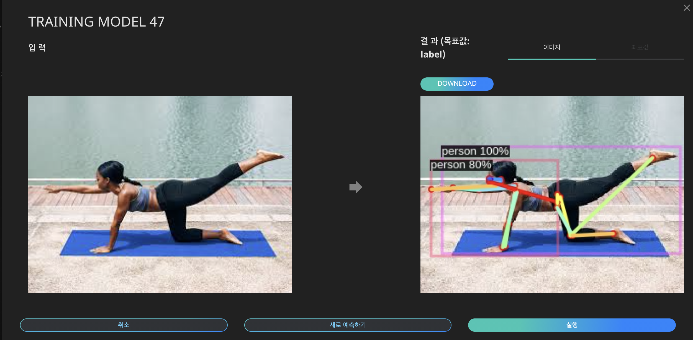

# ** General AI 오토라벨링 **

General AI 는 이미 개발 완료된 Labeling AI의 인공지능을 활용하여 수동라벨링 없이 오토라벨링을 바로 진행할 수 있습니다. 

{: width="500px",hight="100px" }

## ** 1. General AI 에서 지원하는 검출 객체 및 오토라벨링 종류**

### **사람인식**

이미지 내 **사람 객체의 위치를 감지**하여 정보를 제공합니다. 

{: width="500px",hight="500px" }

- 클래스 : person
- 오토라벨링 종류: 일반(박스), 폴리건

### **동물인식**

이미지 내 **동물**의 특정 객체를 탐지하고 위치를 식별하여 정보를 제공합니다.

{: width="500px",hight="500px" }

- 클래스 : person, bear, bird, cat, cow, dog, elephant, giraffe, horse, person, sheep, zebra
(지원하는 클래스 중 원하는 객체만 선택하여 검출할 수 있습니다.)
- 오토라벨링 종류: 일반(박스), 폴리건

### **자율주행**

이미지 내 **교통수단 및 도로시설**의 특정 객체를 탐지하고 위치를 식별하여 정보를 제공합니다.

{: width="500px",hight="500px" }

{: width="500px",hight="500px" }

- 클래스: person, airplane, bench, bicycle, boat, bus, car, firehydrant, motorcycle, parkingmeter, stopsign, trafficlight, train, truck
(지원하는 클래스 중 원하는 객체만 선택하여 검출할 수 있습니다.)
- 오토라벨링 종류: 일반(박스), 폴리건, 시멘틱

### **페이스 포인트 검출**

 이미지 내에 한 사람 또는 여러 사람의 인지하여 **페이스 랜드마크를 표시**합니다.

{: width="600px",hight="500px" }

사람의 얼굴에서 코, 눈, 입, 눈썹, 턱선과 같은 특징들을 랜드마크라고 부를 수 있습니다. 얼굴의 위치와 크기가 주어지면 눈과 코와 같은 얼굴 구성 요소의 모양을 자동으로 결정하고, 이 결과를 다양한 방법으로 응용할 수 있도록 결과물을 제공합니다.

- 클래스 : person
- 오토라벨링 종류: 일반(박스), 폴리건

### **사람 키포인트 검출**

이미지 내 사람의 관절 부위에 좌표를 찍고 이를 선으로 연결하여 키포인트 검출합니다.

{: width="600px",hight="500px" }

사람의 포즈를 설명하기 위해 연결할 수 있는 좌표 집합을 형성합니다. 위의 그림과 같이 각 키포인트를 사람의 관절 마디로 잡은 후, 이미지나 영상에서 키포인트를 연결하면 인물 골격 추출이 가능합니다.

- 클래스 : person
- 오토라벨링 종류: 일반(박스), 폴리건

## **2. 프로젝트 생성하기**

{: width="700px",hight="500px" }  
"LABELING AI | 라벨링" 에서 [+라벨링 시작하기] 버튼을 클릭하거나, "DS2 DATASET | 데이터셋" 으로 이동합니다.  

{: width="700px",hight="500px" }  
오토라벨링 할 "ZIP" 형식의 데이터 셋을 선택한 후 [+라벨링 시작하기] 버튼을 클릭하세요. 이때 데이터의 업로드 상태는 "완료"여야 정상정으로 프로젝트를 생성할 수 있습니다.  

데이터 업로드는 [학습 데이터 연동](/dataset_01_upload.md) 를 확인해주세요.  

{: width="700px",hight="500px" }  
프로젝트 이름, 설명 및 데이터 카테고리를 "물체인식"으로 선택한 후 [다음]을 클릭해주세요.  

{: width="700px",hight="500px" }  
생성한 프로젝트는 "LABELING AI | 라벨링"의 프로젝트 리스트에 추가된 것을 확인할 수 있습니다.  

## **3. General AI 오토라벨링**

{: width="700px",hight="500px" }  
Labeling 프로젝트 대시보드에서 [오토라벨링 시작하기] 버튼을 클릭해주세요.  

General AI 개발을 위하여 다음과 아래 옵션을 설정합니다.

{: width="700px",hight="500px" }  

1. **인공지능 종류 선택하기**

    General AI 에서 시람, 동물, 자율주행, 페이스 포인트 검출, 사람 키포인 중  개발을 원하는 라벨링 인공지능을 선택해주세요. 

2. **클래스 선택** 

    각 카테고리에 포함된 객체 중 물체 인식하고자 하는 객체를 선택할 수 있습니다. 최소 1개 이상의 클래스를 선택해야 하며 다중 선택이 가능합니다.

3. **오토라벨링 종류 선택** 
    - 일반(박스): 객체를 사각형의 박스형태로 라벨링합니다.
    - 폴리건: 객체의 형태에 따라 물체 주의를 점으로 찍어 선형으로 라벨링 합니다.
    - 시멘틱: 객체를 픽셀단위로 구분하여 라벨링 합니다.

    (일반 → 폴리건 → 시멘틱 순으로 정교한 라벨링이 가능합니다) 

4. **전처리 옵션**

    얼굴 비식별화 옵션을 체크하면, 이미지에 포함된 모든 사람 객체를 감지하여 얼굴을 모자이크 처리하여 비식별화 합니다.

5. **오토라벨링 장수**

    최소 100장부터 최대 업로드한 전체 이미지 수 오토라벨링이 가능합니다.

옵션 설정 후 [오토라벨링 시작하기] 버튼을 클릭하면 자동으로 오토라벨링을 시작합니다. 

{: width="700px",hight="500px" }  
팝업창으로 인공지능 개발이 정상적으로 시작됨을 알립니다. 진행상황은 대시보드에서 확인 가능하며, 완료되면 메일 및 알림으로 안내드립니다.

## **4. 오토라벨링 결과 확인하기**

결과물을 직접 확인하고, 라벨을 수정할 수 있습니다.

{: width="700px",hight="500px" }  
"LABELING AI | 라벨링 → 데이터 리스트" 에서 작업 상태가 "완료"인 데이터를 확인합니다.  

{: width="700px",hight="300px" }  

리스트에서 확인하고자 하는 데이터를 클릭하면 오토라벨링된 작업물을 확인할 수 있으며, 좌측 하단의 [EDIT LABEL]을 클릭하여 라벨을 수정할 수 있습니다.  
<!-- 
### 5. 오토라벨링 데이터 검수하기

General AI는 다음과 같은 카테고리의 객체에 대하여 오토라벨링을 제공합니다 .  -->

 
 
 
 