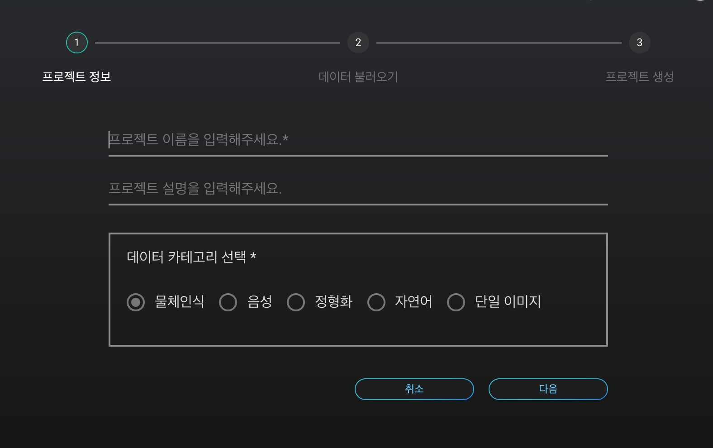
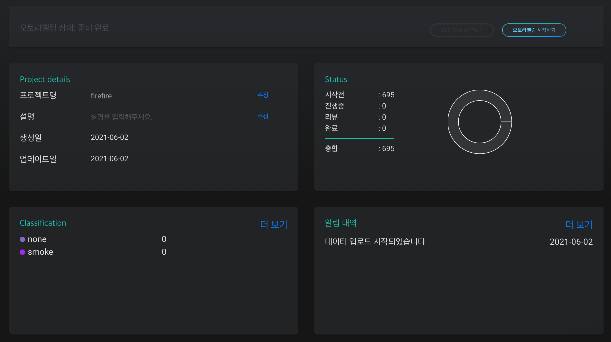

# **라벨링 프로젝트 생성 **

## **라벨링 프로젝트 생성 **

라벨링 프로젝트는 특정 데이터셋에 대하여 라벨링을 진행하기 위한 데이터를 정리하고 관리할 수 있는 공간입니다. 프로젝트를 통해 **프로젝트 생성**, **라벨 클래스 생성 및 관리**, **라벨링 검수**, 다른 작업자와의 **프로젝트 공유** 등의 다양한 기능을 수행할 수 있습니다. **Labeling AI**의 라벨링 툴과 오토라벨링 기능을 통해 데이터 라벨링 작업을 간편하게 수행할 수 있습니다. 

## **1. 프로젝트 생성 방법**

해당 프로젝트에 해당하는 이름 및 설명을 적어 프로젝트를 간략 요약할 수 있습니다.  해당 프로젝트의 학습 데이터의 카테고리를 선택해 주시면 하나의 라벨링 프로젝트가 생성됩니다. 

{: width="600px",hight="300px" }

 
 

## **2. 프로젝트 대쉬보드**

**대쉬보드**에서는 프로젝트의 전반적인 개요를  한눈에 파악하고 직접 작업을 관리할 수 있습니다. 프로젝트 제목 및 설명 작성, 라벨 클라스 추가 및 이름 설정, 파일 추가 등을 할수 있습니다.  또한 수동라벨링 한 이미지의 작업 진행 상황을 확인할 수 있습니다.

{: width="700px",hight="300px" } 
    **<프로젝트 대쉬보드>** 

 
 
**1) Project details**

프로젝트 개요를 작성하고 관리합니다.
프로젝트명과 설명을 작성할 수 있으며, 프로젝트 생성일과 최근 작업일을 자동 업데이트 합니다.

**2) Status**

전체 이미지 파일에 대하여 수동 라벨링의 진행상황 을 확인합니다.
시작전, 진행중, 리뷰, 완료의 단계별로 몇장의 이미지가 포함되어 있는지 확인할 수 있습니다.

    
| 데이터 종류   |      데이터      |   
|:----------:|:-------------------:|
| 시작전 |  업로드는 했으나 labeling이 진행되지 않은 이미지 수 | 
| 진행중 |    labeling이 진행되고 있는 이미지 수   |  
| 리뷰 | 진행 된 labeling을 검수하는 이미지 수  | 
| 완료 | 1개 이상의 labeling을 진행한 이미지 수  | 
| 총합 | 업로드한 총 이미지 수  | 

    
**3) Classfication**

라벨링 클래스별 진행 상황을 확인하고 관리합니다. 라벨링 클래스를 생성, 추가, 수정, 삭제할 수 있습니다.
오토라벨링을 진행하기 위하여 각 클래스당 10개의 수동라벨링이 필요합니다.  따라서 클래스별로 10개 기준  어느 정도 수동 라벨링이 진행되었는지 수치로 간편하게 확인할 수 있습니다. 

**4) 알람 내역**

인공지능 생성에 과정을 알람 내역을 통해 확인 가능합니다.
 

## **3. 프로젝트 관리 및 공유**

프로젝트 공유는 하나의 프로젝트에 대해 여러명의 작업자와 함께 관리할 수 있는 기능으로, 프로젝트 진행상황에 대한 실시간 공유가 가능하고, 여러명의 작업자가 함께 라벨링 작업을 진행할 수 있습니다.

화면 상단의 '회원정보' > '공유하기'를 통하여 새로운 그룹 추가 또는 기존의 그룹을 삭제하거나, 이미 생성된 그룹에 멤버를 추가/삭제할 수 있습니다. 새로운 그룹을 추가하기 위해서는 '그룹추가'에서 그룹명을 입력한 후, 이메일을 입력하여 멤버를 추가하면 됩니다. 멤버를 초대할 때, 멤버의 이메일이 DS2.AI에 회원가입 되어있어야 초대 요청을 보낼 수 있습니다. 멤버가 '회원정보' > '공유하기'에서 요청 수락을 하면 멤버로 등록됩니다.

## **4. 프로젝트 라벨리스트**
 

{: width="700px",hight="300px" } 
**<프로젝트 라벨리스트>** 
 
 

**1. 작업중인 이미지 리스트 확인하기 **

업로드한 이미지 중 설정한 조건에 맞는 이미지를 필터링하여 검색하고 목록화할 수 있습니다.  
 1) 프로젝트는 프로젝트 공유 기능을 통해 여러 작업자와 함께 작업하고 공유할 수 있습니다.     
 2) 작업자별로 어떤 이미지에 라벨링 작업을 진행했는지 확인하고 싶을 경우, 작업자를 선택합니다.     
 3) 작업 상태별 이미지 확인 및 특정 작업 단계의 이미지를 일괄적으로 삭제하고 싶은 경우, 작업 상태를 선택합니다.

**2. 파일명으로 업로드한 파일을 찾을 수 있습니다.**

**3. 라벨링 파일 추가** 
 
  라벨링 하려는 이미지를 추가 업로드 할 수 있습니다. 

**4. 파일 선택**
   
   파일을 선택하여 이미지 미리보기, 라벨링 시작, 이미지 삭제 등의 작업을 할 수 있습니다.

 
 
 
 
 
