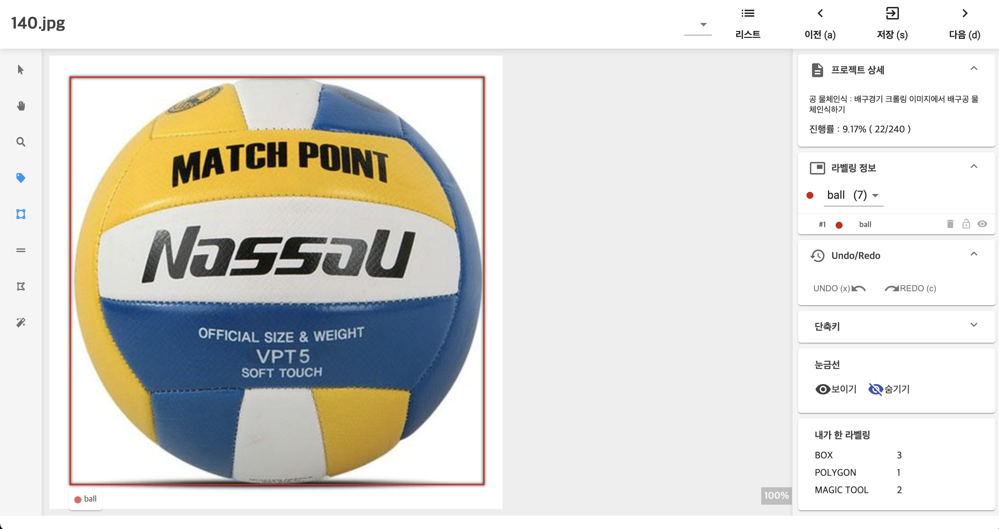
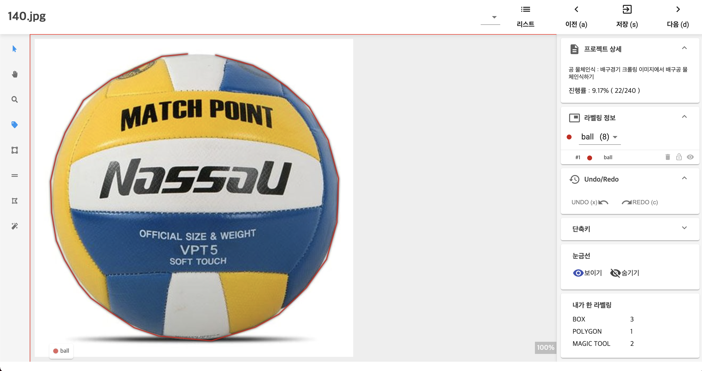
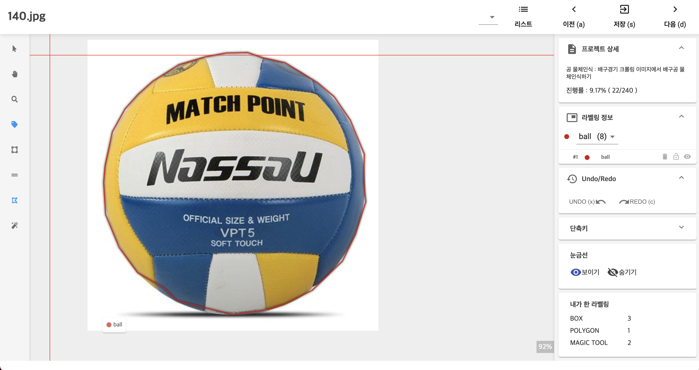

# **물체인식 수동라벨링**

## **Labeling AI의 라벨링 툴**

DS2.ai의 물체인식(Object Detection) 라벨링 작업 툴을 이용하여 편리하게 수동 라벨링을 작업할 수 있습니다. 

### **1. LABELING AI 가 지원하는 라벨링 방식**

[DS2.ai](http://ds2.ai) 는 바운딩박스, 폴리라인, 폴리곤, 매직툴 방식의 라벨링을 지원합니다. 

- 바운딩박스: 객체를 사각형 박스형태로 인식

    {: width="700px",hight="300px" }  

- 폴리라인: 시작점과 끝점이 동일하지 않은 라벨링. 선형 및 비선형 라벨링 가능

    {: width="700px",hight="300px" }  

- 폴리곤: 시작점과 끝점이 동일한 라벨링. 다각형 및 비선형 라벨링시 사용

    {: width="700px",hight="300px" }  

- 매직툴 : 박스 바운딩 라벨링시, 자동으로 폴리곤 형태의 라벨링 지원

### **2. LABELING AI 수동라벨링 툴 기능 소개**

{: width="700px",hight="300px" }  

**[A] 이미지 파일 별 라벨링 탐색**

- 언어 선택: 국기 선택을 통해 한글, 영어를 선택합니다.
- 리스트: 업로드한 이미지 파일 리스트를 확인하거나, 라벨링을 위한 특정 이미지를 선택하여 작업할 수 있습니다.
- 이전: 이전 작업 이미지로 돌아갑니다.  이전 이미지의 라벨링 작업을 수정 또는 확인할 수 있습니다.
- 저장: 현재 라벨링 진행 상태를 저장합니다.
- 다음: 다음 이미지로 넘어갑니다.  

**[B] 라벨링 방법 선택 및 각종 도구**

- Select Region: 태그 수정 등을 할 수 있도록 선택합니다.
- Drag/Pan: 이미지를 이동합니다.
- Zoom In/Out: 이미지를 확대/축소 합니다.
- Show Tags: 라벨링 태그를 표시할지 설정합니다.
- Add Bounding Box: 바운딩 박스 라벨링을 시작합니다.
- Add Polyline: 폴리라인 라벨링을 시작합니다.
- Add Polygon: 폴리건 라벨링을 시작합니다.
- Add Magic Tool: 매직툴을 이용한 라벨링을 시작합니다.  

**[C] 전반적인 라벨링 프로젝트 현황 확인**

- 프로젝트 상세: 프로젝트 상세 설명과 라벨링 진행률이 표시됩니다.
- 라벨링 정보: 프로젝트 생성 후 지정한 라벨링 클래스를 확인할 수 있습니다.
- Undo/Redo: 라벨링을 수정합니다.
- 단축키: 현재 툴 별로 설정되어 있는 단축키 목록이 표시됩니다.
- 눈금선: 라벨링을 할 때, 이미지 파일 위에 가로 눈금선과 세로 눈금선을 표시하거나 숨깁니다.
- 내가 한 라벨링: 현재 진행 완료한 바운딩 박스(BOX), 폴리건(POLYGON), 매직툴(MAGIC TOOL)별 라벨링 갯수를 확인할 수 있습니다.
- 더욱 간편한 라벨링 프로세스를 위하여 도구별 단축키를 지원합니다.  