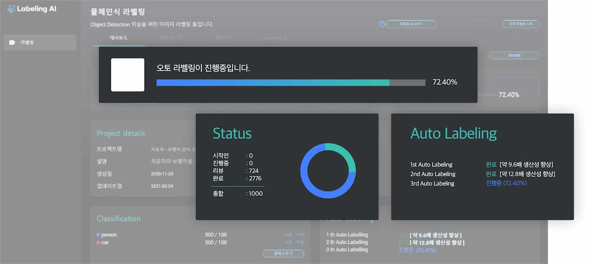

# **오토라벨링** 
 

## **1. 오토라벨링 이란 ?** 

수작업으로 진행되는 레이블링의 번거로움 때문에 레이블링 자동화 기술에 대해 시장 수요가 커지고 있습니다.

 {: width="700px",hight="300px" }

 
자동 레이블링은 딥러닝 모델을 통해서 예측한 레이블을 의미합니다. 이 과정을 통해서 생성한 레이블은 확정된 레이블이 아닙니다. 초기에 예측된 레이블은 수동 레이블링을 더욱 쉽게 해주기 위한 용도로 사용합니다. 자동 레이블링은 적은 양의 레이블링 데이터를 이용하여 레이블링되지 않은 데이터를 자동으로 레이블링합니다.

자동 레이블링은 주요 데이터를 선택적으로 레이블링하여 모델을 학습하는 지능형 과정을 통해서 학습 데이터에 대한 레이블을 빠르게 생성할 수 있도록 지원하는 비즈니스 솔루션입니다. 레이블링되지 않은 데이터 중 소량의 데이터를 수동 레이블링하고, 레이블 정보와 다른 레이블이 있는 데이터를 함께 학습하여 나머지 데이터의 레이블을 빠르게 생성합니다. 레이블을 판단하기 어려운 데이터는 다시 수동 레이블링을 하고, 확실한 데이터는 자동 레이블링함으로써 자동화된 레이블링 프로세스를 제공합니다.

## **2. 오토라벨링 시작하기 **

오토라벨링을 하기위해선 기본적으로 라벨링을 자동으로 하기 위한 사전 데이터 학습을 필요로 합니다. Labeling AI에서는 기본적인 데이터가 학습이 되어 따로 사전 데이터의 학습이 필요로 하지 않은 General AI와 특정 분야 또는 물체에 특화되지만 사전 데이터를 필요로 하는 Custom AI를 제공합니다. 

### ** 2-1. 인공지능 선택하기 **

####  ** 1) Custom AI**

유저의 목적에 맞게 커스텀 된 라벨링 모델을 생성하는 방식의 오토라벨링 방법입니다. 주로 의료와 같은 특정 분야에 따른 라벨링이나 어떤 사물의 특정 부분의 라벨링에 사용 될 수 있습니다. **Custom AI**는 약 10개의 데이터에 대한 수동 라벨링 과정을 통해 직접 유저의 기준에 맞는 라벨링 모델을 학습시킵니다. 학습된 라벨링 모델을 이용하여 오토라벨링이 진행되며, 이는 유저의 목적과 기준에 더욱 정확히 부합하는 오토라벨링 결과를 가져온다는 장점을 가지고 있습니다.

####  **2) General AI **

**General AI**는 미리 학습된 라벨링 데이터를 활용한 pre-trained 모델을 제공하는 방식의 오토라벨링 입니다. pre-trained된 라벨링 모델이 있기 때문에, 별도의 수동라벨링이 필요하지 않아 빠른 라벨링 작업이 가능하다는 장점이 있습니다. 하지만, 특정 기본적으로 주변에서 쉽게 볼 수 있는 물체들에 대한 데이터들이 학습되어 있기 때문에 의료와 같은 특정 분야에 대한 라벨링이나 어떤 사물의 특정 부분의 라벨링은 지원하지 않습니다. 이와 같은 경우에는 Custom AI의 활용이 필요합니다.

### **2-2.  클래스 선택**

클래스 선택은 **General AI** 인공지능 생성을 위한 단계로 어떤 객체를 잡을지 설정할 수 있습니다. **General AI**를 통해 제공되고 있는 라벨링 분야는 [인간, 동물, 자율주행, 페이스 포인트 검출, 사람 키포인트, 시멘틱 세그맨테이션]  등이 있고, 이 중 하나를 선택하여 더욱 세부적인 개별 클래스를 설정할 수 있습니다.

예를 들면, [아래와 같이] '동물' 카테고리에서 'bird' 등을 선택하는 것입니다. 이와 같이 '동물' 카테고리의 모든 클래스를 라벨링하지 않고 필요에 의한 구체적인 클래스를 설정하는 것은, 수동라벨링과 오토라벨링에 소요되는 시간 뿐만 아니라 이후 라벨링 검수에 소요되는 시간 역시 감축해줍니다.

### **2-3. 전처리 옵션**

라벨링 프로젝트의 전처리 옵션으로 얼굴 비식별화를 제공합니다. Labeling AI를 통한 얼굴 비식별화 전처리를 통하여 이미지 내에 등장하는 인물들의 얼굴을 자동으로 인식하고 모자이크처리를 통해 개인정보를 보호함과 동시에 인간, 동물, 자율주행 등의 카테고리에 맞는 라벨링 과정에는 영향을 주지 않게 됩니다.

### **2-4. 오토라벨링 장수**

Custom AI는 사용자가 직접 장수를 선택할 수 없지만, General AI 같은 경우에는 오토라벨링 장수를 사용자가 직접 입력할 수 있도록 지원합니다. 최소 장수는 100장, 최대로는 프로젝트 생성 시작 전 이미지 갯수만큼의 장수를 입력할 수 있습니다. 만약 시작 전 이미지가 100장보다 적을 경우에는, 오토라벨링 장수가 시작전 이미지 갯수로 고정되며 사용자는 이를 변경할 수 없습니다.

 
 
 

