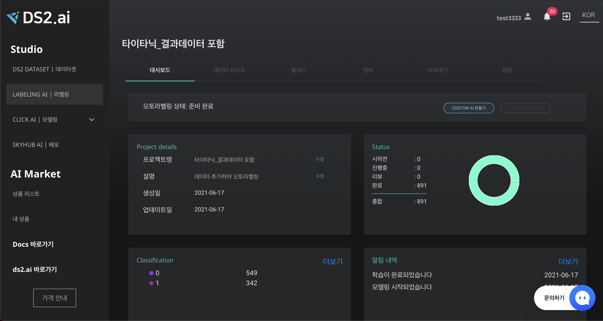

# **정형 데이터 오토라벨링**

정형화 분류, 정형화 회귀(연속값), 자연어 데이터에 대한 수동라벨링, 오토라벨링이 가능합니다.  
**결과값을 포함하는 데이터, 결과값을 포함하지 않는 데이터** 모두 라벨링 AI 를 이용할 수 있습니다. 

1. **결과값 포함하지 않는 데이터**:  데이터 로드 → 수동라벨링 → custom ai 생성 → 오토 라벨링
2. **결과값 포함 데이터** : 데이터 로드 → custom ai 생성 → 데이터 추가하기(라벨링 전 데이터) → 오토라벨링
3. **결과값 포함 + 포함하지 않은 데이터** : 데이터 로드 → custom ai 생성 → 오토라벨링

결과값을 포함하지 않는 데이터의 경우, 소량의 수동라벨링 진행 후 custom ai 를 생성하여 오토라벨링을 진행할 수 있으며,  
결과값을 포함하는 데이터의 경우, 바로 custom ai 생성 후 라벨링 되지 않은 데이터를 추가하면 오토라벨링을 진행할 수 있습니다.

### **1. 프로젝트 생성**

{: width="700px",hight="300px" }  

LABELING AI의 [+라벨링 시작하기] 버튼 클릭시, DS2 DATASET 으로 이동합니다. 

{: width="700px",hight="300px" }  

데이터 리스트에서 원하는 데이터셋을 선택하거나, [데이터 추가하기]를 클릭하여 라벨링하고자 하는 파일을 업로드합니다.

**데이터 추가하기**

{: width="700px",hight="300px" }  

CSV 파일 형식을 선택한 후, 다음 클릭

{: width="700px",hight="300px" }  

- **업로드 데이터에 결과값 칼럼이 포함되어 있는 경우**

    {: width="700px",hight="300px" }  

    데이터 설정에서 '결과값 칼럼 선택' 옵션을 선택하고 결과값 칼럼명을 찾아 선택 후 [확인]을 클릭합니다.

- **데이터에 결과값 칼럼이 포함되어 있지 않은 경우**

    {: width="700px",hight="300px" }  

    데이터 설정에서 '칼럼명 직접 입력' 옵션을 선택하고 라벨링 하려는 칼럼명을 입력 후 [확인]을 클릭합니다.

{: width="700px",hight="300px" }  

프로젝트 이름, 설명 및 카테고리 선택 후 [다음]을 클릭하면 프로젝트 생성이 완성됩니다.

{: width="700px",hight="300px" }  

프로젝트 생성 [완료] 버튼을 클릭하면, 생성한 프로젝트 관리 창으로 이동하며,  "Labeling AI | 라벨링"을 클릭하면 프로젝트 리스트에 업데이트 되었음을 확인할 수 있습니다.

### **2. 클래스 입력 (결과값을 포함하지 않은 데이터)**

{: width="700px",hight="300px" }  

대시보드 "Classification"이 비어있다면, 클래스를 추가해야합니다. Classification의 "더보기" 또는  중간에 "클래스" 클릭합니다.

{: width="700px",hight="300px" }  

[+클래스추가] 버튼을 클릭하여 라벨링 할 클래스명을 추가합니다.

{: width="700px",hight="300px" }  

클래스 이름 및 색상 설정합니다. 클래스명은 영문으로 작성해야하며, 일부 특수문자의 사용만 가능합니다. 작성 후 [완료] 버튼을 클릭합니다. 

{: width="700px",hight="300px" }  

### **3. 수동라벨링 (결과값을 포함하지 않은 데이터)**

정형화 데이터 중 분류 및 자연어 처리 데이터의 경우 각 클래스별 10개 이상의 수동라벨링을, 연속값 데이터의 경우 총 10개 이상의 수동라벨링을 진행하면, Custom AI 를 생성할 수 있습니다.

{: width="700px",hight="300px" }  

'Classfication'의 클래스 생성이 완료되었다면, 프로젝트명 우측의 [수동라벨링 시작] 버튼을 클릭하여 수동 라벨링을 시작합니다.

{: width="700px",hight="300px" }  

데이터 정보에 맞는 화면 하단의 클래스 중 선택하여 클릭하면, 데이터 정보 가장 우측 컬럼에 선택한 클래스가 설정됩니다. 확인 후 [저장] 및 [다음] 버튼을 클릭하여 라벨링을 진행합니다. 

라벨링을 잘못 입력하였을 경우 [이전] 버튼을 클릭하여 이미 작업된 데이터 라벨을 수정 및 저장할 수 있습니다.

### **4. Custom AI 만들기**

{: width="700px",hight="300px" }  

클래스별 객체 수가 10개 이상 확보되면, [CUSTOM AI 만들기] 버튼을 클릭하여 오토라벨링을 위한 인공지능을 생성합니다.

{: width="700px",hight="300px" }  

라벨링 하고자 하는 클래스 선택 후 인공지능 개발 시작하기를 클릭합니다.

{: width="700px",hight="300px" }  

AI 개발 시작 팝업이 뜹니다. 모델링 학습의 시작과 종료는 이메일 및  알림 내역을 통해 확인할 수 있습니다.

### **5. 오토라벨링 시작하기**

오토라벨링 하고자 하는 데이터를 추가합니다. (라벨링 하지 않은 데이터가 이미 업로드 되어있다면, 추가 없이 오토라벨링 할 수 있습니다. 

오토라벨링 시작하기 버튼을 클릭하면 오토라벨링이 시작됩니다.

오토라벨링 시작과 종료는 이메일 및 알림 내역을 통해 확인할 수 있습니다.

### **6. 검수 및 라벨링 AI 고도화**

오토라벨링 한 데이터가 올바르게 라벨링 되었는지 확인하고, 잘못 라벨링 된 데이터를 수정할 수 있습니다. 

또한 수정된 라벨 데이터로 CUSTOM AI를 재생성하면, 보다 정확한 오토라벨링 모델로 고도화 할 수 있습니다.

 
 
 
