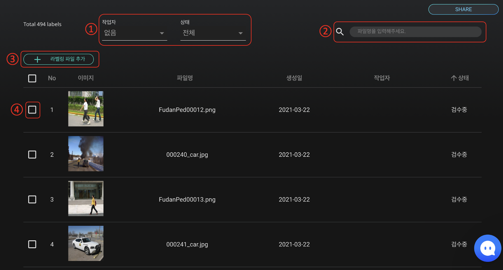
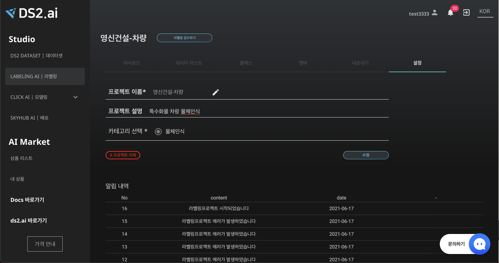

# **라벨링 프로젝트 관리**

## **라벨링 프로젝트란?**

라벨링 프로젝트는 특정 데이터셋에 대하여 라벨링을 진행하기 위한 데이터를 정리하고 관리할 수 있는 공간입니다. 프로젝트를 통해 **프로젝트 생성, 라벨 클래스 생성 및 관리, 라벨링 상태 확인, 다른 작업자와의 프로젝트 공유** 등의 다양한 기능을 수행할 수 있습니다. Labeling AI의 라벨링 툴과 오토라벨링 기능을 통해 데이터 라벨링 작업을 간편하게 수행할 수 있습니다. 

## **프로젝트 관리하기**

### **1. 대시보드**

**대시보드**에서는 프로젝트의 전반적인 개요를  한눈에 파악하고 직접 작업을 관리할 수 있습니다. 프로젝트 제목 및 설명 작성, 라벨 클라스 추가 및 이름 설정, 파일 추가 등을 할수 있습니다.  또한 수동라벨링 한 이미지의 작업 진행 상황을 확인할 수 있습니다.   

{: width="700px",hight="300px" }

1. 라벨링 프로젝트 진행 상태를 확인할 수 있습니다.
2. Project details
프로젝트 개요를 작성하고 관리합니다.
프로젝트명과 설명을 작성할 수 있으며, 프로젝트 생성일과 최근 작업일을 자동 업데이트 합니다.
3. Status

    전체 이미지 파일에 대하여 **수동 라벨링의 진행상황**을 확인합니다.

    시작전, 진행중, 리뷰, 완료의 단계별로 몇장의 이미지가 포함되어 있는지 확인할 수 있습니다.

    - 시작전: 업로드는 했으나 labeling이 진행되지 않은 이미지 수    → 표로 작성
    - 진행중: labeling이 진행되고 있는 이미지 수
    - 리뷰: 진행 된 labeling을 검수하는 이미지 수
    - 완료: 1개 이상의 labeling을 진행한 이미지 수
    - 총합:  업로드한 총 이미지 수
4. Classfication
라벨링 클래스별 진행 상황을 확인하고 관리합니다. 라벨링 클래스를 생성, 추가, 수정, 삭제할 수 있습니다.

    오토라벨링을 진행하기 위하여 각 클래스당 10개의 수동라벨링이 필요합니다.  따라서 클래스별로 10개 기준  어느 정도 수동 라벨링이 진행되었는지 수치로 간편하게 확인할 수 있습니다. 

5. 알림 내역 
인공지능 생성 과정을 알림 내역을 통해 확인 가능합니다. 
6. Label Trainers

    라벨링 작업자와 각 작업자가 수행한 라벨링 개수를 확인할 수 있습니다. 

### **2. 데이터 리스트**

{: width="700px",hight="300px" }

1. 작업중인 이미지 리스트 확인하기 
업로드한 이미지 중 설정한 조건에 맞는 이미지를 필터링하여 검색하고 목록화할 수 있습니다.
    - 작업자 선택: 라벨링 작업은 프로젝트가 공유된 멤버와 함께 작업할 수 있습니다(추후 개발 예정). 작업자별로 어떤 이미지에 라벨링 작업을 진행했는지 확인하고 싶을 경우, 작업자를 선택합니다.
    - 작업 상태 선택, 작업 상태별 이미지 확인 및 특정 작업 단계의 이미지를 일괄적으로 삭제하고 싶은 경우, 작업 상태를 선택합니다.
2. 파일명으로 업로드한 파일을 찾을 수 있습니다.
3. 라벨링 파일 추가 - 라벨링 하려는 이미지를 추가 업로드 할 수 있습니다. 
4. 파일 선택

    파일을 선택하여 이미지 미리보기, 라벨링 시작, 이미지 삭제 등의 작업을 할 수 있습니다.

{: width="700px",hight="300px" }  

라벨링이 완료된 데이터를 클릭하면 결과물 확인 및 라벨 수정이 가능합니다.  라벨 수정의 경우 모델별 검수하기 가이드를 참고해주세요 ! 

### **3. 클래스**

{: width="700px",hight="300px" }  

결과값 클래스를 추가, 수정, 삭제할 수 있습니다.

### **4. 멤버**

{: width="700px",hight="300px" }  

프로젝트를 공유할 팀 및 멤버를 선택하여 팀 멤버의 계정으로 해당 프로젝트를 확인할 수 있습니다. 멤버 추가는 계정 구성에서 확인해주세요.

계정 구성에서 추가한 그룹과 역할을 설정하여 공유할 세부 멤버를 설정합니다. 

### **5. 내보내기**

[LABELING AI|라벨링]의 '내보내기' 기능을 활용하면 라벨링 작업이 완료된 데이터 셋을 DS2.AI 내, 외부에서 보다 편리하게 활용할 수 있습니다. 내보내기 에서는 라벨링 작업이 완료된 데이터셋을 가지고 바로 인공지능 개발하거나 해당 데이터를 로컬 컴퓨터로 저장하는 기능을 지원합니다.

1. **인공지능 개발하기** 

    라벨링된 데이터셋을 가지고 DS2.AI STUDIO의 [CLICK AI | 모델링] 과 연동하여 인공지능을 개발할 수 있습니다. 데이터 형식에 따라 예측, 분류, 물체 인식 등의 인공지능을 개발할 수 있습니다. 또한  원하는 학습서버를 임대하여 jupyter 환경에서 코딩으로 인공지능을 개발하는 커스텀 학습과, CLICK AI를 활용하여 코딩없이 클릭만으로 인공지능을 자동 개발하는 Auto ML로 연동이 가능합니다. 

    {: width="700px",hight="300px" }  

2. **저장**

    데이터 및 라벨 정보를 DS2.AI 밖에서도 편리하게 이용할 수 있도록 로컬 컴퓨터로 다운로드합니다. 

    데이터 형식에 따라 저장, COCO 저장, VOC저장이 있습니다. 

    {: width="700px",hight="300px" }  
    - 저장 : 정형데이터, 자연어 데이터 경우 csv 파일로 다운로드하며, 단일 이미지 분류의 경우 클래스별 폴더에 이미지를 저장한 zip 파일을 다운로드 합니다.

    물체인식 라벨링 데이터셋은 COCO 형식과 VOC형식을 지원합니다. 저장하기 버튼 우측의 '이미지 포함' 을 체크하면  작업한 바운딩 박스, 폴리곤 라벨링된 이미지와 함께 다운로드 받을 수 있습니다.

    - COCO 저장 : 라벨링 정보를 JSON 파일로 다운로드합니다.
    - VOC 저장 : 라벨링 정보를 XML 파일로 다운로드합니다.

### **6. 설정**

{: width="700px",hight="300px" }  

프로젝트 이름, 내용, 카테고리 등의 수정이 가능하며, 알림 내역을 확인할 수 있습니다. 
 
 
 
