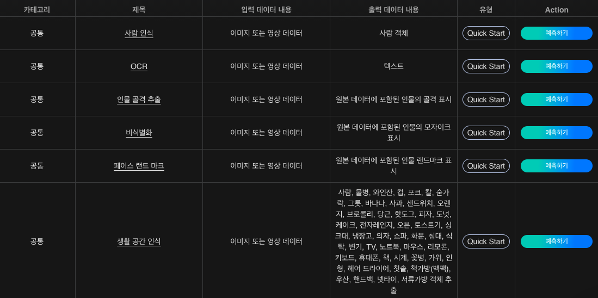

# **사람 인식**

사람인식 기술은 이미지 속의 사람을 인식하여 라벨링하고 좌표값을 추출할 수 있는 인공지능 기술입니다.

{: width="700px",hight="300px" }  

Quick Start 목록에서 '사람 인식'의 '예측하기'를 클릭합니다.

{: width="700px",hight="300px" }  

사람인식 인공지능에 입력할 이미지 데이터를 준비합니다.

{: width="700px",hight="300px" }  

이미지를 업로드하고 '실행'을 클릭하면 인식된 내용을 이미지 상에서 확인하고, 표시된 이미지를 다운로드 할 수 있습니다.

{: width="700px",hight="300px" }  

각 개체의 좌표값을 텍스트 파일로 확인할 수 있습니다.
