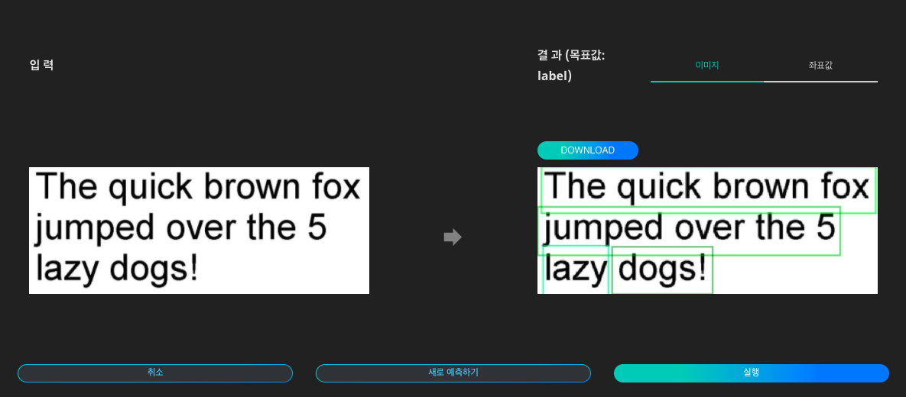
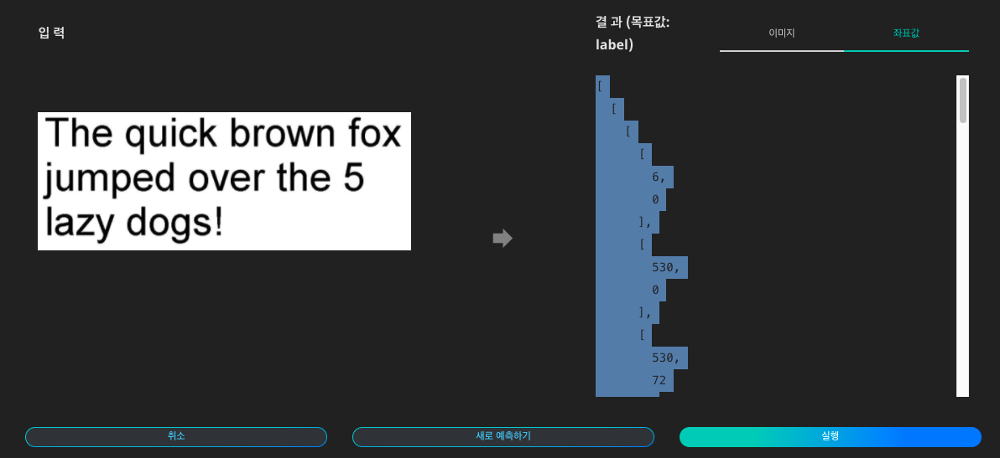

# **OCR**

OCR(광학 문자 인식)은 이미지 상의 글자를 인식하여 텍스트 데이터로 변환해주는 인공지능 기술입니다.

{: width="700px",hight="300px" }  

Quick Start 목록에서 'OCR'의 '예측하기'를 클릭합니다.

{: width="700px",hight="300px" }  

OCR 인공지능에 입력할 이미지 데이터를 준비합니다.

{: width="700px",hight="300px" }  

이미지를 업로드하고 '실행'을 클릭하면 인식된 내용을 이미지 상에서 확인하고, 표시된 이미지를 다운로드 할 수 있습니다.

{: width="700px",hight="300px" }  

각 글자의 좌표값과 해당 텍스트를 확인할 수 있습니다.
