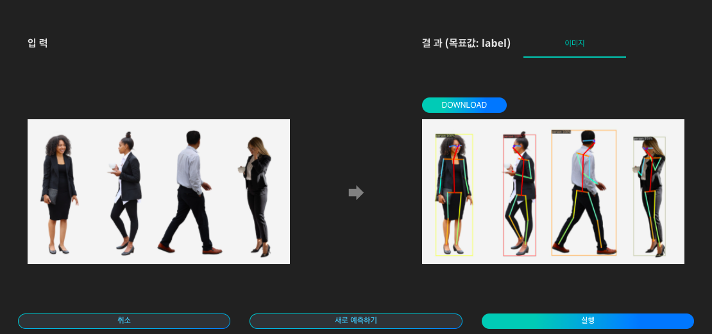

# **인물골격추출**

### 인물 골격 추출이란?

인물 골격 추출이란, 이미지 또는 영상 데이터에서 사람을 탐지하고, 탐지된 사람의 행위를 분석하기 위해 신체 키포인트를 검출하는 방법입니다. 이 과정에 딥러닝 기반 학습방법을 적용시킨 '모션 키포인트 검출(Motion Keypoint Detection)' 인공지능이 사용됩니다.

전통적인 자세 인식 방법은 사람에게 센서와 같은 장비를 부착하여 움직임을 파악하는 것이었습니다. 하지만 실생활에서 항상 장비를 착용할 수도 없고, 움직임에 제한이 생긴다는 한계점이 존재했습니다. 이러한 한계점을 극복하기 위하여, 인공지능을 활용한 모션 키포인트 검출에서는 사람의 포즈를 설명하기 위해 연결할 수 있는 좌표 집합을 형성합니다. 위의 그림과 같이 각 키포인트를 사람의 관절 마디로 잡은 후, 이미지나 영상에서 키포인트를 연결하면 인물 골격 추출이 가능합니다.

{: width="700px",hight="300px" }  

Quick Start 목록에서 '인물 골격 추출'의 '예측하기'를 클릭합니다.

{: width="700px",hight="300px" }  

인물 골격 추출 인공지능에 입력할 이미지 데이터를 준비합니다.

{: width="700px",hight="300px" }  

이미지를 업로드하고 '실행'을 클릭하면 인식된 내용을 이미지 상에서 확인하고, 표시된 이미지를 다운로드 할 수 있습니다.

