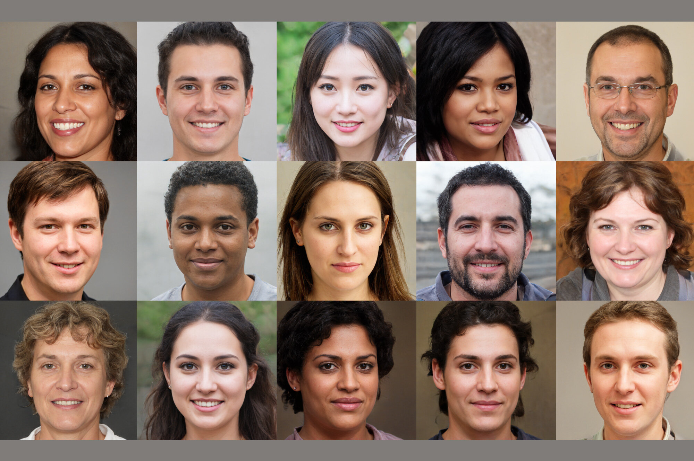
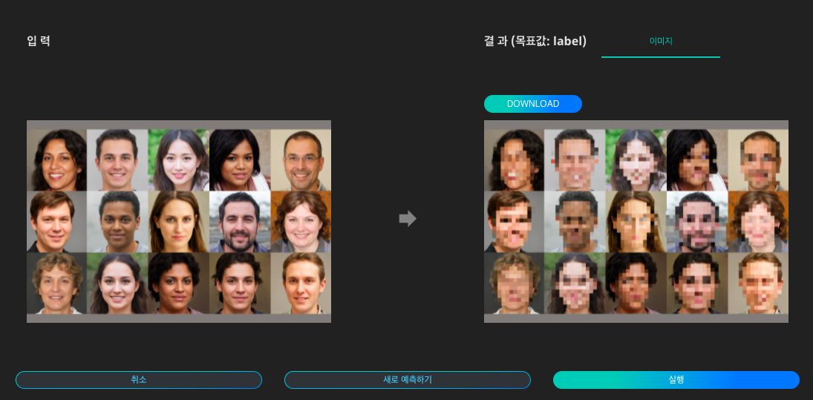

# **비식별화**

### 비식별화 기술이란?

비식별화 기술은 이미지/영상 데이터에 포함된 얼굴 부분을 모자이크 처리함으로써 데이터의 본질은 훼손하지 않으면서 데이터 주체의 개인정보를 보호합니다. 익명화한 양질의 데이터는 인공지능 고도화에 핵심 요소가 되어 금융, 유통, 의료 등의 산업에서 고객 맞춤형 서비스를 제공하게 될 것입니다. DS2.AI의 비식별화 기술을 통해 데이터의 개인 정보를 지워 데이터의 활용도를 높여보세요!

{: width="700px",hight="300px" }  

Quick Start 목록에서 '비식별화'의 '예측하기'를 클릭합니다.

{: width="700px",hight="300px" }  

비식별화 인공지능에 입력할 이미지 데이터를 준비합니다.

{: width="700px",hight="300px" }  

이미지를 업로드하고 '실행'을 클릭하면 인식된 내용을 이미지 상에서 확인하고, 표시된 이미지를 다운로드 할 수 있습니다.

