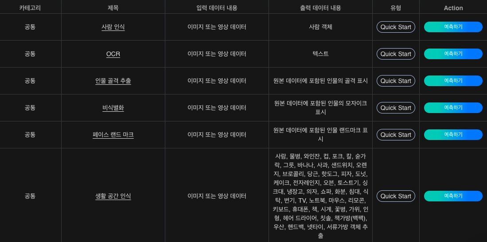
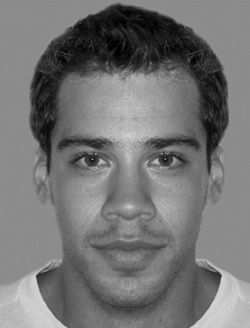
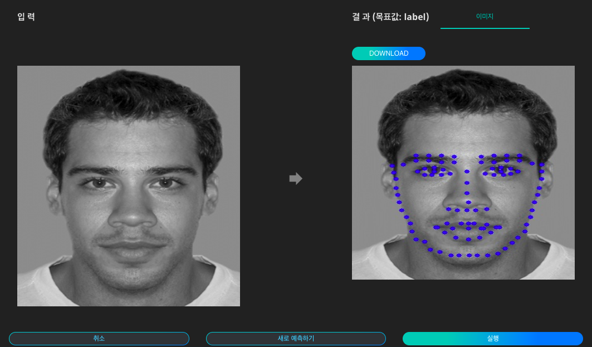

# **페이스 랜드마크**

사람의 얼굴에서 코, 눈, 입, 눈썹, 턱선과 같은 특징들을 랜드마크라고 부를 수 있습니다. DS2.AI의 페이스 랜드마크 서비스는 이미지, 영상 내에 한 사람 또는 여러 사람의 얼굴을 인지하여 페이스 랜드마크를 표시합니다. 얼굴의 위치와 크기가 주어지면 눈과 코와 같은 얼굴 구성 요소의 모양을 자동으로 결정하고, 이 결과를 다양한 방법으로 응용할 수 있도록 결과물을 제공합니다.

{: width="700px",hight="300px" }  

Quick Start 목록에서 '페이스 랜드 마크'의 '예측하기'를 클릭합니다.

{: width="700px",hight="300px" }  

페이스 랜드 마크 인공지능에 입력할 이미지 데이터를 준비합니다.

{: width="700px",hight="300px" }  

이미지를 업로드하고 '실행'을 클릭하면 인식된 내용을 이미지 상에서 확인하고, 표시된 이미지를 다운로드 할 수 있습니다.

