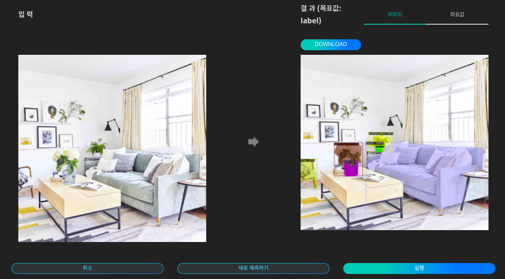
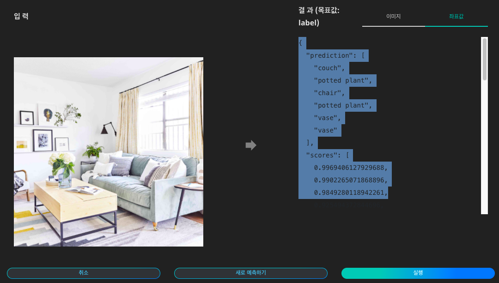

# **생활 공간 인식**

생활공간 인식은 물체 인식 서비스 중 생활 공간의 객체에 특화시킨 물체인식 서비스 입니다. 
생활공간 속 물체 인식을 서비스를 활용하여 나만의 공간을 꾸미고 활용도를 높여보세요. 또한 물체인식 서비스를 비즈니스에 응용하여 유사 상품을 검색하는 등의 사업적 활용이 가능하므로, 고객에게 맞춤 제품 및 인테리어를 제안할 수도 있습니다.

- **인식 객체**  
사람, 물병, 와인잔, 컵, 포크, 칼, 숟가락, 그릇, 바나나, 사과, 샌드위치, 오렌지, 브로콜리, 당근, 핫도그, 피자, 도넛, 케이크,  전자레인지, 오븐, 토스트기, 싱크대, 냉장고, 의자, 쇼파, 화분, 침대, 식탁, 변기, TV, 노트북, 마우스, 리모콘, 키보드, 휴대폰, 책, 시계, 꽃병, 가위, 인형, 헤어 드라이어, 칫솔, 책가방(백팩), 우산, 핸드백, 넷타이, 서류가방 객체 추출

{: width="700px",hight="300px" }  

Quick Start 목록에서 '생활 공간 인식'의 '예측하기'를 클릭합니다.

{: width="500px",hight="300px" }  

Quick Start 목록에서 '생활 공간 인식'의 '예측하기'를 클릭합니다.

{: width="700px",hight="300px" }  

이미지를 업로드하고 '실행'을 클릭하면 인식된 내용을 이미지 상에서 확인하고, 표시된 이미지를 다운로드 할 수 있습니다.

{: width="700px",hight="300px" }  

각 개체의 좌표값을 텍스트 파일로 확인할 수 있습니다.
