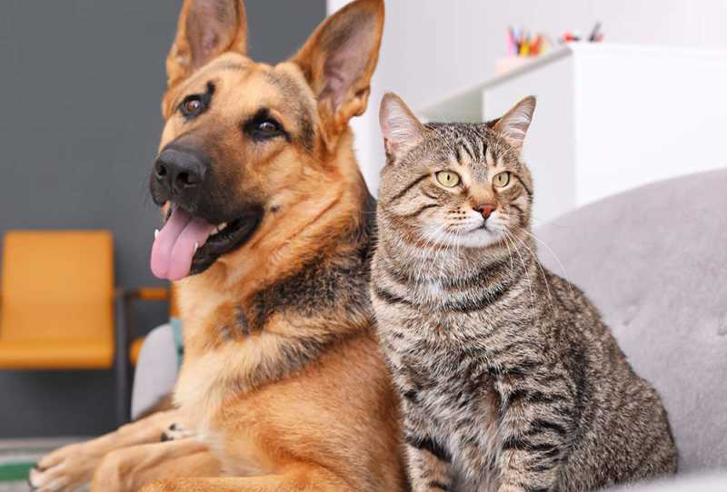
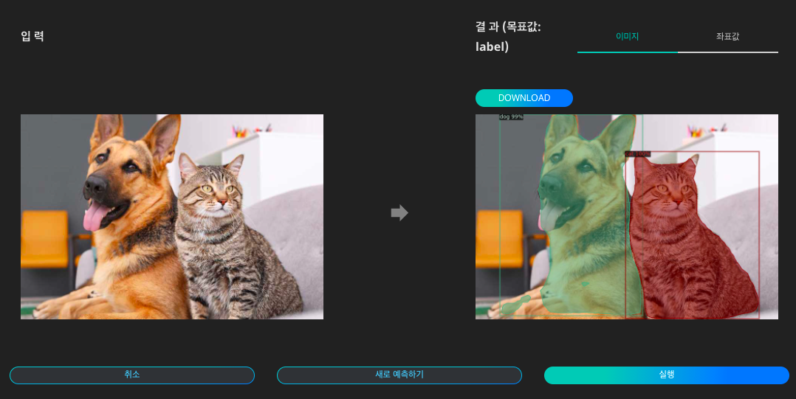
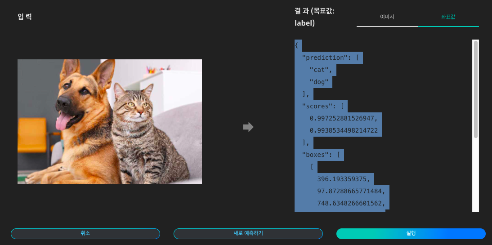

# **동물인식**

사람의 육안으로 동물과 그 종을 구분하는 것은 당연한 일이지만, 컴퓨터가 이미지 또는 영상 데이터를 보고 동물을 인식하여 결과를 도출한다면 컴퓨터 비전 분야에서 나아가 다양한 산업군에 활용될 수 있습니다. 예를 들어, 동물 인식의 결과는 동물 및 인간의 부상 및 재산 피해를 유발할 수 있는 동물-차량 충돌을 예방하거나, 동물 분류와 관련된 연구 분야에서 활용될 수 있습니다.

- 인식 객체:

사람, 새, 고양이, 개, 말, 양, 소, 코끼리, 곰, 얼룩말, 기린

{: width="700px",hight="300px" }  

Quick Start 목록에서 '동물 인식'의 '예측하기'를 클릭합니다.

{: width="700px",hight="300px" }  

동물 인식 인공지능에 입력할 이미지 데이터를 준비합니다.

{: width="700px",hight="300px" }  

이미지를 업로드하고 '실행'을 클릭하면 인식된 내용을 이미지 상에서 확인하고, 표시된 이미지를 다운로드 할 수 있습니다.

{: width="700px",hight="300px" }  

각 개체의 좌표값을 텍스트 파일로 확인할 수 있습니다.
