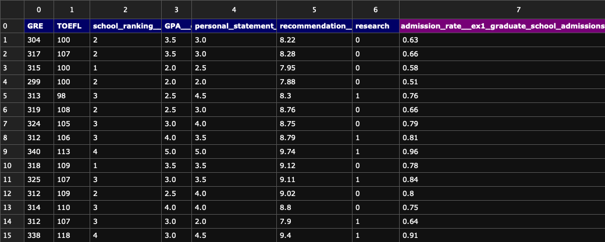
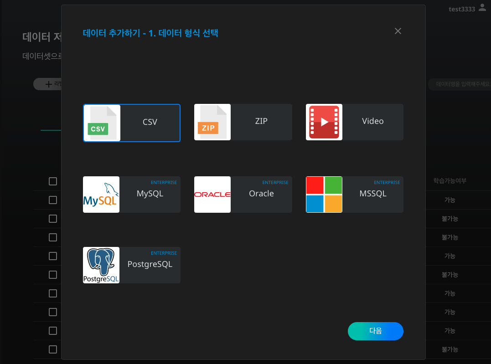
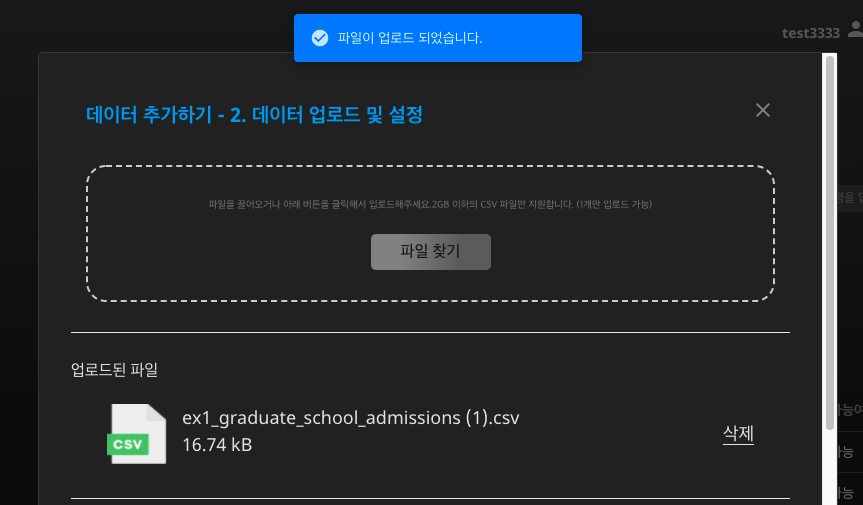
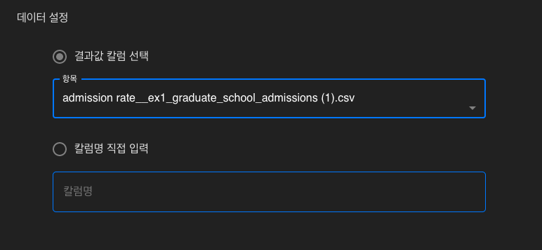
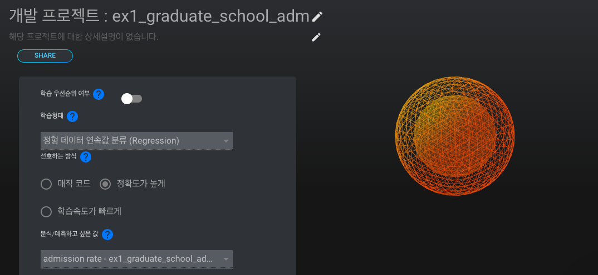
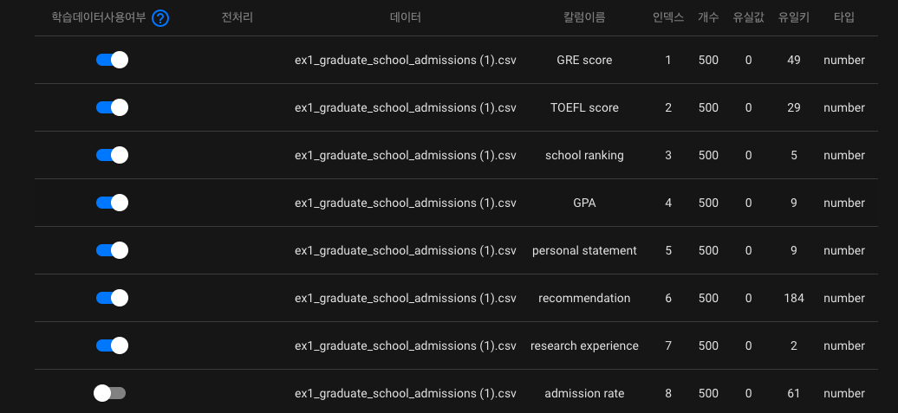
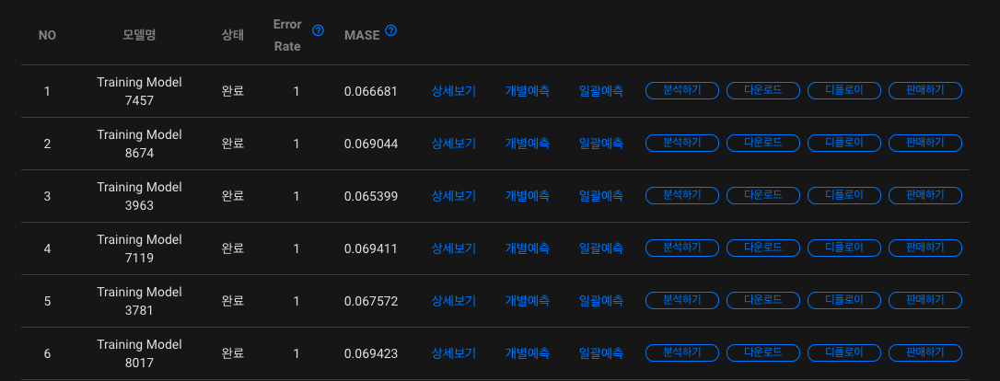
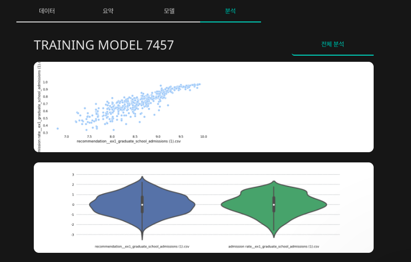

# **대학원 입학 확률 예측하여 데이터 분석하기**

종종 대학원 입학시험(GRE)에서 만점을 받아도 원하는 학교에 진학하지 못하는 학생들의 경우를 뉴스에서 보신 적이 있을겁니다. 일반적으로 대학원 입학은 대학원 입학시험(GRE) 점수, TOEFL 점수, 학교 랭킹, 학점, 자기소개서 등의 다양한 요소가 영향을 미칩니다. 이를 수치화하여 인공지능으로 예측할 수 있다면 대학원 입학 원서를 작성할 때 보완할 부분에 대한 파악과 원서 구성이 용이해질 것입니다.

본 레시피에서는 대학원 입학 확률을 예측하는 인공지능을 생성하고, 생성된 인공지능 모델의 분석 결과를 확인하는 프로세스를 살펴보도록 하겠습니다.

### **1. 데이터 살펴보기**

학습 데이터를 확인하는 것은 인공지능 모델의 질을 향상시키는데 필수적인 과정입니다. 학습에 사용될 데이터를 살펴봅시다.

은행 과금 여부 예측 인공지능에 활용될 데이터는 csv 형식으로써, 데이터의 컬럼을 쉼표로 구분한 텍스트 데이터입니다. 아래와 같이 표의 형태를 가진 데이터라고 볼 수 있습니다.

[graduate_school_admissions.csv](dataset/graduate_school_admissions.csv)  

{: width="700px",hight="300px" }  

본 레시피에서 인공지능 학습에 사용될 데이터인 'graduate_school_admissions.csv'를 살펴보도록 하겠습니다. 각 컬럼 별로 특정 학생의 GRE 점수, TOEFL 점수, 학점(GPA), 자기소개서(personal_statement), 추천서(recommendation), 연구 경험(research), 입학 확률(admission_rate)을 포함하고 있습니다. 이 데이터와 [DS2.AI](http://ds2.AI) 플랫폼을 이용하여, 특정 고객의 대학원 입학 확률을 예측하는 인공지능 모델을 생성해봅시다.  

- 인공지능 입력 데이터: 학생 정보 (GRE 점수, TOEFL 점수, 학점, 자기소개서, 추천서, 연구 경험)
- 인공지능 출력 데이터: 대학원 입학 확률

### **2. DS2 DATASET에서 학습데이터 업로드하기**

{: width="700px",hight="300px" }  

[DS2.ai](http://ds2.ai) 콘솔의 DS2 DATASET에서 '데이터 추가하기'를 클릭합니다.  

{: width="700px",hight="300px" }  

'graduate_school_admissions.csv'를 업로드 해야하므로 CSV를 선택합니다. 표 형식의 데이터를 업로드 할때, CSV 외에도 MySQL, Oracle, MSSQL, PostgreSQL의 형식이 지원되니, 파일 형식에 맞추어 데이터를 업로드하시면 되겠습니다.  

{: width="700px",hight="300px" }  

{: width="700px",hight="300px" }   

csv 파일을 업로드하고 결과값 칼럼을 선택합니다. 본 레시피는 학생의 정보를 입력 데이터로 하고, 대학원 입학 확률을 출력 데이터로 하는 인공지능 생성이 목적이므로 'admission_rate'를 결과값 칼럼으로 선택합니다. 인공지능은 각 칼럼의 데이터와 대학원 입학 확률의 상관관계를 유추하며 학습을 진행할 것입니다.  

데이터 업로드가 성공적으로 마무리되면 해당 학습 데이터를 위한 '데이터 커넥터' 생성이 완료된 것입니다.  

### **3. CLICK AI로 인공지능 모델링하기**

인공지능 모델링은 알고리즘을 데이터로 학습시키는 과정을 의미합니다. DS2.AI의 CLICK AI에서는 하나의 학습 데이터셋을 학습시킨 여러개의 인공지능 모델을 생성합니다. 여러개의 모델의 정확도, RMSE, Error Rate 등의 값을 비교하여 최적의 모델을 선택해보세요.  

{: width="700px",hight="300px" }   

인공지능 모델링을 위하여 DS2 DATASET에서 해당 데이터 커넥터를 선택하고, 'AI 개발 시작하기'를 클릭합니다.  

{: width="700px",hight="300px" }   

인공지능 모델링에 요구되는 세부사항을 설정합니다. 학습형태는 '정형 데이터 연속값 분류(Regression)'으로 설정합니다. 여기서 '정형 데이터'는 말그대로 틀과 형식이 정해져있는 데이터를 의미하고, 'graduate_school_admissions.csv'는 표 형식이 정해진 데이터이므로 정형 데이터에 속합니다. 또한 의료 비용 예측의 결과값은 소수점을 포함한 연속값으로 표시되기 때문에, '정형 데이터 연속값'로 학습 형태를 설정합니다. 그 외의 설정 역시 원하는 방식에 맞추어 선택하시면 되겠습니다.  

{: width="700px",hight="300px" }   

CLICK AI에서는 학습 데이터를 한 눈에 볼 수 있는 데이터 요약 기능을 지원합니다. 각 칼럼에 대한 데이터(파일명), 칼럼 이름, 인덱스, 데이터 개수, 유실값, 유일키, 타입의 상세 내용을 확인할 수 있고, 전처리 여부에 대한 판단을 할 수 있습니다. 예를 들어, 공란 갯수인 유실값을 확인하여, 공란을 제외할지, 또는 평균으로 대체할지 등의 전처리 옵션을 선택합니다.  

CLICK AI에서 인공지능 모델링이 완료되면 이메일로 알림을 보내드립니다. 모델링이 완료되었다는 것은, 업로드한 데이터셋을 이용하여 여러개의 인공지능 모델이 생성되었음을 의미합니다. 아래와 같이 모델명, 상태, 정확도, Error Rate를 확인하여 다양한 모델을 비교해보세요.  

{: width="700px",hight="300px" }   
모델별로 상세보기, 개별예측, 일괄예측, 분석하기, 다운로드, 디플로이, 판매하기의 기능을 지원합니다. 본 레시피에서는 분석하기 기능을 살펴보겠습니다.  

- **분석하기**

{: width="700px",hight="300px" }   

인공지능으로 단순 결과값을 예측하는 것보다 중요한 것은 데이터의 분포 및 경향성을 해석하여 인공지능에 대한 더 깊은 이해를 하는 것입니다. CLICK AI의 분석하기 기능을 활용하면, 각 칼럼과 결과값의 상관 관계를 시각화하여 확인할 수 있습니다. 위 그림은 2차원 그래프로 표현된 recommendation과 admission_rate의 분포를 담고 있으며, recommendation과 admission_rate의 컬럼별 분포도 포함되어 있습니다.  

이 외에도 API 판매, 모델 다운로드 제공, 칩셋 판매 제공 등의 다양한 방법으로 인공지능을 활용할 수 있도록 지원해드리니, 자세한 내용은 상담 문의를 요청하시면 되겠습니다.  

 
 
 
 

*More Recipes*

[시간별 에너지 사용량 예측하여 API 확인하기](recipes_04_energy.md)  
[샘플데이터를 전처리하여 영화 리뷰 긍정, 부정 예측 모델 생성하기](recipes_06_movie.md)  

 
 
