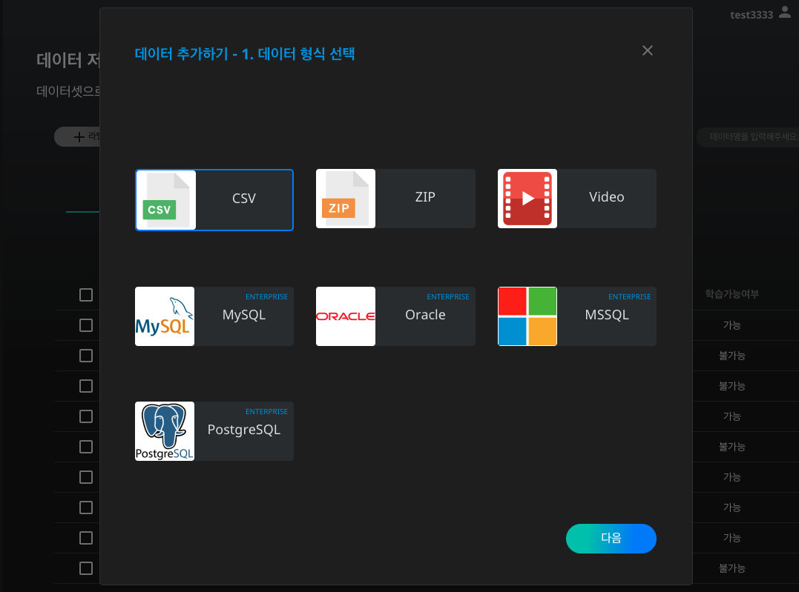
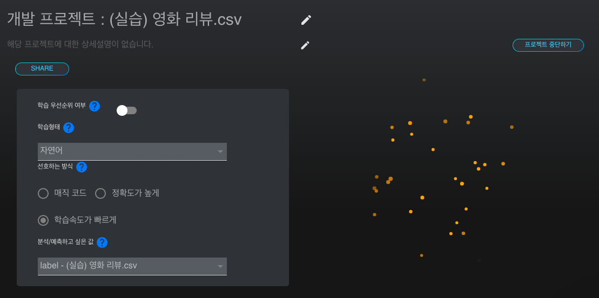

# **샘플데이터를 활용한 영화 리뷰 긍정, 부정 예측 모델 생성하기**

일상생활 속에서 인공지능을 활용한 서비스는 많이 접할 수 있지만, 직접 인공지능 개발 경험을 하는 것은 흔하지 않습니다. 더더군다나 학습 데이터를 직접 준비해야 한다는 점은 인공지능 개발 진입 장벽을 높이는 원인 중 하나입니다.  

DS2.ai는 더욱 손쉬운 인공지능 생성 프로세스를 위하여 학습형태별, 산업군별 샘플 데이터를 제공하고 있습니다. 본 레시피에서는 특정 영화 리뷰가 긍정적인 내용인지 부정적인 내용인지 판단하는 인공지능을 생성하기 위하여 샘플 데이터를 다운받고, 인공지능을 모델링하는 프로세스를 살펴보도록 하겠습니다.  

 

### **1. DS2 DATASET에서 샘플데이터 다운받기**

샘플 데이터의 목록을 확인하고, 본 레시피를 위한 데이터를 다운받아봅시다.

![이미지이름]{: width="700px",hight="300px" }   

[DS2.ai](http://ds2.ai) 콘솔의 DS2 DATASET에서 '샘플 템플릿'을 클릭합니다.

![이미지이름]{: width="700px",hight="300px" }   

학습형태별, 산업군별 샘플 데이터가 나열되어 있는 것을 확인하실 수 있습니다. DS2 DATASET에서 제공하는 샘플 데이터는 다음과 같습니다.  

- 학습형태별
    - 카테고리: 직원 퇴사여부, 타이타닉 생존, 고객 카드 추천, 보험사기예측, 유리종류예측, 이메일마케팅 클릭 예측 등
    - 연속값: 대학원 입학예측, 도서관 방문객 입출입 예측, 대출상환일 예측, 연소득분위 예측
    - 자연어: 영화리뷰, 평판관리
    - 이미지분류: 선박분류, 숫자mnist, 차량분류
    - 물체인식: 차량인식
    - GAN: 말-얼룩말 변환, 여름-겨울 변환, 데이터 늘리기

- 산업군별
    - 금융 및 자산관리: 고객카드추천, 대출심사, 카드발급 심사, 투자상품추천, 중고차 가격 예측 등
    - 보험: 보험사기 예측, 생명보험가입 위험수준 예측 등
    - 제조: ph농도 예측, 독버섯분류, 아이리스꽃 종류 등
    - 마케팅: 과금예측, 평판관리 등

![이미지이름]{: width="700px",hight="300px" }   

본 레시피를 위해서는 자연어 데이터 중 영화리뷰를 다운받습니다. 자연어 학습 형태에 대해서는 아래 '데이터 살펴보기'에서 자세히 다루도록 하겠습니다.  

### **2. 데이터 살펴보기**

학습 데이터를 확인하는 것은 인공지능 모델의 질을 향상시키는데 필수적인 과정입니다.  

학습에 자연어 데이터와 자연어 처리 학습 형태에 대해서 알아봅시다.  

![이미지이름]{: width="700px",hight="300px" }   

자연어란 사람들이 일상적으로 사용하는 언어를 의미하며, 컴퓨터와 소통하는 언어인 인공어와 반대 개념으로 사용되고 있습니다. 본 레시피에서 사용될 '영화리뷰.csv'는 각 컬럼별로 사용자 ID, 리뷰 내용, 라벨(긍정, 부정 여부)의 데이터를 포함하고 있습니다. 이 중 '리뷰 내용' 칼럼의 데이터는 사람들이 직접 작성한 리뷰 내용이므로, 자연어 데이터에 해당됩니다. 또한 라벨 컬럼의 경우, 해당 리뷰 내용이 긍정적이면 1, 부정적이면 0으로 표기되어 있습니다.  

자연어를 분석하는 것은 인간의 감이나 경험에 의존해야 하는 경우가 많으므로, 컴퓨터가 자연어를 이해하는 것은 쉽지 않았던 것이 사실입니다. 하지만 축적된 텍스트 데이터와 사람이 직접 평가한 라벨을 인공지능이 학습한다면, 더욱 효율적으로 텍스트 데이터를 분석할 수 있습니다. 다양한 자연어 처리 기법이 존재하지만, 본 레시피에서 사용되는 방법은 '감정 분석'이라고 하는 기법입니다. 감정 분석은 텍스트 데이터의 내용에 들어있는 의견, 감성, 평가, 태도 등의 주관적인 정보를 도출하는 과정입니다.  

자연어 처리에 대한 데이터 준비가 완료되셨다면, DS2 DATASET과 CLICK AI를 이용하여 인공지능 생성을 본격적으로 시작해봅시다.  

### **3. DS2 DATASET에서 학습데이터 업로드하기**

![이미지이름]{: width="700px",hight="300px" }   

[DS2.ai](http://ds2.ai) 콘솔의 DS2 DATASET에서 '데이터 추가하기'를 클릭합니다.  

![이미지이름]{: width="700px",hight="300px" }   

'영화리뷰.csv'를 업로드 해야하므로 CSV를 선택합니다. 표 형식의 데이터를 업로드 할때, CSV 외에도 MySQL, Oracle, MSSQL, PostgreSQL의 형식이 지원되니, 파일 형식에 맞추어 데이터를 업로드하시면 되겠습니다.  

### **4. CLICK AI로 인공지능 모델링하기**

인공지능 모델링은 알고리즘을 데이터로 학습시키는 과정을 의미합니다. DS2.AI의 CLICK AI에서는 하나의 학습 데이터셋을 학습시킨 여러개의 인공지능 모델을 생성합니다. 여러개의 모델의 정확도, RMSE, Error Rate 등의 값을 비교하여 최적의 모델을 선택해보세요.  

![이미지이름]{: width="700px",hight="300px" }   

인공지능 모델링을 위하여 DS2 DATASET에서 해당 데이터 커넥터를 선택하고, 'AI 개발 시작하기'를 클릭합니다.

![이미지이름]{: width="700px",hight="300px" }   

인공지능 모델링에 요구되는 세부사항을 설정합니다. 학습형태는 '자연어'로 설정합니다. 그 외의 설정 역시 원하는 방식에 맞추어 선택하시면 되겠습니다.  

![이미지이름]{: width="700px",hight="300px" }   

본 레시피는 고객의 리뷰 내용을 입력 데이터로 하고, 긍정, 부정 여부를 출력 데이터로 하는 인공지능 생성이 목적이므로 'label'을 결과값 칼럼으로 선택합니다. 인공지능은 각 행의 자연어 내용과 긍정, 부정 여부의 상관관계를 유추하며 학습을 진행할 것입니다.  

![이미지이름]{: width="700px",hight="300px" }   

CLICK AI에서는 학습 데이터를 한 눈에 볼 수 있는 데이터 요약 기능을 지원합니다. 각 칼럼에 대한 데이터(파일명), 칼럼 이름, 인덱스, 데이터 개수, 유실값, 유일키, 타입, 최소값, 최대값의 상세 내용을 확인할 수 있고, 전처리 여부에 대한 판단을 할 수 있습니다. 예를 들어, 공란 갯수인 유실값을 확인하여, 공란을 제외할지, 또는 평균으로 대체할지 등의 전처리 옵션을 선택합니다.  

![이미지이름]{: width="700px",hight="300px" }   

전처리를 원하는 컬럼을 선택합니다.  

![이미지이름]{: width="700px",hight="300px" }   

원하는 전처리 옵션을 선택합니다.  

![이미지이름]{: width="700px",hight="300px" }   

해당 컬럼의 전처리가 완료되었음을 확인하고, START를 클릭하여 인공지능 생성을 시작합니다.  

![이미지이름]{: width="700px",hight="300px" }   

CLICK AI에서 인공지능 모델링이 완료되면 이메일로 알림을 보내드립니다. 모델링이 완료되었다는 것은, 업로드한 데이터셋을 이용하여 여러개의 인공지능 모델이 생성되었음을 의미합니다. 아래와 같이 모델명, 상태, 정확도, Error Rate를 확인하여 다양한 모델을 비교해보세요.  

위 과정에서 확인하셨듯이, 필요에 따라 얼마든지 데이터를 추가 혹은 수정하여 인공지능을 생성하실 수 있습니다. 저희가 본 레시피에서 사용한 예제 템플릿은 단순히 데이터를 클릭AI 사용에 돕기 위해 보여주는 예시일 뿐이며, 굳이 똑같은 양식으로 하실 필요는 없다는 점을 참고해주세요.  

인공지능 생성 후에는 개별 및 일괄 예측, 분석하기, API 판매, 모델 다운로드 제공, 칩셋 판매 제공 등의 다양한 방법으로 인공지능을 활용할 수 있도록 지원해드리니, 자세한 내용은 상담 문의를 요청하시면 되겠습니다.  

 
 
 
 

*More Recipes*

[대학원 입학 확률 예측하여 데이터 분석하기](recipes_05_graduate.md)  
[두 데이터를 결합하여 유리 종류 예측 모델 생성하기](recipes_07_glass.md)  

 
 
