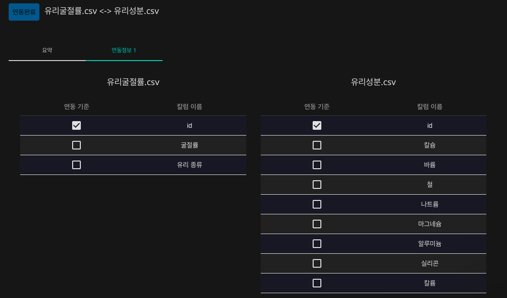

# **두 데이터를 결합하여 유리 종류 예측 모델 생성하기**

하나의 데이터 파일안에 우리가 원하는 모든 정보를 가지고 있을 때, 인공지능 학습을 하기에는 더할나위 없이 최고의 상황입니다. 하지만 하나의 데이터 파일로는 정보가 부족할 때 혹은 다른 추가적인 데이터가 필요할 때, 우리는 더 높은 신뢰도 혹은 정확도를 가진 인공지능을 위해서 필연적으로 두 개 이상의 데이터를 결합해야 합니다. 일반적으로 프로그래밍을 이용하거나 엑셀을 통해 할 수 있지만, 프로그래밍의 경우 이에 대한 전문적인 지식이 있어야 한다는 전제가 있고, 엑셀을 이용한 작업은 비교적 시간적 비용이 많이 든다는 단점이 있습니다.  

본 레시피에서는 DS2.ai에서 클릭만으로 데이터를 쉽게 결합하는 방법을 살펴봅시다. DS2.ai의 데이터 결합은 텍스트 기반의 인공지능 모델에 한해서 적용됩니다.  

### **1. 데이터 살펴보기**

학습 데이터를 확인하는 것은 인공지능 모델의 질을 향상시키는데 필수적인 과정입니다. 학습에 사용될 데이터를 살펴봅시다.  

유리 종류 예측 인공지능에 활용될 데이터는 csv 형식으로써, 데이터의 컬럼을 쉼표로 구분한 텍스트 데이터입니다. 아래와 같이 표의 형태를 가진 데이터라고 볼 수 있습니다.  

[유리성분.csv](dataset/유리성분.csv)

{: width="500px",hight="300px" }     

[유리굴절률.csv](dataset/유리굴절률.csv)

{: width="200px",hight="300px" }     

본 레시피에서 인공지능 학습에 사용될 데이터인 '유리성분.csv'와 '유리굴절률.csv'은 위와 같은 데이터를 포함하고 있습니다. 이 데이터와 [DS2.AI](http://ds2.AI) 플랫폼을 이용하여, 유리 종류를 예측하는 인공지능 모델을 생성해봅시다.  

- 인공지능 입력 데이터: 칼슘, 바륨, 철, 나트륨, 마그네슘, 알루미늄, 실리콘, 칼륨 함유량, 유리굴절률
- 인공지능 출력 데이터: 유리 종류

### **2. DS2 DATASET에서 학습데이터 업로드하기**

{: width="700px",hight="300px" }     

[DS2.ai](http://ds2.ai) 콘솔의 DS2 DATASET에서 '데이터 추가하기'를 클릭합니다.  

{: width="700px",hight="300px" }     

'유리성분.csv'와 '유리굴절률.csv'을 업로드 해야하므로 CSV를 선택합니다. 표 형식의 데이터를 업로드 할때, CSV 외에도 MySQL, Oracle, MSSQL, PostgreSQL의 형식이 지원되니, 파일 형식에 맞추어 데이터를 업로드하시면 되겠습니다.  

{: width="700px",hight="300px" }     

첫번째 업로드 파일인 '유리굴절률.csv'가 업로드 되었음을 확인합니다.  

{: width="700px",hight="300px" }     

csv 파일을 업로드하고 결과값 칼럼을 선택합니다. 본 레시피는 칼슘, 바륨, 철, 나트륨, 마그네슘, 알루미늄, 실리콘, 칼륨 함유량, 유리굴절률을 입력 데이터로 하고, 유리 종류를 출력 데이터로 하는 인공지능 생성이 목적이므로 '유리 종류'를 결과값 칼럼으로 선택합니다. 인공지능은 입력 데이터와 유리 종류의 상관관계를 유추하며 학습을 진행할 것입니다.  

{: width="700px",hight="300px" }     

동일한 데이터 업로드 과정을 반복하여 '유리성분.csv' 파일에 대한 데이터 커넥터도 생성해주세요.  

### **3. CLICK AI로 인공지능 모델링하기**

인공지능 모델링은 알고리즘을 데이터로 학습시키는 과정을 의미합니다. DS2.AI의 CLICK AI에서는 하나의 학습 데이터셋을 학습시킨 여러개의 인공지능 모델을 생성합니다. 여러개의 모델의 정확도, RMSE, Error Rate 등의 값을 비교하여 최적의 모델을 선택해보세요.  

{: width="700px",hight="300px" }     

인공지능 모델링을 위하여 DS2 DATASET에서 해당되는 두개의 데이터 커넥터를 선택하고, 'AI 개발 시작하기'를 클릭합니다.  

{: width="700px",hight="300px" }     

인공지능 모델링에 요구되는 세부사항을 설정합니다. 학습형태는 '정형 데이터 카테고리 분류(Classification)로 설정합니다. 여기서 '정형 데이터'는 말그대로 틀과 형식이 정해져있는 데이터를 의미하고, '유리성분.csv'와 '유리굴절률.csv'는 표 형식이 정해진 데이터 이므로 정형 데이터에 속합니다. 또한 유리 종류는 여러개의 카테고리로 표시되기 때문에, '정형 데이터 카테고리 분류'로 학습 형태를 설정합니다. 그 외의 설정 역시 원하는 방식에 맞추어 선택하시면 되겠습니다.  

{: width="700px",hight="300px" }     

이제 두 데이터를 연동해보겠습니다. 두 데이터에서 동일 컬럼인 ID를 연동 기준으로 선택하고, 연동을 선택하면 위와 같이 '연동완료'라고 표시되는 것을 확인하실 수 있습니다.  

{: width="700px",hight="300px" }     

CLICK AI에서는 학습 데이터를 한 눈에 볼 수 있는 데이터 요약 기능을 지원합니다. 각 칼럼에 대한 데이터(파일명), 칼럼 이름, 인덱스, 데이터 개수, 유실값, 유일키, 타입의 상세 내용을 확인할 수 있고, 전처리 여부에 대한 판단을 할 수 있습니다. 예를 들어, 공란 갯수인 유실값을 확인하여, 공란을 제외할지, 또는 평균으로 대체할지 등의 전처리 옵션을 선택합니다.  

{: width="700px",hight="300px" }     

전처리를 원하는 컬럼을 선택한 후, '전처리하기' 버튼을 클릭합니다.  

{: width="700px",hight="300px" }     

원하는 전처리 옵션을 선택합니다.  

{: width="700px",hight="300px" }     

전처리가 완료 되었음을 확인하고, START 버튼을 눌러 인공지능 생성을 시작합니다.

{: width="700px",hight="300px" }     

CLICK AI에서 인공지능 모델링이 완료되면 이메일로 알림을 보내드립니다. 모델링이 완료되었다는 것은, 업로드한 데이터셋을 이용하여 여러개의 인공지능 모델이 생성되었음을 의미합니다. 아래와 같이 모델명, 상태, 정확도, Error Rate를 확인하여 다양한 모델을 비교해보세요.  

인공지능 생성 후에는 개별 및 일괄 예측, 분석하기, API 판매, 모델 다운로드 제공, 칩셋 판매 제공 등의 다양한 방법으로 인공지능을 활용할 수 있도록 지원해드리니, 자세한 내용은 상담 문의를 요청하시면 되겠습니다.  

 
 

*More Recipes*

[샘플데이터를 전처리하여 영화 리뷰 긍정, 부정 예측 모델 생성하기](recipes_06_movie.md)  
[외부 인공지능 모델 업로드하여 API 판매하기](recipes_08_external_ai.md) 

 
 