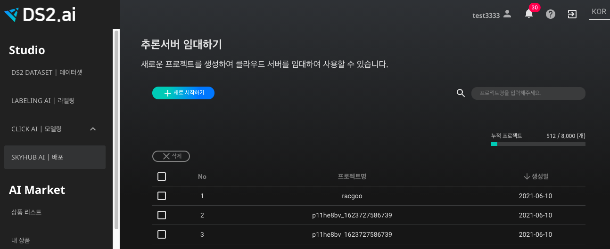
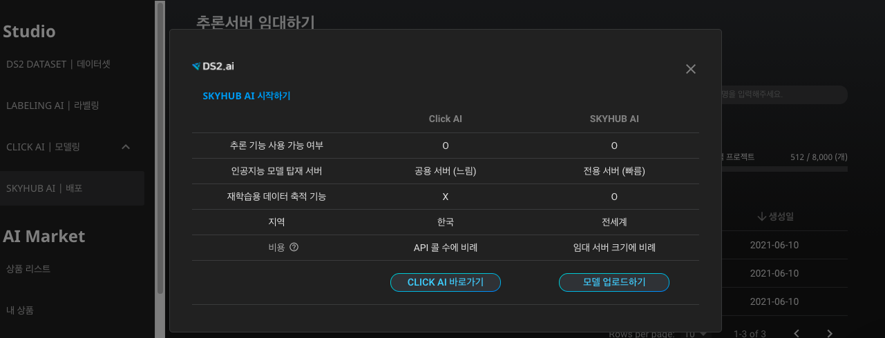
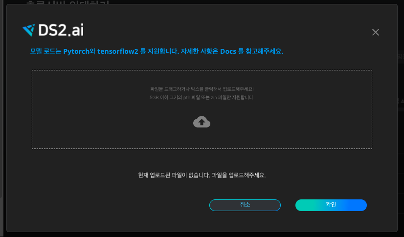
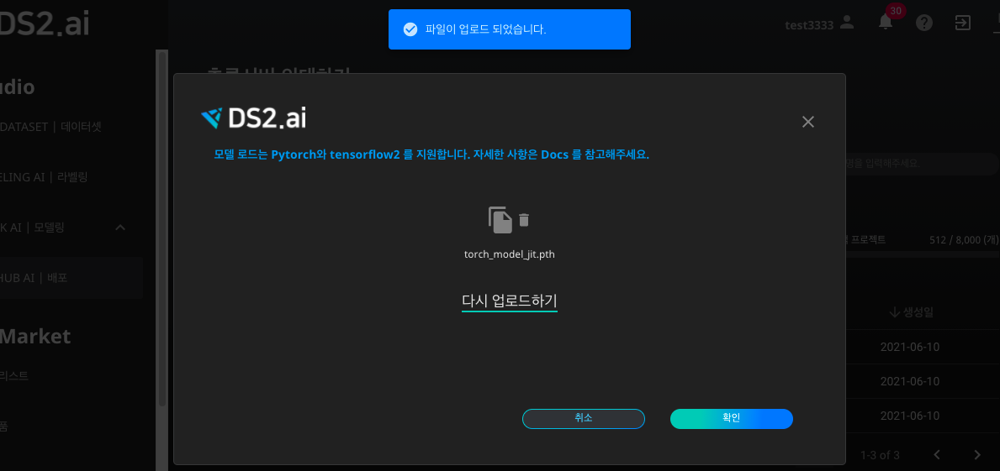
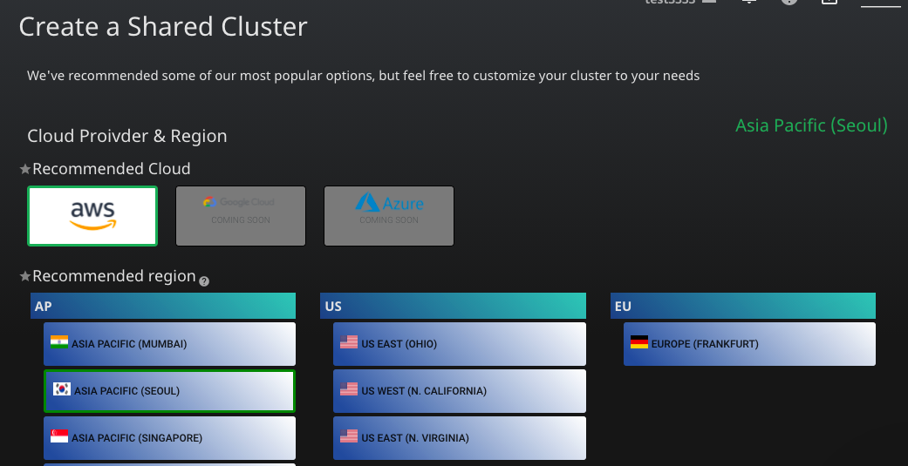
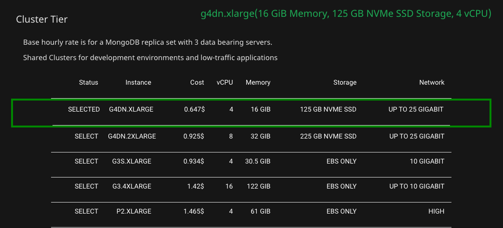
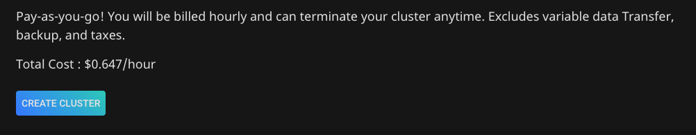
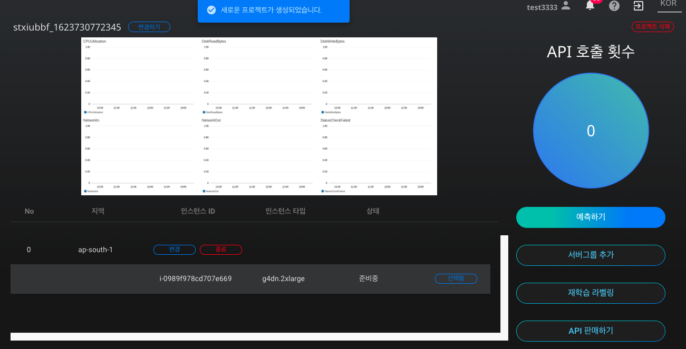
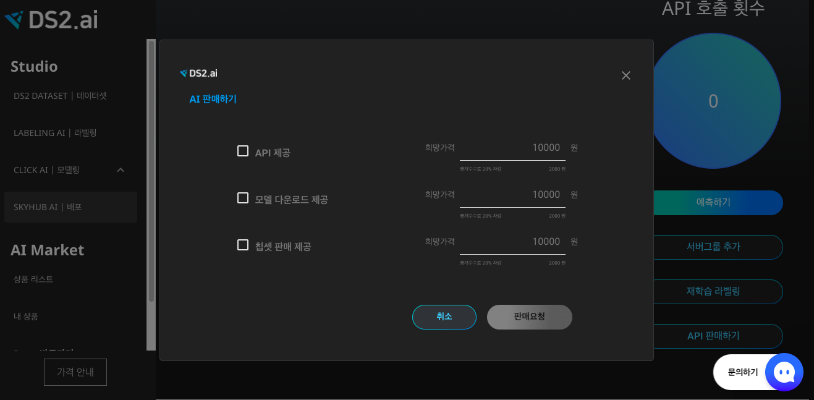

# **외부 인공지능 모델 업로드하여 API 판매하기**  

비즈니스의 인공지능 도입이 사회적인 트렌드로 자리잡음에 따라, PyTorch나 TensorFlow 같은 딥러닝 프레임워크가 주목을 받고 있습니다. 두 프레임워크 모두 다 독자적으로(stand-alone) 사용가능하고, 비즈니스 뿐만 아니라 학계에서도 크게 부각되고 있습니다.  

DS2.ai의 SKYHUB AI는 PyTorch와 TensorFlow를 이용하여 생성한 인공지능 모델을 불러와 추론 서버를 임대하고, API 판매, 재학습 등을 할 수 있도록 지원합니다. 본 레시피에서는 PyTorch 형식의 인공지능 모델을 업로드하여 API를 판매하는 프로세스를 살펴보겠습니다.  

### **1. SKYHUB AI에서 외부 모델 업로드하기**

{: width="700px",hight="300px" }     

[DS2.ai](http://ds2.ai) 콘솔의 SKYHUB AI에서 '새로 시작하기'를 클릭합니다.

{: width="700px",hight="300px" }     

DS2.ai를 처음 사용해보시는 분들을 위하여, CLICK AI와 SKYHUB AI의 차이점을 확인하실 수 있습니다. SKYHUB AI의 '모델 업로드하기'를 선택합니다.  

{: width="700px",hight="300px" }     

앞서 다루었듯, 모델 로드는 PyTorch와 TensorFlow2를 지원합니다. 본 레시피에서는 PyTorch 모델, 즉 확장자가 pth인 파일을 업로드해보겠습니다.  

{: width="700px",hight="300px" }     

'파일이 업로드 되었습니다.' 메세지를 확인한 후, '확인'을 눌러 프로젝트 생성 단계로 넘어갑니다.  

### **2. SKYHUB AI 프로젝트 생성하기**

인공지능 모델 업로드가 완료된 후에는, 원하는 서버를 선택하여 인공지능을 배포할 수 있습니다.  

{: width="700px",hight="300px" }     

클라우드의 종류는 AWS(Amazon Web Services), GCP(Google Cloud Platform), AZURE가 있습니다. 이 중 GCP와 AZURE 서버는 영업팀 문의 후 사용 할 수 있습니다.  

{: width="700px",hight="300px" }     

선택한 Region의 서버에서 여러개의 Cluster Tier의 목록을 확인합니다. 각각의 가격, vCPU, 메모리, 용량, 네트워크를 확인하여 원하는 서버를 선택하시면 됩니다.  

{: width="700px",hight="300px" }     

모든 선택이 완료되면 총 금액을 확인하실 수 있습니다. 해당 내용이 맞으시면 'CREATE CLUSTER'을 선택해주세요.  

### **3. API 판매하기**

DS2.AI는 생성된 인공지능 모델을 비즈니스에 도입하거나, 연구 목적 등으로 사용하실 수 있도록 다양한 방법을 지원하고 있습니다. 그 중 하나는 DS2.AI를 이용하여 생성된 모델을 API로 판매하는 방법입니다.  

{: width="700px",hight="300px" }     

위와 같은 대시보드가 뜨면, SKYHUB AI에서 생성된 프로젝트가 성공적으로 생성되었음을 확인하실 수 있습니다. 본 레시피의 목적인 API 판매하기를 위하여, 우측에 있는 'API 판매하기'를 클릭해주세요.  

{: width="700px",hight="300px" }     

SKYHUB AI의 특정 프로젝트에서 'API 판매하기'를 클릭하면, API 제공, 모델 다운로드 제공, 칩셋 판매 제공의 세 가지 옵션 중 하나로 판매하실 수 있도록 지원해드립니다.  

1. API 제공: API를 통한 예측하기 등의 기능을 사용할 수 있도록 배포합니다.
2. 모델 다운로드 제공: 모델을 직접 다운로드하는 방식으로 배포합니다.
3. 칩셋 판매 제공: 외부 기기에 탑재되는 칩셋 부착으로 인공지능 모델을 사용할 수 있습니다.

 추가 문의 또는 자세한 내용은 위 화면에서 '판매 요청'을 클릭하시면 되겠습니다.  

 
 

*More Recipes*

[두 데이터를 결합하여 유리 종류 예측 모델 생성하기](recipes_07_glass.md)   
[AI Market에서 학습완료된 인공지능 사용하기](recipes_09_aimarket.md)   

 
 