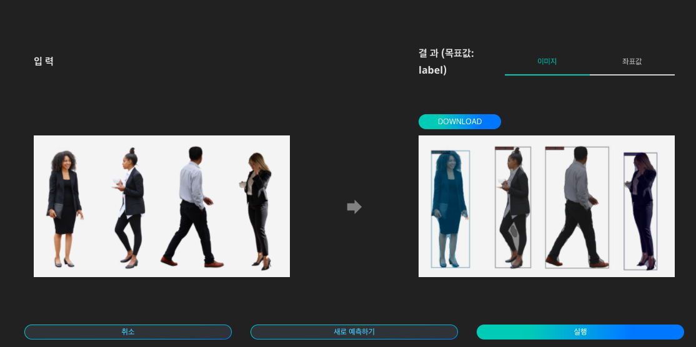

# **AI Market에서 학습완료된 인공지능 사용하기**

DS2.ai의 AI Market은 누구나 인공지능 모델을 자유롭게 사고 팔 수 있도록 서비스를 제공합니다. DS2.ai에서 개발한 인공지능 뿐만 아니라 외부에서 생성한 모델을 업로드하여 판매하실 수 있습니다.  

AI Market에 등록되어 있는 DS2.ai에서 개발한 인공지능은 크게 Custom AI, Quick Start 두 종류로 구분됩니다. 자세한 내용은 docs의 AI Market을 참고해주세요.  

본 레시피에서는 AI Market에서 학습이 완료된 인공지능인 Quick Start 인공지능 중 사람인식과 OCR을 사용하는 프로세스를 살펴보도록 하겠습니다.  

### **사람인식 인공지능 사용하기**

사람인식 기술은 이미지 속의 사람을 인식하여 라벨링하고 좌표값을 추출할 수 있는 인공지능 기술입니다.  

{: width="700px",hight="300px" }     

Quick Start 목록에서 '사람 인식'의 '예측하기'를 클릭합니다.  

{: width="700px",hight="300px" }     

사람인식 인공지능에 입력할 이미지 데이터를 준비합니다.  

{: width="700px",hight="300px" }     

이미지를 업로드하고 '실행'을 클릭하면 인식된 내용을 이미지 상에서 확인하고, 표시된 이미지를 다운로드 할 수 있습니다.  

{: width="700px",hight="300px" }     

각 개체의 좌표값을 텍스트 파일로 확인할 수 있습니다.  

### **OCR 인공지능 사용하기**

OCR(광학 문자 인식)은 이미지 상의 글자를 인식하여 텍스트 데이터로 변환해주는 인공지능 기술입니다.  

{: width="700px",hight="300px" }     

Quick Start 목록에서 'OCR'의 '예측하기'를 클릭합니다.  

{: width="700px",hight="300px" }     

OCR 인공지능에 입력할 이미지 데이터를 준비합니다.  

{: width="700px",hight="300px" }     

이미지를 업로드하고 '실행'을 클릭하면 인식된 내용을 이미지 상에서 확인하고, 표시된 이미지를 다운로드 할 수 있습니다.  

{: width="700px",hight="300px" }     

각 글자의 좌표값과 해당 텍스트를 확인할 수 있습니다.  

 
 

*More Recipes*

[외부 인공지능 모델 업로드하여 API 판매하기](recipes_08_external_ai.md) 
[은행 과금 여부 예측 인공지능 다운받기](recipes_01_bank_marketing.md)  

 
 