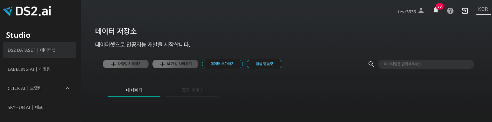
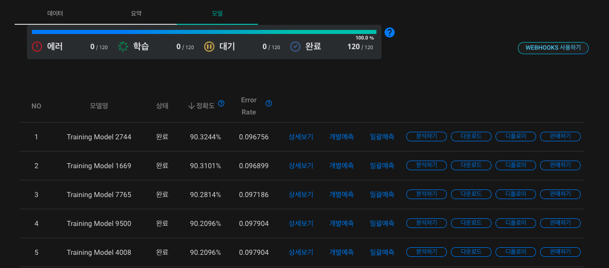
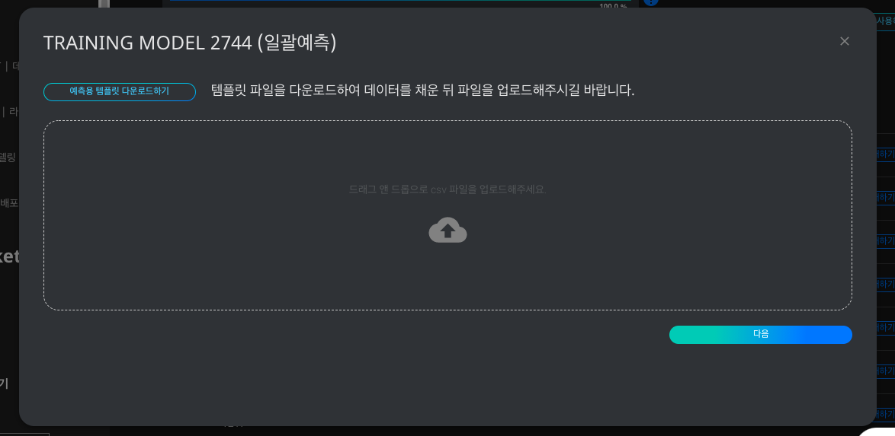

# **은행 과금 여부 예측 인공지능 다운받기**

최근 금융 서비스 부문의 마케팅이 AI도입을 시작하고 있습니다. 초기 마케터들은 방대한 데이터를 가지고 패턴화하여 분석 결과를 통해 기존 고객들에 대한 마케팅 방식을 개선하였습니다. 하지만 점점 늘어나는 데이터를 유지 관리하고 분석하며 패턴을 만들어 예측하는 것은 쉽지않은 일입니다.

인공지능의 예측 결과로 어떤 타겟군을 목표로 마케팅을 할 것인지, 최적의 잠재고객은 누구인지, 사용자의 의도는 어떻게 파악할 지, 앞으로 어떤 상품을 만들 것인지에 대한 판단을 내릴 수 있습니다. 본 레시피에서는 고객 정보에 따른 은행 과금 여부를 예측하는 인공지능을 생성하고, 추후 사용을 위해 다운로드 받는 프로세스를 함께 살펴보겠습니다.

### 1. 데이터 살펴보기

학습 데이터를 확인하는 것은 인공지능 모델의 질을 향상시키는데 필수적인 과정입니다. 학습에 사용될 데이터를 살펴봅시다.

은행 과금 여부 예측 인공지능에 활용될 데이터는 csv 형식으로써, 데이터의 컬럼을 쉼표로 구분한 텍스트 데이터입니다. 아래와 같이 표의 형태를 가진 데이터라고 볼 수 있습니다.

[은행마케팅.csv](./dataset/은행마케팅.csv)

{: width="700px",hight="300px" }  

본 레시피에서 인공지능 학습에 사용될 데이터인 '은행마케팅.csv'를 살펴보도록 하겠습니다. 각 컬럼 별로 특정 고객의 나이, 직업, 혼인여부, 학업, 신용카드 소지 여부, 연봉, 집담보대출, 기타 대출, 연락 방법, 최근 연락한 날 (일), 최근 연락한 날 (월), 최근 연락 기간, 최근 캠페인 참가 여부, 최근 캠페인 이후 시간 소요 (일), 최근 캠페인 이후 연락 횟수, 이전 마케팅 성공 여부, 과금 여부를 포함하고 있습니다. 이 데이터와 [DS2.AI](http://ds2.AI) 플랫폼을 이용하여, 특정 고객의 과금 여부를 예측하는 인공지능 모델을 생성해봅시다.

- 인공지능 입력 데이터: 고객 정보 (나이, 직업, 혼인여부, 학업, 신용카드 소지 여부 등)
- 인공지능 출력 데이터: 과금 여부

### 2. DS2 DATASET에서 학습데이터 업로드하기

{: width="700px",hight="300px" }  

[DS2.ai](http://ds2.ai) 콘솔의 DS2 DATASET에서 '데이터 추가하기'를 클릭합니다.

{: width="700px",hight="300px" }  

'은행마케팅.csv'를 업로드 해야하므로 CSV를 선택합니다. 표 형식의 데이터를 업로드 할때, CSV 외에도 MySQL, Oracle, MSSQL, PostgreSQL의 형식이 지원되니, 파일 형식에 맞추어 데이터를 업로드하시면 되겠습니다.

{: width="700px",hight="300px" }  

csv 파일을 업로드하고 결과값 칼럼을 선택합니다. 본 레피시는 고객의 정보를 입력 데이터로 하고, 과금 여부를 출력 데이터로 하는 인공지능 생성이 목적이므로 '과금 여부'를 결과값 칼럼으로 선택합니다. 인공지능은 각 칼럼의 데이터와 과금 여부의 상관관계를 유추하며 학습을 진행할 것입니다.

데이터 업로드가 성공적으로 마무리되면 해당 학습 데이터를 위한 '데이터 커넥터' 생성이 완료된 것입니다.

### 3. CLICK AI로 인공지능 모델링하기

인공지능 모델링은 알고리즘을 데이터로 학습시키는 과정을 의미합니다. DS2.AI의 CLICK AI에서는 하나의 학습 데이터셋을 학습시킨 여러개의 인공지능 모델을 생성합니다. 여러개의 모델의 정확도, RMSE, Error Rate 등의 값을 비교하여 최적의 모델을 선택해보세요.

{: width="700px",hight="300px" }  

인공지능 모델링을 위하여 DS2 DATASET에서 해당 데이터 커넥터를 선택하고, 'AI 개발 시작하기'를 클릭합니다.

{: width="700px",hight="300px" }  

인공지능 모델링에 요구되는 세부사항을 설정합니다. 학습형태는 '정형 데이터 카테고리 분류(Classification)로 설정합니다. 여기서 '정형 데이터'는 말그대로 틀과 형식이 정해져있는 데이터를 의미하고, '은행마케팅.csv'는 표 형식이 정해진 데이터 이므로 정형 데이터에 속합니다. 또한 은행 과금 여부 예측의 결과값은 yes와 no의 두 개의 카테고리로 표시되기 때문에, '정형 데이터 카테고리 분류'로 학습 형태를 설정합니다. 그 외의 설정 역시 원하는 방식에 맞추어 선택하시면 되겠습니다.

CLICK AI에서 인공지능 모델링이 완료되면 이메일로 알림을 보내드립니다. 모델링이 완료되었다는 것은, 업로드한 데이터셋을 이용하여 여러개의 인공지능 모델이 생성되었음을 의미합니다. 아래와 같이 모델명, 상태, 정확도, Error Rate를 확인하여 다양한 모델을 비교해보세요.

{: width="700px",hight="300px" }  

모델별로 상세보기, 개별예측, 일괄예측, 분석하기, 다운로드, 디플로이, 판매하기의 기능을 지원합니다. 본 레시피에서는 개별예측, 일괄예측, 다운로드의 3가지 기능을 살펴보겠습니다.

- 개별예측

{: width="700px",hight="300px" }  

하나의 인공지능 모델을 선택한 후 컬럼 값을 직접 입력하여 결과값을 예측할 수 있습니다. 본 레시피의 경우, 나이, 직업, 혼인여부 등의 고객 정보를 입력하여 과금 여부를 예측하는 인공지능 모델을 활용해볼 수 있습니다.

- 일괄 예측

{: width="700px",hight="300px" }  

여러 고객의 정보를 입력하여 한번에 예측을 하고 싶은 경우, 일괄 예측 기능을 활용하면 됩니다. 일괄 예측을 선택한 후 '예측용 템플릿 다운로드하기'를 클릭하면, csv 형태의 템플릿을 다운받을 수 있습니다. 각 컬럼에 해당하는 여러명의 고객 정보를 각 컬럼에 입력하여 업로드하신 후, 예측값인 '과금 여부' 컬럼이 모두 채워진 csv파일을 확인하시면 됩니다.

- 다운로드

{: width="700px",hight="300px" }  

DS2.AI는 생성된 인공지능 모델을 비즈니스에 도입하거나, 연구 목적으로 사용하실 수 있도록 다양한 방법을 지원하고 있습니다. 그 중 하나는 모델 자체를 직접 다운로드 하는 방식입니다. 모델 사용권 구매시 딥러닝 모델 파일과 주피터에서 추론 (Inference) 기능을 사용할 수 있는 코드를 함께 이메일로 받게 됩니다. 또한 추가적으로 Jetson Nano 2GB Developer Kit에 인공지능 모델을 설치하여 받아보실 수 있게 지원해드리니, 자세한 내용은 구매 및 설치 상담 문의를 요청하시면 되겠습니다.

<!-- More ...

(다른 레시피로 이동, 두개정도 링크 걸기)

- (예시) 강아지, 고양이 분류 인공지능 생성하기
- (예시) 의료비용 예측 인공지능 판매하기 -->