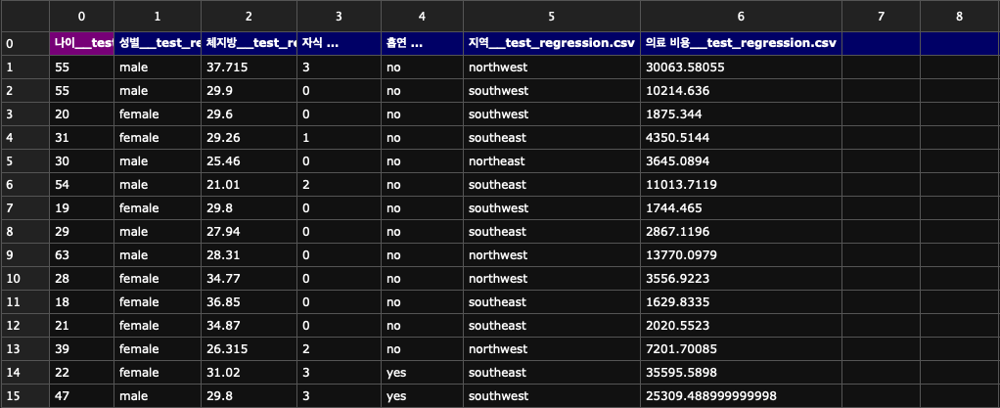
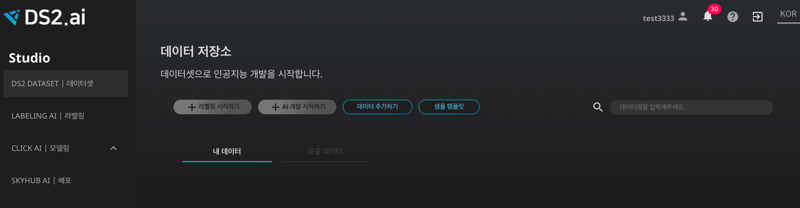
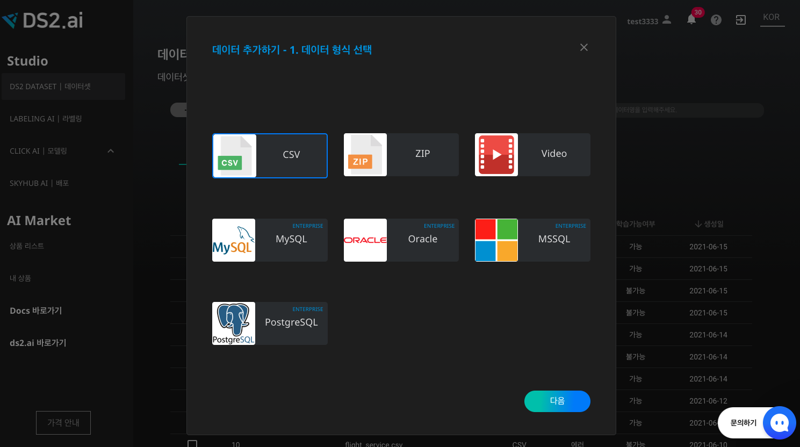
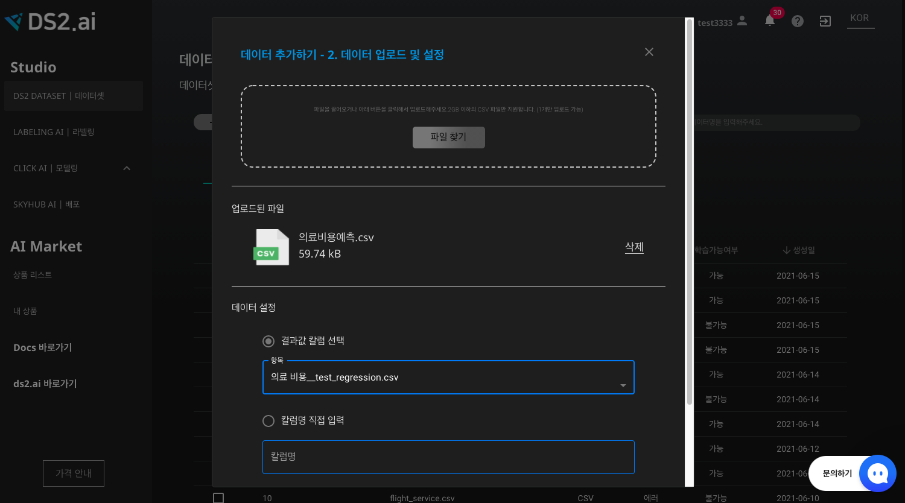
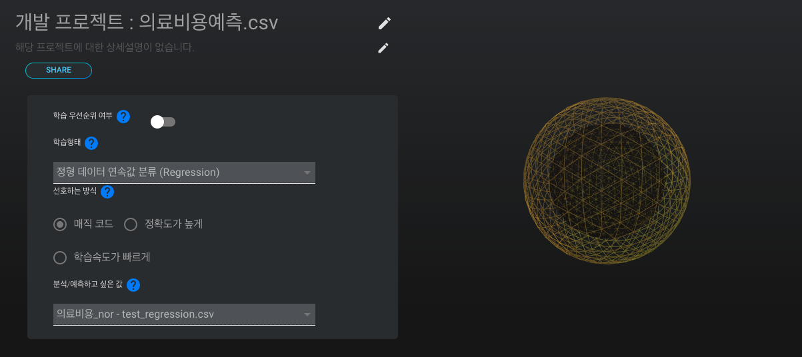
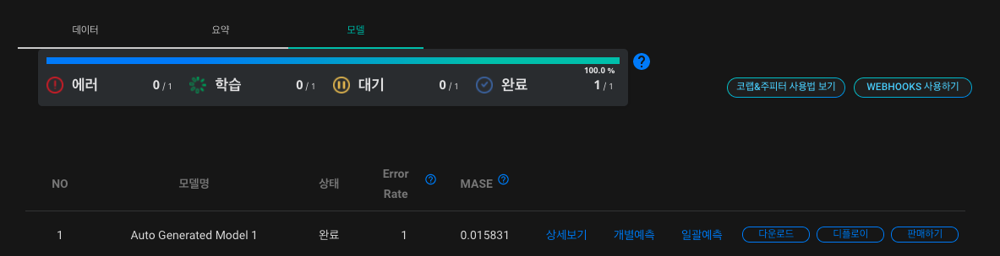
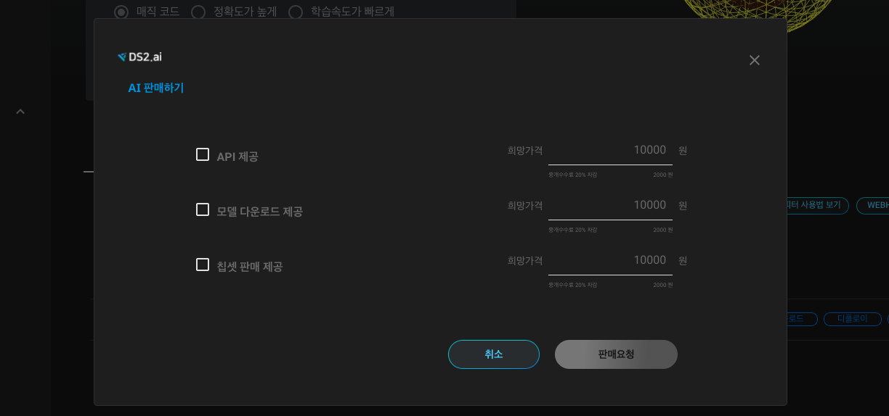

# **의료비용 예측 인공지능 판매하기**

의료 분야에서 내리는 판단은 방대한 데이터와 변수를 기반으로 하는 경우가 많으므로, 빠르게 많은 정보를 처리하는 인공지능을 도입한다면 데이터의 패턴 분석과 예측 과정이 더욱 자유로워질 것입니다.

본 레시피에서는 고객 정보에 따른 의료비용을 예측하는 인공지능을 생성하고, 학습 데이터로 생성한 인공지능 모델을 외부에 판매하는 프로세스를 살펴보겠습니다.

### 1. 데이터 살펴보기

학습 데이터를 확인하는 것은 인공지능 모델의 질을 향상시키는데 필수적인 과정입니다. 학습에 사용될 데이터를 살펴봅시다.

의료비용 예측 인공지능에 활용될 데이터는 csv 형식으로써, 데이터의 컬럼을 쉼표로 구분한 텍스트 데이터입니다. 아래와 같이 표의 형태를 가진 데이터라고 볼 수 있습니다.

[의료비용예측.csv](./dataset/의료비용예측.csv)

{: width="700px",hight="300px" }  

본 레시피에서 인공지능 학습에 사용될 데이터인 '의료비용예측.csv'를 살펴보도록 하겠습니다. 각 컬럼 별로 특정 고객의 나이, 성별, 체지방, 자식 수, 흡연 여부, 지역, 의료비용을 포함하고 있습니다. 이 데이터와 [DS2.AI](http://ds2.AI) 플랫폼을 이용하여, 특정 고객의 의료비용을 예측하는 인공지능 모델을 생성해봅시다.

- 인공지능 입력 데이터: 고객 정보 (나이, 성별, 체지방, 자식 수, 흡연 여부, 지역)
- 인공지능 출력 데이터: 의료비용

### 2. DS2 DATASET에서 학습데이터 업로드하기

{: width="700px",hight="300px" }  

[DS2.ai](http://ds2.ai) 콘솔의 DS2 DATASET에서 '데이터 추가하기'를 클릭합니다.

{: width="700px",hight="300px" }  

'의료비용예측.csv'를 업로드 해야하므로 CSV를 선택합니다. 표 형식의 데이터를 업로드 할때, CSV 외에도 MySQL, Oracle, MSSQL, PostgreSQL의 형식이 지원되니, 파일 형식에 맞추어 데이터를 업로드하시면 되겠습니다.

{: width="700px",hight="300px" }  

csv 파일을 업로드하고 결과값 칼럼을 선택합니다. 본 레시피는 고객의 정보를 입력 데이터로 하고, 의료 비용을 출력 데이터로 하는 인공지능 생성이 목적이므로 '의료 비용'를 결과값 칼럼으로 선택합니다. 인공지능은 각 칼럼의 데이터와 의료 비용의 상관관계를 유추하며 학습을 진행할 것입니다.

데이터 업로드가 성공적으로 마무리되면 해당 학습 데이터를 위한 '데이터 커넥터' 생성이 완료된 것입니다.

### 3. CLICK AI로 인공지능 모델링하기

인공지능 모델링은 알고리즘을 데이터로 학습시키는 과정을 의미합니다. DS2.AI의 CLICK AI에서는 하나의 학습 데이터셋을 학습시킨 여러개의 인공지능 모델을 생성합니다. 여러개의 모델의 정확도, RMSE, Error Rate 등의 값을 비교하여 최적의 모델을 선택해보세요.

{: width="700px",hight="300px" }  

인공지능 모델링을 위하여 DS2 DATASET에서 해당 데이터 커넥터를 선택하고, 'AI 개발 시작하기'를 클릭합니다.

{: width="700px",hight="300px" }  

CLICK AI에서 인공지능 모델링이 완료되면 이메일로 알림을 보내드립니다. 모델링이 완료되었다는 것은, 업로드한 데이터셋을 이용하여 여러개의 인공지능 모델이 생성되었음을 의미합니다. 아래(위?)와 같이 모델명, 상태, 정확도, Error Rate를 확인하여 다양한 모델을 비교해보세요.

{: width="700px",hight="300px" }  

모델별로 상세보기, 개별예측, 일괄예측, 디플로이, 판매하기의 기능을 지원합니다. 본 레시피에서는 판매하기를 집중적으로 다뤄보겠습니다.

- 판매하기

{: width="700px",hight="300px" }  

DS2.AI는 생성된 인공지능 모델을 비즈니스에 도입하거나, 연구 목적 등으로 사용하실 수 있도록 다양한 방법을 지원하고 있습니다. 그 중 하나는 DS2.AI를 이용하여 생성된 모델을 외부에 판매하는 방법입니다. CLICK AI에서 특정 모델의 '판매하기'를 클릭하면, API 제공, 모델 다운로드 제공, 칩셋 판매 제공의 세 가지 옵션 중 하나로 판매하실 수 있도록 지원해드리니, 자세한 내용은 구매 및 설치 상담 문의를 요청하시면 되겠습니다.